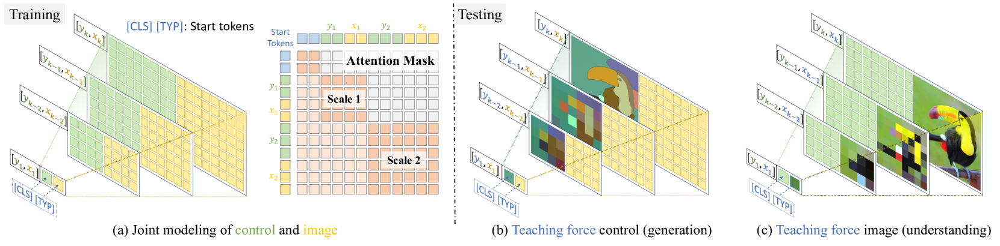

# ControlVAR：揭秘可控视觉自回归建模的奥秘

发布时间：2024年06月14日

`LLM应用

这篇论文介绍了一种名为ControlVAR的框架，它通过在视觉自回归（VAR）建模中引入像素级控制来提高条件生成的灵活性和效率。这种方法特别关注于与大型语言模型（LLMs）的集成，以解决扩散模型（DMs）在条件视觉生成中存在的问题，如高计算成本和推理延迟。ControlVAR框架的创新之处在于其能够在训练过程中联合建模图像和像素级条件，并在测试时实施条件控制，从而在多个条件生成任务中显示出优于其他流行模型的性能。因此，这篇论文属于LLM应用类别，因为它专注于开发和应用技术来增强LLM在特定任务（如条件视觉生成）中的效能。` `图像生成` `人工智能`

> ControlVAR: Exploring Controllable Visual Autoregressive Modeling

# 摘要

> 扩散模型（DMs）的兴起极大地推动了条件视觉生成的发展，尤其是在控制到图像生成领域。然而，其高昂的计算成本、推理延迟以及与大型语言模型（LLMs）集成的复杂性，促使我们寻找替代方案。本文推出的ControlVAR框架，通过在视觉自回归（VAR）建模中引入像素级控制，实现了条件生成的灵活性与效率。不同于传统模型学习条件分布，ControlVAR在训练中联合建模图像与像素级条件，并在测试时实施条件控制。我们采用下一级AR预测模式，统一控制与图像表示，并引入教师强制指导策略，以增强可控生成。实验证明，ControlVAR在多个条件生成任务中，相比如ControlNet和T2I-Adaptor等流行模型，展现出更高的效能与灵活性。

> Conditional visual generation has witnessed remarkable progress with the advent of diffusion models (DMs), especially in tasks like control-to-image generation. However, challenges such as expensive computational cost, high inference latency, and difficulties of integration with large language models (LLMs) have necessitated exploring alternatives to DMs. This paper introduces ControlVAR, a novel framework that explores pixel-level controls in visual autoregressive (VAR) modeling for flexible and efficient conditional generation. In contrast to traditional conditional models that learn the conditional distribution, ControlVAR jointly models the distribution of image and pixel-level conditions during training and imposes conditional controls during testing. To enhance the joint modeling, we adopt the next-scale AR prediction paradigm and unify control and image representations. A teacher-forcing guidance strategy is proposed to further facilitate controllable generation with joint modeling. Extensive experiments demonstrate the superior efficacy and flexibility of ControlVAR across various conditional generation tasks against popular conditional DMs, \eg, ControlNet and T2I-Adaptor.

[Arxiv](https://arxiv.org/abs/2406.09750)