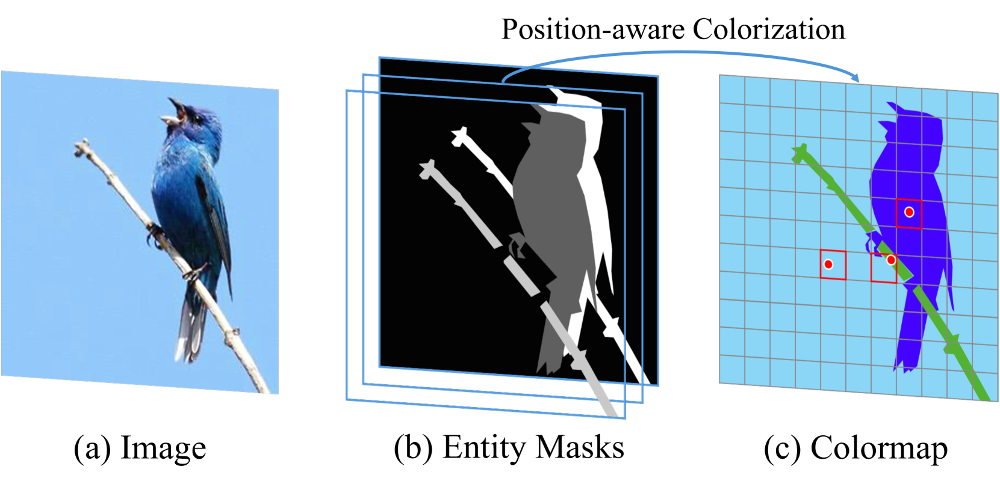

# ControlVAR：探索视觉自回归建模的可控性

发布时间：2024年06月14日

`Agent

理由：这篇论文介绍了一种新的框架ControlVAR，用于条件视觉生成，并强调了其在多个条件生成任务中的高效能与灵活性。虽然它提到了大型语言模型（LLMs），但主要关注的是视觉生成领域，特别是通过引入像素级控制在视觉自回归建模中的应用。这表明论文的核心在于开发和优化一个特定的生成模型，即Agent，用于处理视觉数据的条件生成任务。因此，将其归类为Agent是合适的。` `图像生成` `计算机视觉`

> ControlVAR: Exploring Controllable Visual Autoregressive Modeling

# 摘要

> 扩散模型（DMs）的兴起推动了条件视觉生成的飞速发展，尤其是在控制到图像生成领域。然而，其高昂的计算成本、推理延迟以及与大型语言模型（LLMs）集成的挑战，促使研究者寻找替代方案。本文推出的ControlVAR框架，通过在视觉自回归（VAR）建模中引入像素级控制，实现了条件生成的灵活与高效。不同于传统模型学习条件分布，ControlVAR在训练中联合建模图像与像素级条件，测试时则施加精确控制。我们采用下一级AR预测范式，统一控制与图像表示，并提出教师强制指导策略，以增强可控生成。实验证明，ControlVAR在多个条件生成任务中，相比如ControlNet和T2I-Adaptor等流行模型，展现出更高的效能与灵活性。

> Conditional visual generation has witnessed remarkable progress with the advent of diffusion models (DMs), especially in tasks like control-to-image generation. However, challenges such as expensive computational cost, high inference latency, and difficulties of integration with large language models (LLMs) have necessitated exploring alternatives to DMs. This paper introduces ControlVAR, a novel framework that explores pixel-level controls in visual autoregressive (VAR) modeling for flexible and efficient conditional generation. In contrast to traditional conditional models that learn the conditional distribution, ControlVAR jointly models the distribution of image and pixel-level conditions during training and imposes conditional controls during testing. To enhance the joint modeling, we adopt the next-scale AR prediction paradigm and unify control and image representations. A teacher-forcing guidance strategy is proposed to further facilitate controllable generation with joint modeling. Extensive experiments demonstrate the superior efficacy and flexibility of ControlVAR across various conditional generation tasks against popular conditional DMs, \eg, ControlNet and T2I-Adaptor.

[Arxiv](https://arxiv.org/abs/2406.09750)