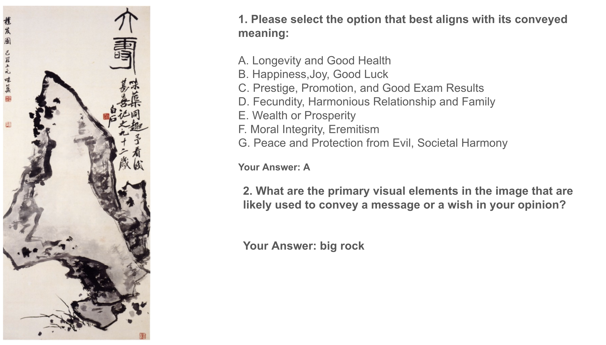

# 构建中国文化之窗：一款专为解读中国双关猜谜艺术而设计的多模态数据集

发布时间：2024年06月14日

`LLM应用

这篇论文关注的是大型视觉-语言模型（VLMs）在艺术领域的应用，特别是在理解和解释富含文化元素的艺术形式方面的挑战和局限性。论文通过推出一个专注于中国传统文化的多模态艺术理解数据集，并评估了当前最先进的VLMs在这些任务上的表现，指出了它们在理解和解释文化特定内容方面的不足。因此，这篇论文属于LLM应用类别，因为它探讨了LLM在特定领域（艺术和文化理解）的应用和改进。` `文化研究`

> Creating a Lens of Chinese Culture: A Multimodal Dataset for Chinese Pun Rebus Art Understanding

# 摘要

> 大型视觉-语言模型（VLMs）虽在日常内容理解上表现出色，但在艺术领域，尤其是富含文化的艺术形式中，其潜力尚未充分挖掘。艺术，作为人类智慧与创造力的结晶，蕴含着复杂的跨文化叙事与象征。本文推出的“谐音谜语艺术数据集”，是一个根植于中国传统文化的多模态艺术理解数据集，专注于三大任务：识别视觉关键元素、解读元素象征意义及阐释信息内涵。评估表明，即便是最先进的VLMs，在这些任务上也显露出局限性，解释常带偏见且不乏虚构，情境学习带来的提升亦有限。我们发布此数据集，旨在推动VLMs更深入地理解和诠释文化特定内容，促进超越英语语料库的多元包容性。

> Large vision-language models (VLMs) have demonstrated remarkable abilities in understanding everyday content. However, their performance in the domain of art, particularly culturally rich art forms, remains less explored. As a pearl of human wisdom and creativity, art encapsulates complex cultural narratives and symbolism. In this paper, we offer the Pun Rebus Art Dataset, a multimodal dataset for art understanding deeply rooted in traditional Chinese culture. We focus on three primary tasks: identifying salient visual elements, matching elements with their symbolic meanings, and explanations for the conveyed messages. Our evaluation reveals that state-of-the-art VLMs struggle with these tasks, often providing biased and hallucinated explanations and showing limited improvement through in-context learning. By releasing the Pun Rebus Art Dataset, we aim to facilitate the development of VLMs that can better understand and interpret culturally specific content, promoting greater inclusiveness beyond English-based corpora.

[Arxiv](https://arxiv.org/abs/2406.10318)