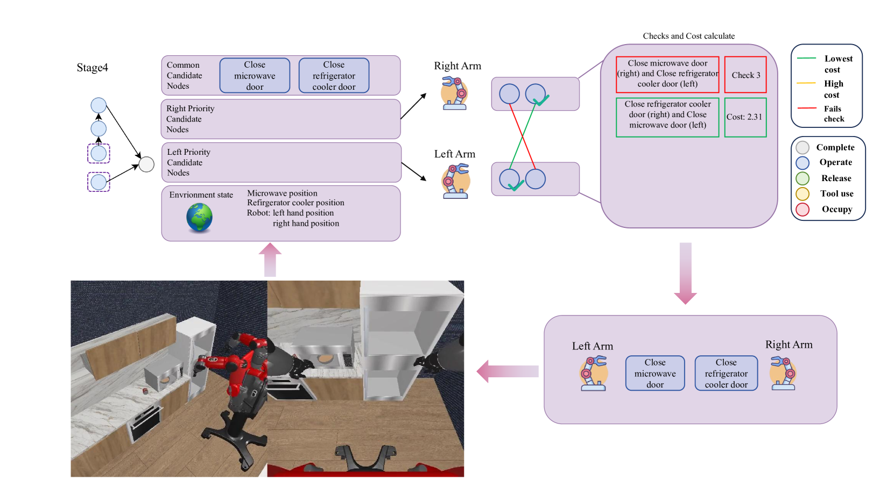
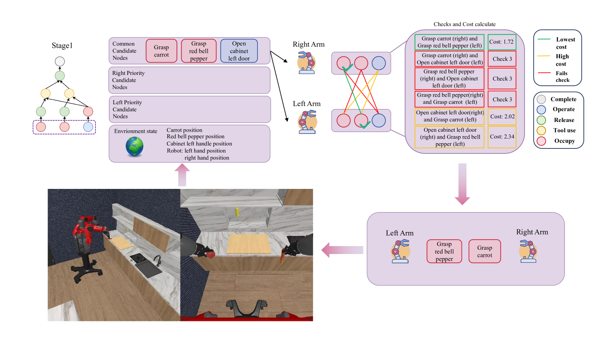
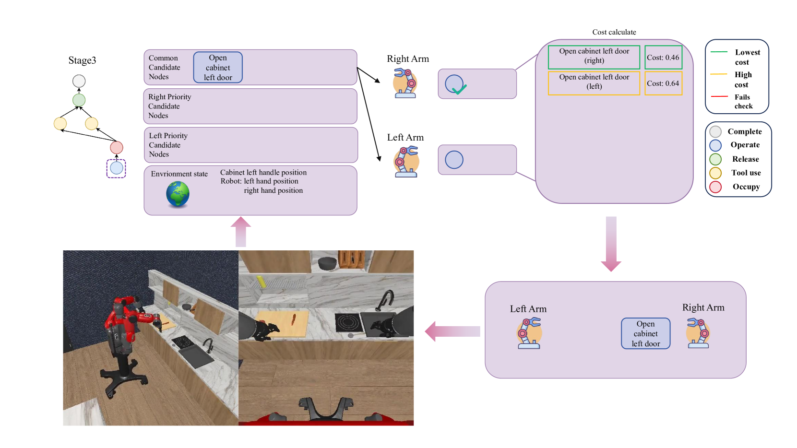

# DAG-Plan：构建双臂协同规划的有向无环依赖图

发布时间：2024年06月14日

`Agent

理由：这篇论文介绍了一个专为双臂机器人设计的任务规划框架（DAG-Plan），该框架利用大型语言模型（LLMs）来分解复杂任务，并通过有向无环图（DAG）进行任务分配和协调。这个系统可以被视为一个智能代理（Agent），因为它能够根据环境动态调整任务分配，实现高效的任务执行。这与Agent的定义相符，即一个能够感知环境并采取行动以达到目标的系统。虽然该框架使用了LLMs，但其主要贡献在于任务规划和执行的代理行为，而不是LLM的理论研究或应用。因此，将其归类为Agent更为合适。` `机器人技术` `自动化`

> DAG-Plan: Generating Directed Acyclic Dependency Graphs for Dual-Arm Cooperative Planning

# 摘要

> 双臂机器人通过协同操作和任务执行，展现出比单臂机器人更高的灵活性和效率。然而，对于复杂的长远任务，如何有效协调双臂仍是一大挑战。现有的任务规划方法多针对单臂机器人，未能充分发挥双臂系统的潜力。为此，我们推出了DAG-Plan，一个专为双臂机器人设计的任务规划框架。该框架利用LLMs将复杂任务分解为可执行的子任务，并通过有向无环图（DAG）进行表示。关键在于，DAG-Plan能根据实时环境动态分配任务给合适的手臂，实现高效并行执行。在双臂厨房基准测试中，DAG-Plan的表现显著优于传统方法，效率提升近50%，成功率更是翻倍。

> Dual-arm robots offer enhanced versatility and efficiency over single-arm counterparts by enabling concurrent manipulation of multiple objects or cooperative execution of tasks using both arms. However, effectively coordinating the two arms for complex long-horizon tasks remains a significant challenge. Existing task planning methods predominantly focus on single-arm robots or rely on predefined bimanual operations, failing to fully leverage the capabilities of dual-arm systems. To address this limitation, we introduce DAG-Plan, a structured task planning framework tailored for dual-arm robots. DAG-Plan harnesses large language models (LLMs) to decompose intricate tasks into actionable sub-tasks represented as nodes within a directed acyclic graph (DAG). Critically, DAG-Plan dynamically assigns these sub-tasks to the appropriate arm based on real-time environmental observations, enabling parallel and adaptive execution. We evaluate DAG-Plan on the novel Dual-Arm Kitchen Benchmark, comprising 9 sequential tasks with 78 sub-tasks and 26 objects. Extensive experiments demonstrate the superiority of DAG-Plan over directly using LLM to generate plans, achieving nearly 50% higher efficiency compared to the single-arm task planning baseline and nearly double the success rate of the dual-arm task planning baseline.

[Arxiv](https://arxiv.org/abs/2406.09953)