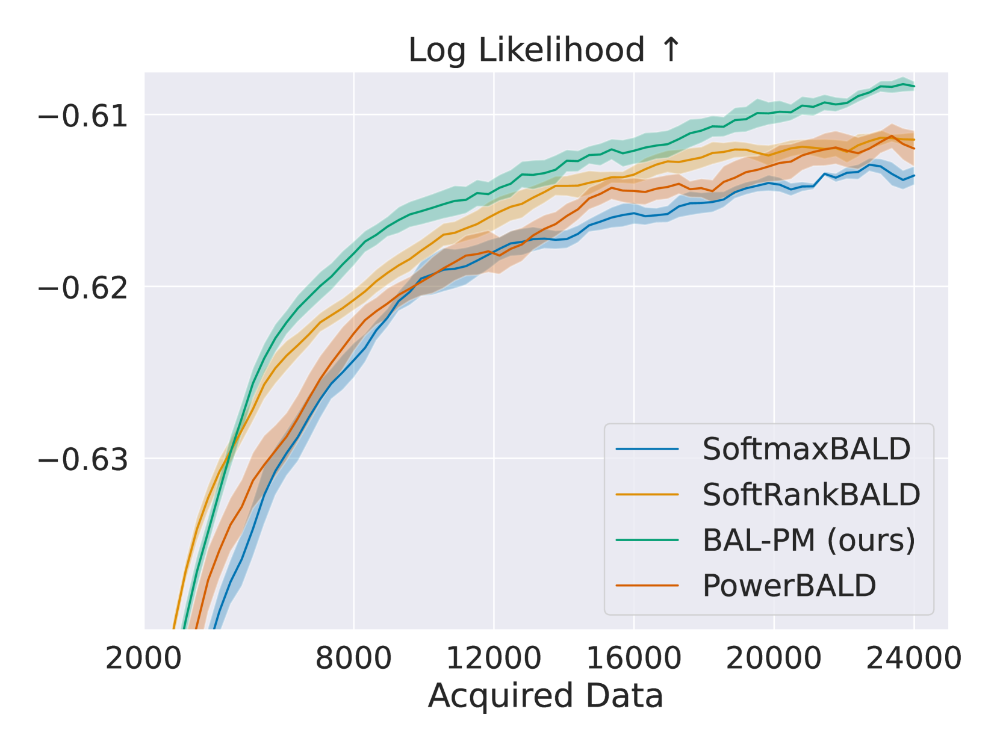

# 利用深度贝叶斯主动学习优化大语言模型中的偏好建模

发布时间：2024年06月14日

`LLM应用

这篇论文主要探讨了如何通过贝叶斯主动学习来优化大型语言模型（LLMs）在获取人类偏好时的数据选择和标注过程，以降低成本并促进模型的发展。这种方法直接应用于LLMs的实际应用中，特别是在处理人类偏好数据集时，通过改进的获取策略显著减少了所需的偏好标签数量。因此，这篇论文属于LLM应用分类。` `人工智能` `数据标注`

> Deep Bayesian Active Learning for Preference Modeling in Large Language Models

# 摘要

> 近年来，借助人类偏好引导大型语言模型（LLMs）的行为已取得显著成效，但数据选择和标注仍是大规模应用中的瓶颈。选择关键信息点以获取人类反馈，能大幅降低偏好标注成本，促进LLMs发展。贝叶斯主动学习为此提供了一个有效的框架，并在多个领域取得成功。然而，以往将其用于偏好建模的尝试并未达到预期。本研究发现，简单的知识不确定性估计导致样本冗余。为此，我们提出了偏好建模的贝叶斯主动学习器（BAL-PM），一种新型随机获取策略，旨在偏好模型中寻找高知识不确定性点，并最大化特征空间中提示分布的熵。实验显示，BAL-PM在两个主流人类偏好数据集上减少了33%至68%的偏好标签需求，并超越了以往的随机贝叶斯获取策略。

> Leveraging human preferences for steering the behavior of Large Language Models (LLMs) has demonstrated notable success in recent years. Nonetheless, data selection and labeling are still a bottleneck for these systems, particularly at large scale. Hence, selecting the most informative points for acquiring human feedback may considerably reduce the cost of preference labeling and unleash the further development of LLMs. Bayesian Active Learning provides a principled framework for addressing this challenge and has demonstrated remarkable success in diverse settings. However, previous attempts to employ it for Preference Modeling did not meet such expectations. In this work, we identify that naive epistemic uncertainty estimation leads to the acquisition of redundant samples. We address this by proposing the Bayesian Active Learner for Preference Modeling (BAL-PM), a novel stochastic acquisition policy that not only targets points of high epistemic uncertainty according to the preference model but also seeks to maximize the entropy of the acquired prompt distribution in the feature space spanned by the employed LLM. Notably, our experiments demonstrate that BAL-PM requires 33% to 68% fewer preference labels in two popular human preference datasets and exceeds previous stochastic Bayesian acquisition policies.

[Arxiv](https://arxiv.org/abs/2406.10023)