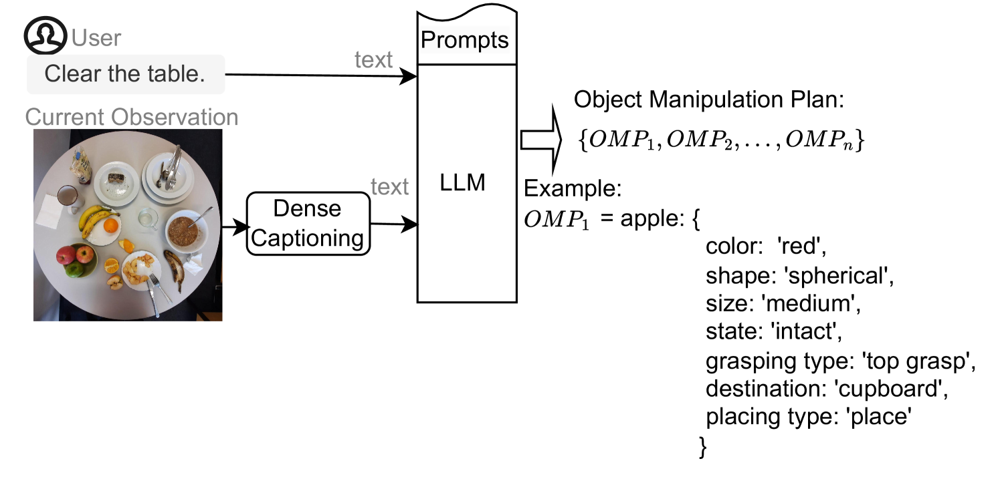
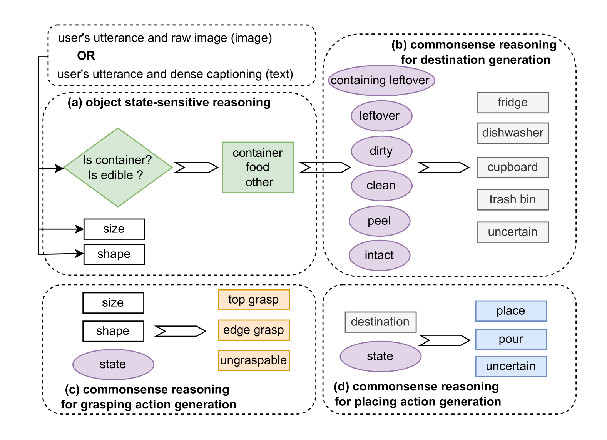
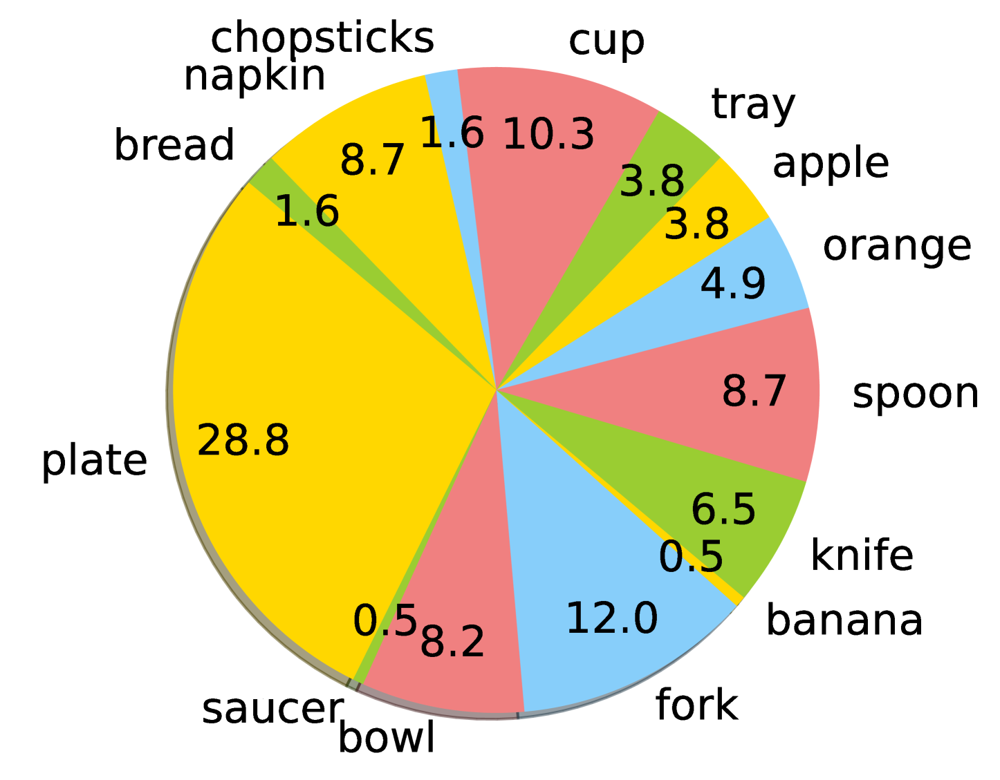

# 细节之差，成就非凡：针对物体状态敏感的神经机器人任务规划研究

发布时间：2024年06月14日

`Agent

理由：这篇论文介绍了一种名为物体状态敏感代理（OSSA）的任务规划代理，它由预训练神经网络驱动，并专注于生成针对物体状态敏感的计划。这种代理的设计和评估表明，它在处理特定任务（如桌面清理）时能够有效地考虑物体的状态。因此，这篇论文更符合Agent分类，因为它描述了一个具体的代理系统及其在特定任务中的应用。` `机器人技术` `自动化`

> Details Make a Difference: Object State-Sensitive Neurorobotic Task Planning

# 摘要

> 物体的当前状态对机器人的任务规划和操作至关重要，但检测并生成状态敏感的计划颇具挑战。预训练的大型语言模型（LLMs）和视觉-语言模型（VLMs）在计划生成方面表现出色，但它们是否能生成针对物体状态敏感的计划尚无定论。为此，我们推出了物体状态敏感代理（OSSA），一种由预训练神经网络驱动的任务规划代理，并提出了两种实现方式：模块化模型（结合视觉处理与自然语言处理）和单一VLM模型。我们通过桌面清理任务来评估这两种方法，并创建了一个考虑物体状态的多模态基准数据集。结果表明，单一模型在处理物体状态敏感任务上更胜一筹。OSSA的代码已公开于\url{https://github.com/Xiao-wen-Sun/OSSA}。

> The state of an object reflects its current status or condition and is important for a robot's task planning and manipulation. However, detecting an object's state and generating a state-sensitive plan for robots is challenging. Recently, pre-trained Large Language Models (LLMs) and Vision-Language Models (VLMs) have shown impressive capabilities in generating plans. However, to the best of our knowledge, there is hardly any investigation on whether LLMs or VLMs can also generate object state-sensitive plans. To study this, we introduce an Object State-Sensitive Agent (OSSA), a task-planning agent empowered by pre-trained neural networks. We propose two methods for OSSA: (i) a modular model consisting of a pre-trained vision processing module (dense captioning model, DCM) and a natural language processing model (LLM), and (ii) a monolithic model consisting only of a VLM. To quantitatively evaluate the performances of the two methods, we use tabletop scenarios where the task is to clear the table. We contribute a multimodal benchmark dataset that takes object states into consideration. Our results show that both methods can be used for object state-sensitive tasks, but the monolithic approach outperforms the modular approach. The code for OSSA is available at \url{https://github.com/Xiao-wen-Sun/OSSA}

[Arxiv](https://arxiv.org/abs/2406.09988)