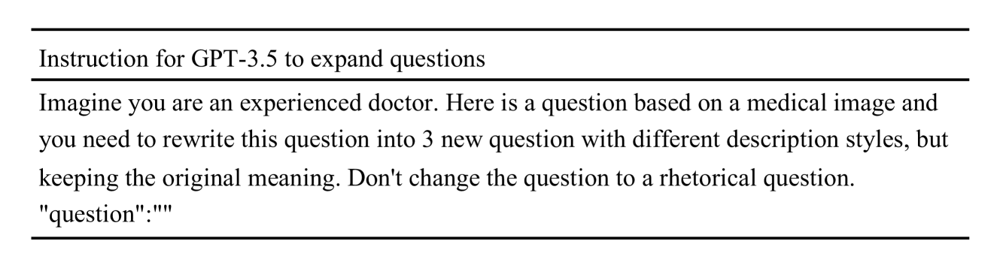

# 探索大规模视觉语言模型中的医学幻觉：检测与评估

发布时间：2024年06月14日

`LLM应用

这篇论文主要探讨了大型视觉语言模型（LVLMs）在医疗领域的应用，特别是在医学视觉问答和影像报告生成中的应用。论文提出了专门针对医学领域的幻觉检测与评估方法，包括Med-HallMark基准和MediHall Score评估指标，以及MediHallDetector模型。这些工具和方法旨在提高LVLMs在医疗应用中的可靠性和准确性，减少幻觉现象对医疗决策的影响。因此，这篇论文的内容更偏向于LLM的具体应用，特别是在医疗领域的应用，而不是理论研究或Agent、RAG相关的研究。` `多模态学习`

> Detecting and Evaluating Medical Hallucinations in Large Vision Language Models

# 摘要

> 大型视觉语言模型（LVLMs）在医疗领域的作用日益凸显，涵盖医学视觉问答与影像报告生成等应用。虽然它们承袭了基础大型语言模型（LLMs）的强大功能，但也同样易受幻觉影响，这在医疗领域尤为关键，因为错误容忍度极低。遗憾的是，医学领域尚未有专门的幻觉检测与评估方法或基准。为此，我们推出了Med-HallMark，这是首个专为医学多模态领域定制的幻觉检测与评估基准，它提供多任务支持、多维数据及层次化分类。同时，我们提出了MediHall Score，一种新型医学评估指标，通过层次化评分体系考量幻觉的严重性与类型，细致评估其临床影响。此外，我们还开发了MediHallDetector，一种专精于幻觉检测的医学LVLM，采用多任务训练以提升检测精度。通过一系列实验，我们为流行的LVLMs设定了基准，并发现MediHall Score能更细致地揭示幻觉影响，而MediHallDetector的性能也得到了显著提升。我们期待这项工作能大幅增强LVLMs在医疗应用中的可靠性，相关资源即将公开。

> Large Vision Language Models (LVLMs) are increasingly integral to healthcare applications, including medical visual question answering and imaging report generation. While these models inherit the robust capabilities of foundational Large Language Models (LLMs), they also inherit susceptibility to hallucinations-a significant concern in high-stakes medical contexts where the margin for error is minimal. However, currently, there are no dedicated methods or benchmarks for hallucination detection and evaluation in the medical field. To bridge this gap, we introduce Med-HallMark, the first benchmark specifically designed for hallucination detection and evaluation within the medical multimodal domain. This benchmark provides multi-tasking hallucination support, multifaceted hallucination data, and hierarchical hallucination categorization. Furthermore, we propose the MediHall Score, a new medical evaluative metric designed to assess LVLMs' hallucinations through a hierarchical scoring system that considers the severity and type of hallucination, thereby enabling a granular assessment of potential clinical impacts. We also present MediHallDetector, a novel Medical LVLM engineered for precise hallucination detection, which employs multitask training for hallucination detection. Through extensive experimental evaluations, we establish baselines for popular LVLMs using our benchmark. The findings indicate that MediHall Score provides a more nuanced understanding of hallucination impacts compared to traditional metrics and demonstrate the enhanced performance of MediHallDetector. We hope this work can significantly improve the reliability of LVLMs in medical applications. All resources of this work will be released soon.

[Arxiv](https://arxiv.org/abs/2406.10185)