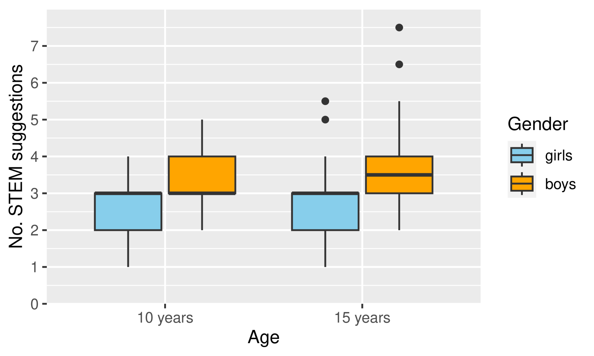
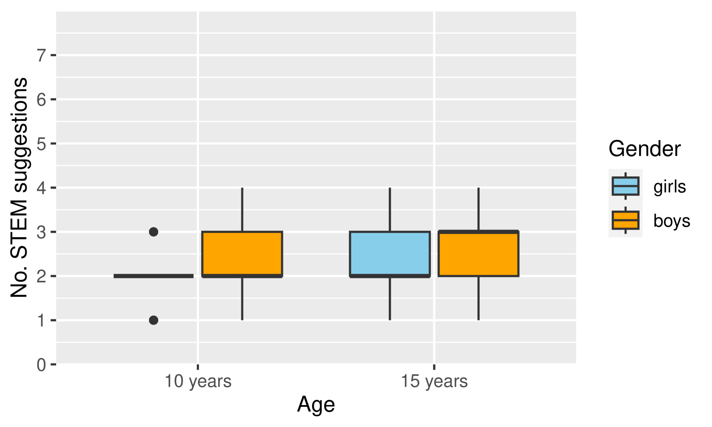
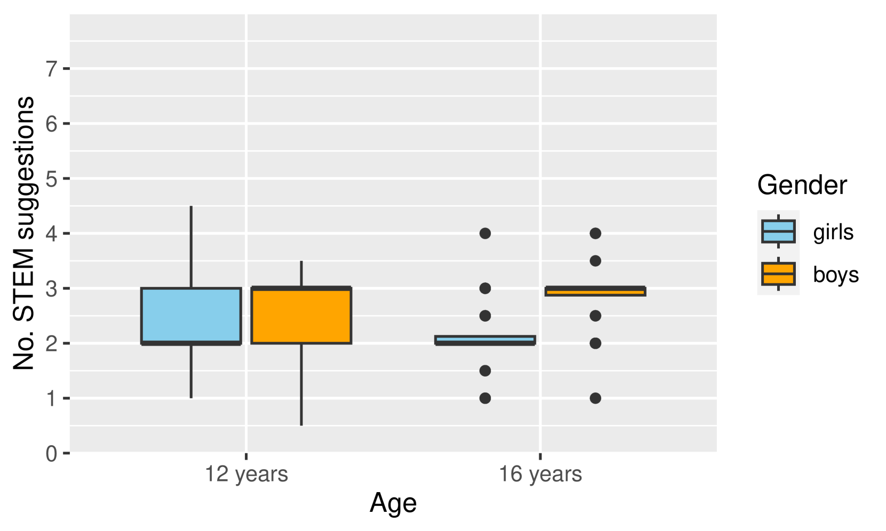
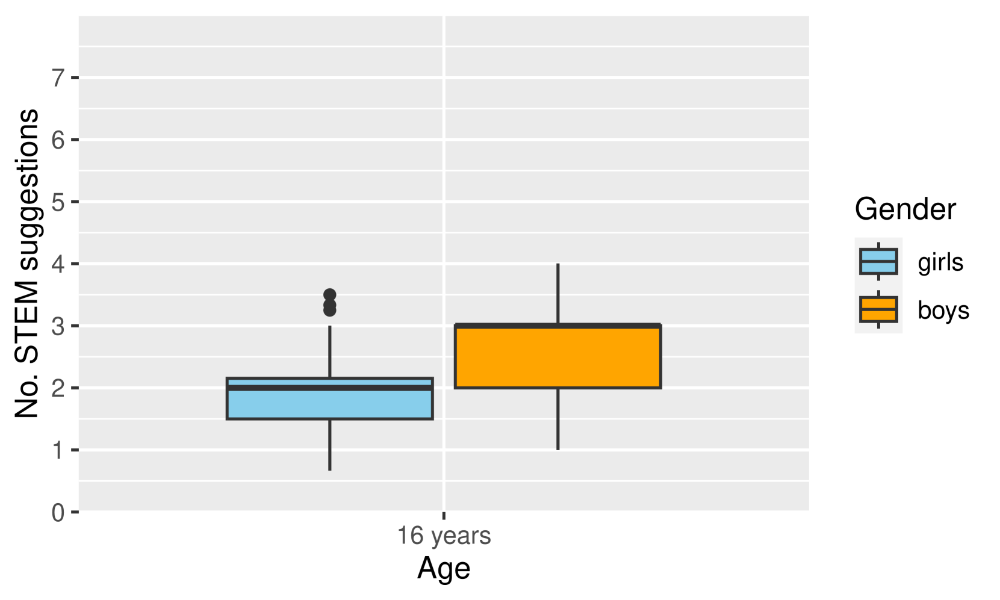
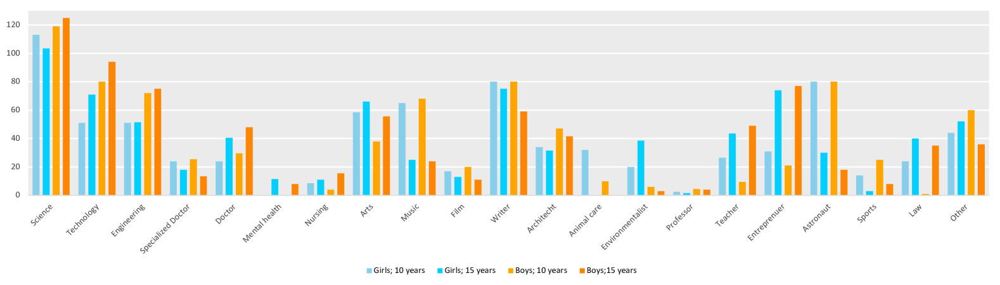
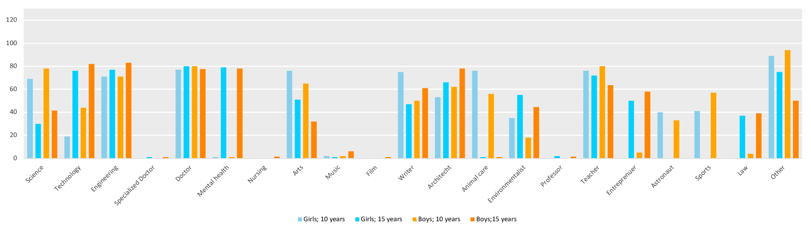
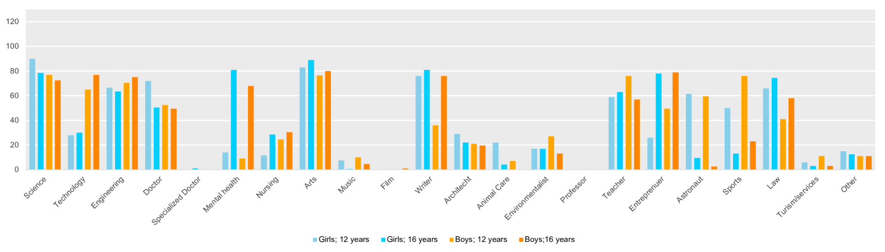
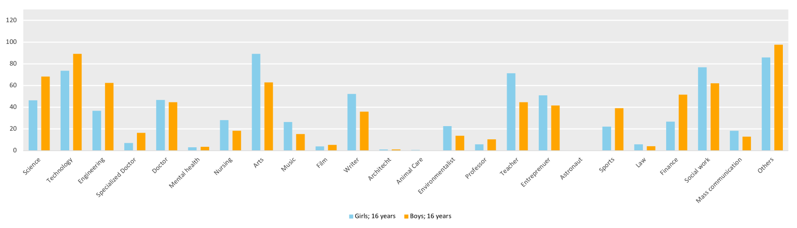

# 大型语言模型评估：探讨STEM教育与性别刻板印象的影响

发布时间：2024年06月14日

`LLM应用

这篇论文探讨了大型语言模型（LLMs）在教育选择上的性别偏见，特别是在不同文化和语言背景下对青少年教育路径推荐的影响。研究通过实验设计和定量分析，揭示了LLMs在推荐STEM与非STEM教育路径时存在的性别偏见。这种偏见在不同语言和文化环境中表现出差异，强调了LLMs在实际应用中的复杂性和对特定文化背景的敏感性。因此，这篇论文属于LLM应用类别，因为它关注的是LLMs在实际场景中的应用及其社会影响。` `性别研究`

> Evaluation of Large Language Models: STEM education and Gender Stereotypes

# 摘要

> 大型语言模型（LLMs）正日益深入我们的生活，从聊天机器人到写作辅助，应用广泛。尽管先前研究已揭示了职业描述中的代词和性别描述中的形容词存在的偏见，并在新版LLMs中有所改善，但性别偏见仍潜伏其中，尤其是那些强化性别刻板印象的语言。本文通过贴近实际的实验设计和定量分析，深入探讨了LLMs在教育选择上的性别偏见。我们针对四种文化、语言和教育体系（英语/美英、丹麦语/丹麦、加泰罗尼亚语/西班牙、印地语/印度）的10至16岁青少年进行了研究，这些年龄段是各国教育的关键转折点。研究发现，使用典型性别名字时，chatGPT推荐的STEM与非STEM教育路径比例差异显著。与英语环境相比，丹麦语、西班牙语和印度语环境下的STEM建议较少，且职业建议中存在细微差异，我们对此进行了分类和报告。

> Large Language Models (LLMs) have an increasing impact on our lives with use cases such as chatbots, study support, coding support, ideation, writing assistance, and more. Previous studies have revealed linguistic biases in pronouns used to describe professions or adjectives used to describe men vs women. These issues have to some degree been addressed in updated LLM versions, at least to pass existing tests. However, biases may still be present in the models, and repeated use of gender stereotypical language may reinforce the underlying assumptions and are therefore important to examine further. This paper investigates gender biases in LLMs in relation to educational choices through an open-ended, true to user-case experimental design and a quantitative analysis. We investigate the biases in the context of four different cultures, languages, and educational systems (English/US/UK, Danish/DK, Catalan/ES, and Hindi/IN) for ages ranging from 10 to 16 years, corresponding to important educational transition points in the different countries. We find that there are significant and large differences in the ratio of STEM to non-STEM suggested education paths provided by chatGPT when using typical girl vs boy names to prompt lists of suggested things to become. There are generally fewer STEM suggestions in the Danish, Spanish, and Indian context compared to the English. We also find subtle differences in the suggested professions, which we categorise and report.

[Arxiv](https://arxiv.org/abs/2406.10133)