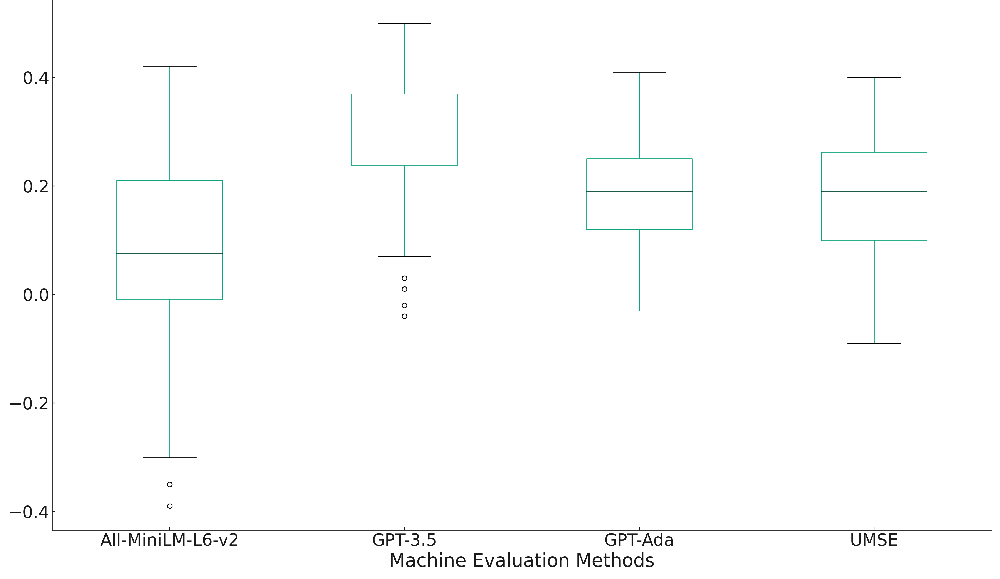
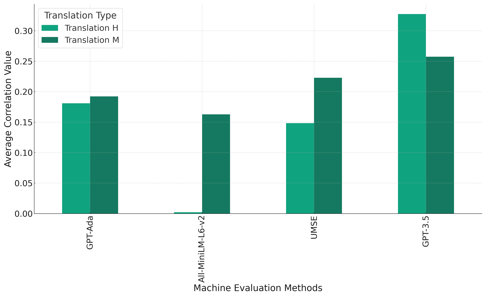
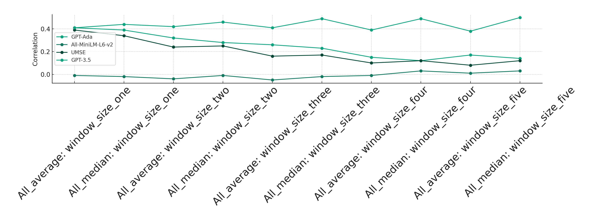
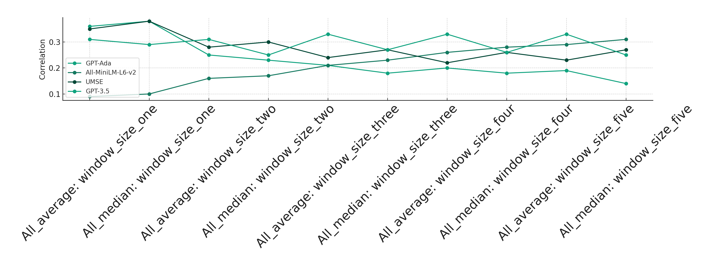

# 探究人类与机器在同声传译评估中的关联性

发布时间：2024年06月14日

`Agent

理由：这篇论文主要关注的是口译服务的自动化评估，特别是在同声传译中使用自动评估指标来衡量翻译的准确性或忠实度。它探讨了如何通过分析自动评估指标与人类评估的相关性来提高评估的可靠性。虽然涉及到了大型语言模型（如GPT-3.5）的使用，但重点在于如何作为一个评估工具或代理（Agent）来辅助或替代人类评估，而不是探讨LLM的理论或应用。因此，将其归类为Agent更为合适。` `口译服务` `语言翻译`

> Exploring the Correlation between Human and Machine Evaluation of Simultaneous Speech Translation

# 摘要

> 评估口译服务性能复杂多变，涉及口语翻译的微妙性、口译策略及用户期望的多样性。自动化评估方法的应用使得这一任务更加复杂，因为口译文本在源语言与目标语言间的线性关系因口译策略而减少。本研究旨在通过分析自动评估指标与人类评估的相关性，探讨自动指标在同声传译评估中的可靠性。我们关注口译质量的一个关键方面——翻译的准确性或忠实度。以语言专家的人类评估为基准，我们评估了句子嵌入和大型语言模型与这些评估的相关性。我们量化了源文本与翻译文本间的语义相似性，无需依赖参考翻译。研究结果显示，GPT模型，尤其是直接提示的GPT-3.5，在源文本与目标文本间的语义相似性方面与人类判断表现出最强的相关性，即便在评估短文本段时亦是如此。此外，研究还揭示了上下文窗口大小对这种相关性的显著影响。

> Assessing the performance of interpreting services is a complex task, given the nuanced nature of spoken language translation, the strategies that interpreters apply, and the diverse expectations of users. The complexity of this task become even more pronounced when automated evaluation methods are applied. This is particularly true because interpreted texts exhibit less linearity between the source and target languages due to the strategies employed by the interpreter.
  This study aims to assess the reliability of automatic metrics in evaluating simultaneous interpretations by analyzing their correlation with human evaluations. We focus on a particular feature of interpretation quality, namely translation accuracy or faithfulness. As a benchmark we use human assessments performed by language experts, and evaluate how well sentence embeddings and Large Language Models correlate with them. We quantify semantic similarity between the source and translated texts without relying on a reference translation. The results suggest GPT models, particularly GPT-3.5 with direct prompting, demonstrate the strongest correlation with human judgment in terms of semantic similarity between source and target texts, even when evaluating short textual segments. Additionally, the study reveals that the size of the context window has a notable impact on this correlation.

[Arxiv](https://arxiv.org/abs/2406.10091)