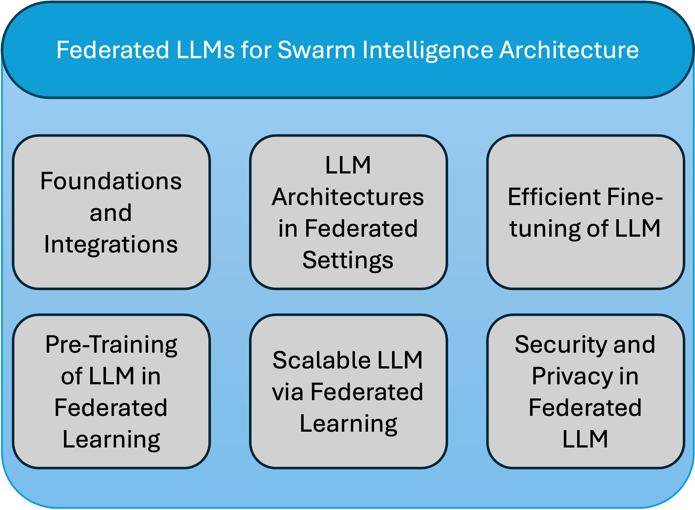

# 群体智能中的联邦学习驱动大型语言模型：综述探索

发布时间：2024年06月14日

`联邦学习为训练大型语言模型提供了一个既解决数据隐私问题又实现去中心化的框架。本文深入探讨了联邦学习大型语言模型的最新进展，特别聚焦于机器遗忘这一关键技术，以符合“被遗忘权”等隐私法规。在联邦LLMs的背景下，机器遗忘意味着在不重新训练模型的情况下，系统且安全地移除个体数据对模型的影响。我们分析了多种实现有效遗忘的策略，包括扰动技术、模型分解和增量学习，并讨论了它们如何平衡模型性能与数据隐私。此外，通过分析最新的案例研究和实验结果，我们评估了这些方法在实际应用中的效果和效率。调查显示，开发更强大和可扩展的联邦遗忘方法正成为研究热点，预示着这一领域在AI伦理与分布式机器学习技术交汇处的重要未来研究方向。
LLM应用` `联邦学习` `数据隐私`

> Federated Learning driven Large Language Models for Swarm Intelligence: A Survey

# 摘要

> 联邦学习为训练大型语言模型提供了一个既解决数据隐私问题又实现去中心化的框架。本文深入探讨了联邦学习大型语言模型的最新进展，特别聚焦于机器遗忘这一关键技术，以符合“被遗忘权”等隐私法规。在联邦LLMs的背景下，机器遗忘意味着在不重新训练模型的情况下，系统且安全地移除个体数据对模型的影响。我们分析了多种实现有效遗忘的策略，包括扰动技术、模型分解和增量学习，并讨论了它们如何平衡模型性能与数据隐私。此外，通过分析最新的案例研究和实验结果，我们评估了这些方法在实际应用中的效果和效率。调查显示，开发更强大和可扩展的联邦遗忘方法正成为研究热点，预示着这一领域在AI伦理与分布式机器学习技术交汇处的重要未来研究方向。

> Federated learning (FL) offers a compelling framework for training large language models (LLMs) while addressing data privacy and decentralization challenges. This paper surveys recent advancements in the federated learning of large language models, with a particular focus on machine unlearning, a crucial aspect for complying with privacy regulations like the Right to be Forgotten. Machine unlearning in the context of federated LLMs involves systematically and securely removing individual data contributions from the learned model without retraining from scratch. We explore various strategies that enable effective unlearning, such as perturbation techniques, model decomposition, and incremental learning, highlighting their implications for maintaining model performance and data privacy. Furthermore, we examine case studies and experimental results from recent literature to assess the effectiveness and efficiency of these approaches in real-world scenarios. Our survey reveals a growing interest in developing more robust and scalable federated unlearning methods, suggesting a vital area for future research in the intersection of AI ethics and distributed machine learning technologies.

[Arxiv](https://arxiv.org/abs/2406.09831)