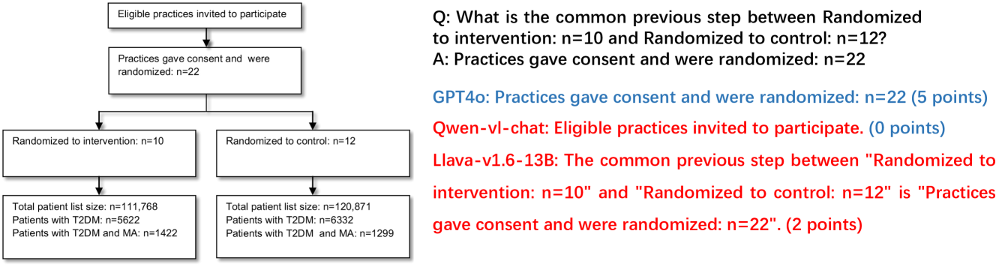

# 首次开展对多模态大型语言模型流程图理解能力的多维度评估研究

发布时间：2024年06月14日

`LLM应用

这篇论文介绍了FlowCE，一个专门用于评估多模态大型语言模型（MLLMs）在流程图相关任务中表现的综合评估工具。FlowCE的设计目的是从多个维度（如推理、定位识别、信息提取、逻辑验证及总结能力）评估MLLMs的能力。这种评估工具的开发和应用直接关联到LLM的实际应用场景，特别是在处理流程图任务方面的能力评估。因此，这篇论文属于LLM应用分类。` `流程图` `多模态语言模型`

> First Multi-Dimensional Evaluation of Flowchart Comprehension for Multimodal Large Language Models

# 摘要

> 随着多模态大型语言模型（MLLMs）技术的进步，其能力日益增强。尽管已有多种评估系统，但针对流程图相关任务的全面评估方法仍显不足，这些任务在生活和工作中至关重要。为此，我们推出了首个全面评估工具FlowCE，旨在多维度评估MLLMs在流程图任务中的表现，包括推理、定位识别、信息提取、逻辑验证及总结能力。遗憾的是，即便是最先进的GPT4o模型，得分也仅为56.63。开源模型中，Phi-3-Vision以49.97分领先。我们期待FlowCE能推动基于流程图任务的MLLMs研究，并已将该项目开源于：\url{https://github.com/360AILAB-NLP/FlowCE}。

> With the development of multimodal large language models (MLLMs) technology, its general capabilities are increasingly powerful. To evaluate the various abilities of MLLMs, numerous evaluation systems have emerged. But now there is still a lack of a comprehensive method to evaluate MLLMs in the tasks related to flowcharts, which are very important in daily life and work. We propose the first comprehensive method, FlowCE, to assess MLLMs across various dimensions for tasks related to flowcharts. It encompasses evaluating MLLMs' abilities in Reasoning, Localization Recognition, Information Extraction, Logical Verification, and Summarization on flowcharts. However, we find that even the GPT4o model achieves only a score of 56.63. Among open-source models, Phi-3-Vision obtained the highest score of 49.97. We hope that FlowCE can contribute to future research on multimodal large language models (MLLMs) for tasks based on flowcharts. We are open-sourcing this project: \url{https://github.com/360AILAB-NLP/FlowCE}

[Arxiv](https://arxiv.org/abs/2406.10057)