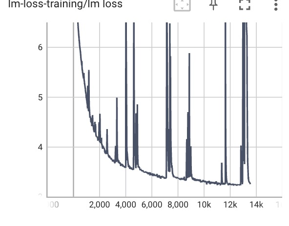
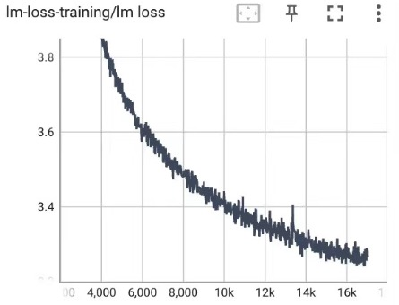
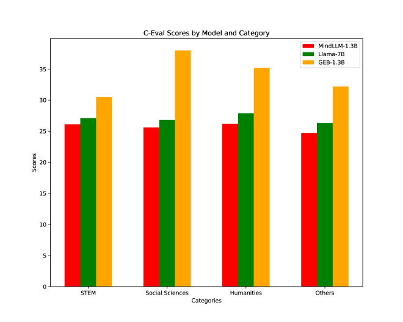

# GEB-1.3B：一款开放的轻量级大型语言模型

发布时间：2024年06月14日

`LLM应用

理由：这篇论文主要介绍了GEB-1.3B这一轻量级大型语言模型（LLM）的开发和性能，强调了其在CPU上的高效运行和优越的性能表现。论文中提到的技术如ROPE、Group-Query-Attention和FlashAttention-2，以及模型在多个基准测试中的表现，都是针对LLM在实际应用中的优化和改进。因此，这篇论文更符合LLM应用分类，因为它关注的是LLM在实际场景中的应用和性能优化，而不是理论研究或Agent的设计与实现。` `机器学习`

> GEB-1.3B: Open Lightweight Large Language Model

# 摘要

> 近期，如ChatGPT、Claude和Llama等大型语言模型（LLMs）展现了卓越性能，甚至在多项任务中超越人类表现。然而，这些模型对计算资源的巨大需求，使得它们只能在高性能服务器上运行，且常导致响应延迟。随着对LLMs在CPU上高效运行的需求日益增长，轻量级模型研究逐渐兴起。本研究推出的GEB-1.3B，是一款在中英文数据上训练了5500亿令牌的轻量级LLM，采用了ROPE、Group-Query-Attention和FlashAttention-2等创新训练技术，既加速了训练过程，又保持了模型性能。通过使用1000万个指令样本进行微调，GEB-1.3B在MMLU、C-Eval和CMMLU等基准测试中表现卓越，超越了同类模型。特别地，GEB-1.3B的FP32版本在CPU上的推理速度令人瞩目，且正通过量化技术进一步提升速度。GEB-1.3B的开源发布，标志着轻量级LLMs领域的一大进步。

> Recently developed large language models (LLMs) such as ChatGPT, Claude, and Llama have demonstrated impressive abilities, and even surpass human-level performance in several tasks. Despite their success, the resource-intensive demands of these models, requiring significant computational power for both training and inference, limit their deployment to high-performance servers. Additionally, the extensive calculation requirements of the models often lead to increased latency in response times. With the increasing need for LLMs to operate efficiently on CPUs, research about lightweight models that are optimized for CPU inference has emerged. In this work, we introduce GEB-1.3B, a lightweight LLM trained on 550 billion tokens in both Chinese and English languages. We employ novel training techniques, including ROPE, Group-Query-Attention, and FlashAttention-2, to accelerate training while maintaining model performance. Additionally, we fine-tune the model using 10 million samples of instruction data to enhance alignment. GEB-1.3B exhibits outstanding performance on general benchmarks such as MMLU, C-Eval, and CMMLU, outperforming comparative models such as MindLLM-1.3B and TinyLLaMA-1.1B. Notably, the FP32 version of GEB-1.3B achieves commendable inference times on CPUs, with ongoing efforts to further enhance speed through advanced quantization techniques. The release of GEB-1.3B as an open-source model marks a significant contribution to the development of lightweight LLMs, promising to foster further research and innovation in the field.

[Arxiv](https://arxiv.org/abs/2406.09900)