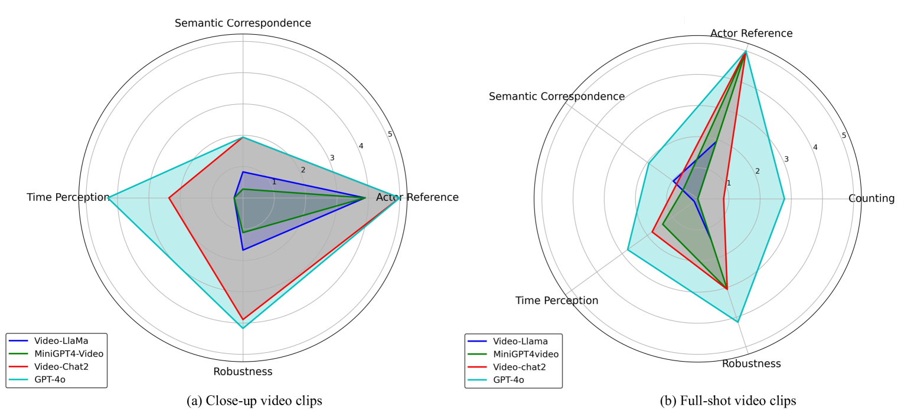

# GPT-4o：探索多模态大型语言模型在解读小猪行为中的视觉洞察力

发布时间：2024年06月14日

`LLM应用

理由：这篇论文主要探讨了多模态大型语言模型（LLMs）在畜牧场景中动物行为识别任务中的应用。研究聚焦于评估这些模型在视觉感知能力方面的表现，并通过特定的测试数据集进行全面评估。论文内容涉及模型的实际应用和性能评估，而非理论研究或Agent的设计与实现，因此最适合归类为LLM应用。` `畜牧业` `动物行为学`

> GPT-4o: Visual perception performance of multimodal large language models in piglet activity understanding

# 摘要

> 动物行为学在动物研究中占据重要地位，而动物行为标注则是研究的基础。这一过程涉及复杂、主观且多模态的视频片段标注。随着多模态大型语言模型（LLMs）技术的飞速发展，畜牧场景中的动物行为理解任务迎来了新的应用。本研究聚焦于评估这些模型在动物活动识别中的视觉感知能力，为此我们制作了包含仔猪特写及全景视频片段的测试数据集。通过在计数、行为者指称、语义对应、时间感知和鲁棒性五个方面的全面评估，我们发现尽管这些模型在语义对应和时间感知上尚需提升，但已初步展现出识别动物活动的能力。特别地，GPT-4o在这一领域表现卓越，尤其是在特写视频片段中，Video-Chat2和GPT-4o的语义对应和时间感知能力显著优于全景视频。这些初步实验不仅证实了多模态大型语言模型在畜牧场景视频理解中的潜力，也为未来的动物行为视频研究指明了新方向。此外，深入研究视觉提示对模型的影响，有望通过人类视觉处理技术进一步提升畜牧场景中动物行为识别的精确度和效率。

> Animal ethology is an crucial aspect of animal research, and animal behavior labeling is the foundation for studying animal behavior. This process typically involves labeling video clips with behavioral semantic tags, a task that is complex, subjective, and multimodal. With the rapid development of multimodal large language models(LLMs), new application have emerged for animal behavior understanding tasks in livestock scenarios. This study evaluates the visual perception capabilities of multimodal LLMs in animal activity recognition. To achieve this, we created piglet test data comprising close-up video clips of individual piglets and annotated full-shot video clips. These data were used to assess the performance of four multimodal LLMs-Video-LLaMA, MiniGPT4-Video, Video-Chat2, and GPT-4 omni (GPT-4o)-in piglet activity understanding. Through comprehensive evaluation across five dimensions, including counting, actor referring, semantic correspondence, time perception, and robustness, we found that while current multimodal LLMs require improvement in semantic correspondence and time perception, they have initially demonstrated visual perception capabilities for animal activity recognition. Notably, GPT-4o showed outstanding performance, with Video-Chat2 and GPT-4o exhibiting significantly better semantic correspondence and time perception in close-up video clips compared to full-shot clips. The initial evaluation experiments in this study validate the potential of multimodal large language models in livestock scene video understanding and provide new directions and references for future research on animal behavior video understanding. Furthermore, by deeply exploring the influence of visual prompts on multimodal large language models, we expect to enhance the accuracy and efficiency of animal behavior recognition in livestock scenarios through human visual processing methods.

[Arxiv](https://arxiv.org/abs/2406.09781)