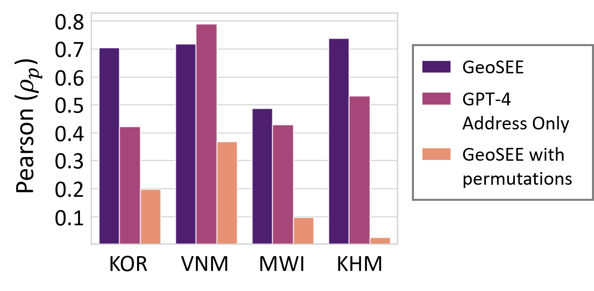
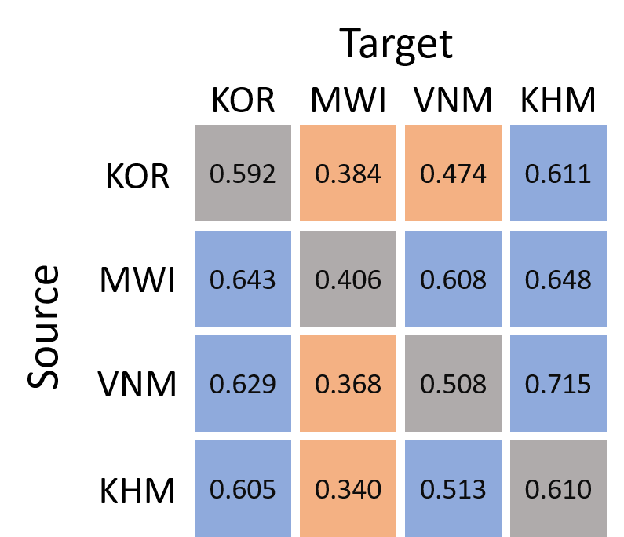
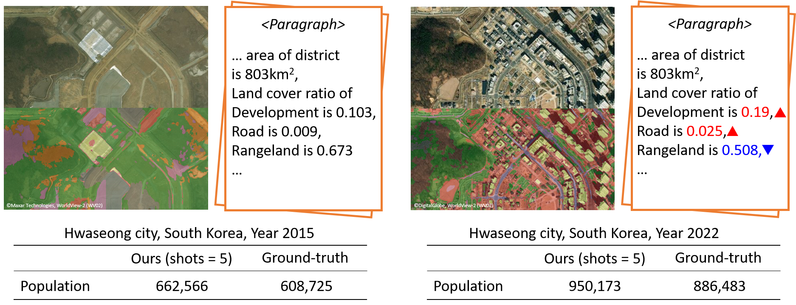

# GeoSEE：借助大型语言模型，精准估算区域社会经济状况

发布时间：2024年06月14日

`LLM应用

这篇论文摘要描述了一种名为GeoSEE的方法，该方法利用大型语言模型（LLM）来评估和预测社会经济状况，特别是在大范围地理区域内。这种方法通过结合AI驱动的推理模型和多源异构数据，能够精准估计各类社会经济指标。GeoSEE方法特别强调了其在无监督和低样本情境下的优越性能，以及其在资源有限的国家中的经济高效性。这表明该论文主要关注LLM在实际应用中的效能，特别是在社会经济分析领域的应用，因此应归类为LLM应用。` `社会经济评估` `可持续发展`

> GeoSEE: Regional Socio-Economic Estimation With a Large Language Model

# 摘要

> 通过结合AI驱动的推理模型与多源异构数据，我们超越了传统调查的局限，为在大范围地理区域内评估社会经济状况（如贫困和人口）开辟了新途径。GeoSEE方法利用大型语言模型（LLM）的统一流程，精准估计各类社会经济指标。面对多样化的信息模块，包括卫星图像预处理数据，GeoSEE智能选择适用于每个国家和指标的模块，其选择依据是LLM内置的社会地理知识，宛如领域专家的智慧。系统通过情境学习，整合所选模块的自然语言文本结果，计算出目标指标。在不同发展阶段的国家中，我们的方法在无监督和低样本情境下均展现出优于其他模型的预测能力。在资源有限的国家，这种高效且经济的性能，凸显了GeoSEE在全球范围内持续监测和推动可持续发展目标（如减贫和公平增长）的巨大潜力。

> Moving beyond traditional surveys, combining heterogeneous data sources with AI-driven inference models brings new opportunities to measure socio-economic conditions, such as poverty and population, over expansive geographic areas. The current research presents GeoSEE, a method that can estimate various socio-economic indicators using a unified pipeline powered by a large language model (LLM). Presented with a diverse set of information modules, including those pre-constructed from satellite imagery, GeoSEE selects which modules to use in estimation, for each indicator and country. This selection is guided by the LLM's prior socio-geographic knowledge, which functions similarly to the insights of a domain expert. The system then computes target indicators via in-context learning after aggregating results from selected modules in the format of natural language-based texts. Comprehensive evaluation across countries at various stages of development reveals that our method outperforms other predictive models in both unsupervised and low-shot contexts. This reliable performance under data-scarce setting in under-developed or developing countries, combined with its cost-effectiveness, underscores its potential to continuously support and monitor the progress of Sustainable Development Goals, such as poverty alleviation and equitable growth, on a global scale.

[Arxiv](https://arxiv.org/abs/2406.09799)