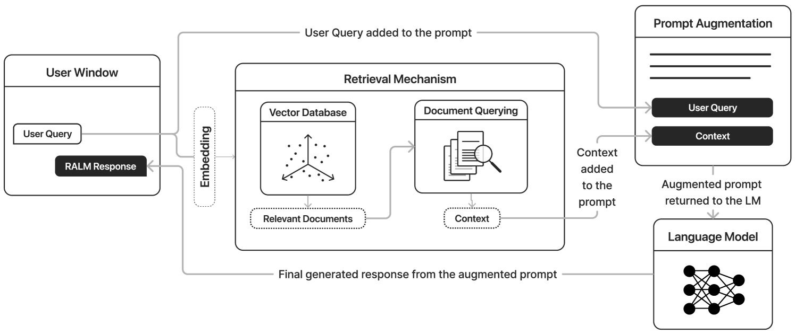
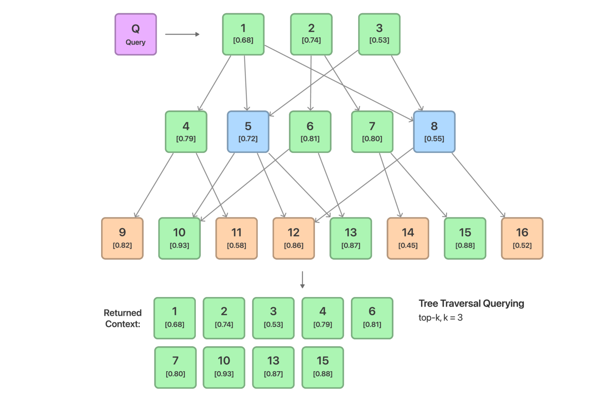
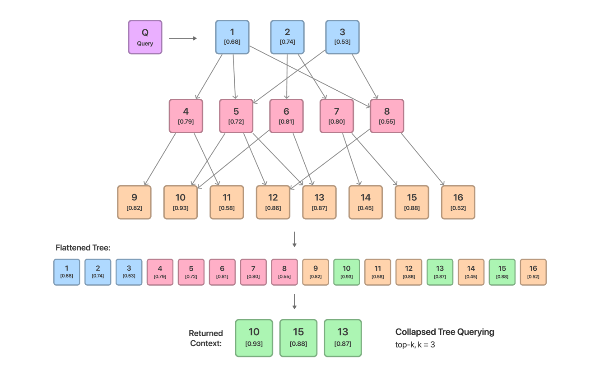
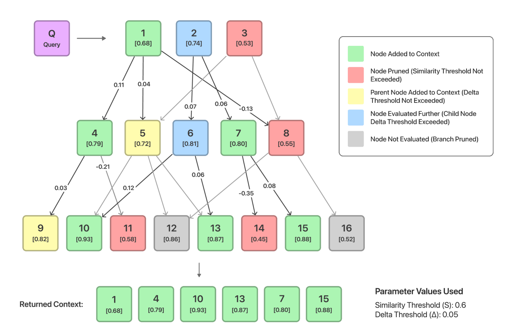
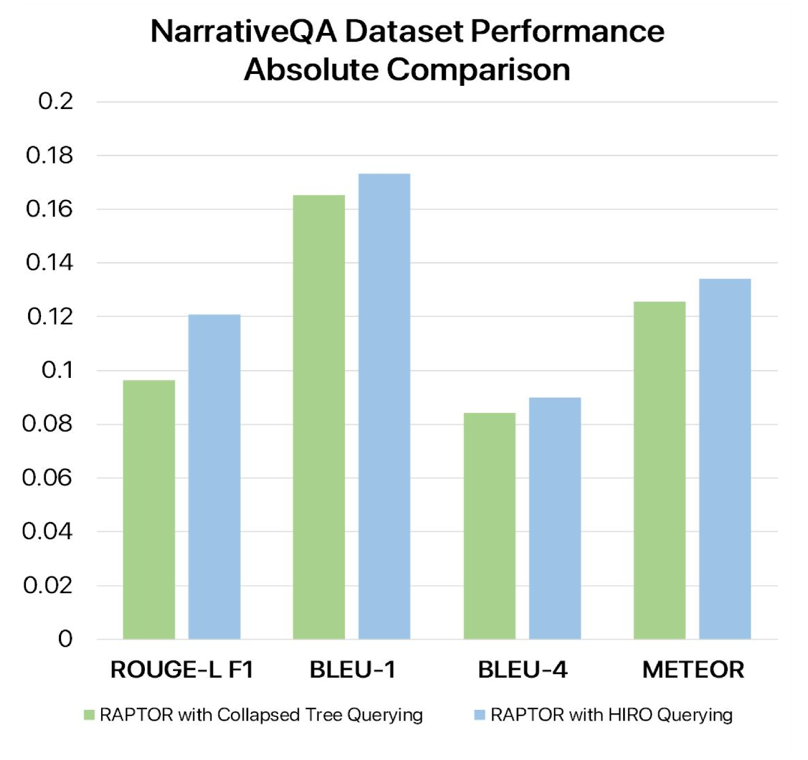
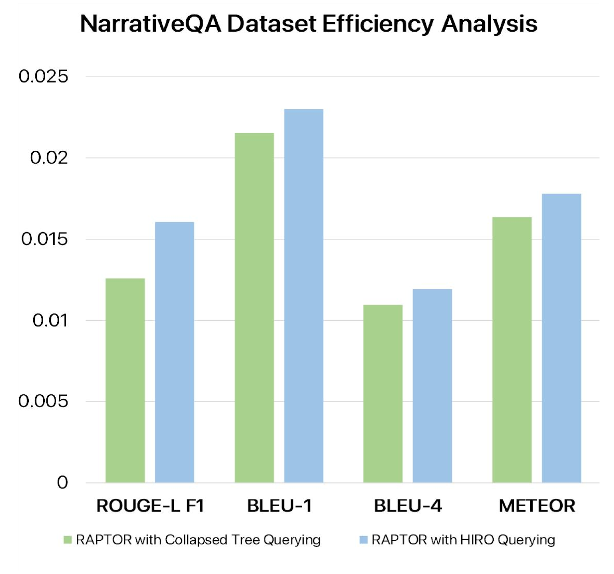
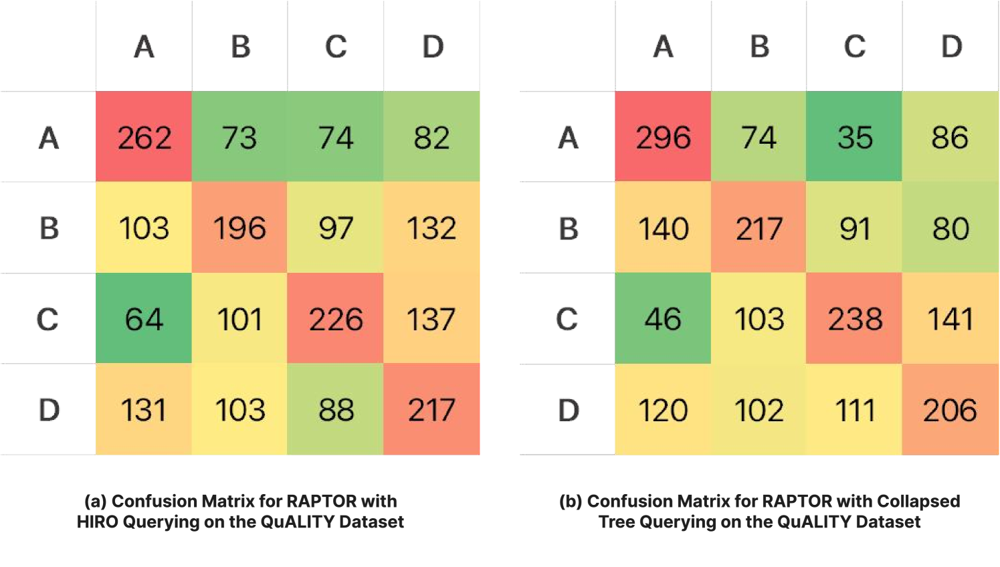

# HIRO：优化分层信息检索策略

发布时间：2024年06月14日

`RAG

这篇论文主要讨论了检索增强生成（RAG）技术在大型语言模型（LLMs）中的应用，特别是在处理长篇上下文时的挑战和改进方法。论文介绍了HIRO（分层信息检索优化）这一新型查询方法，它利用分层结构存储文档，并通过深度优先搜索和分支修剪来优化信息检索过程，从而提高LLMs在知识密集任务中的性能。因此，这篇论文属于RAG分类。` `信息检索`

> HIRO: Hierarchical Information Retrieval Optimization

# 摘要

> 大型语言模型（LLMs）虽在自然语言处理任务中表现卓越，但受限于静态训练数据，其响应常显陈旧或浅显。检索增强生成（RAG）通过实时整合外部知识，显著提升了模型在知识密集任务中的准确性与可信度。然而，RAG增强的LLMs在面对长篇上下文时显得力不从心，信息过载导致响应质量受损。近期，RAG应用开始采用分层数据结构存储文档，以不同层次的总结和信息密度进行组织。在此基础上，我们推出了HIRO（分层信息检索优化），一种利用分层结构存储文档的新型查询方法。HIRO通过深度优先搜索的递归相似度计算和分支修剪，有效减少了返回给LLM的上下文量，同时确保信息无损。在NarrativeQA数据集上，HIRO相较现有查询机制实现了10.85%的性能提升。

> Large Language Models (LLMs) excel in natural language tasks but face limitations due to static training datasets, resulting in outdated or contextually shallow responses. Retrieval-Augmented Generation (RAG) addresses this by integrating real-time external knowledge, enhancing model accuracy and credibility, especially for knowledge-intensive tasks. However, RAG-enhanced LLMs struggle with long contexts, causing them to "choke" on information overload, compromising response quality. Recent RAG applications use hierarchical data structures for storing documents, organized at various levels of summarization and information density. In this context, we introduce HIRO (Hierarchical Information Retrieval Optimization), a novel querying approach for RAG applications using hierarchical structures for storing documents. HIRO employs DFS-based recursive similarity score calculation and branch pruning to minimize the context returned to the LLM without informational loss. HIRO outperforms existing querying mechanisms on the NarrativeQA dataset by an absolute performance gain of 10.85%.

[Arxiv](https://arxiv.org/abs/2406.09979)