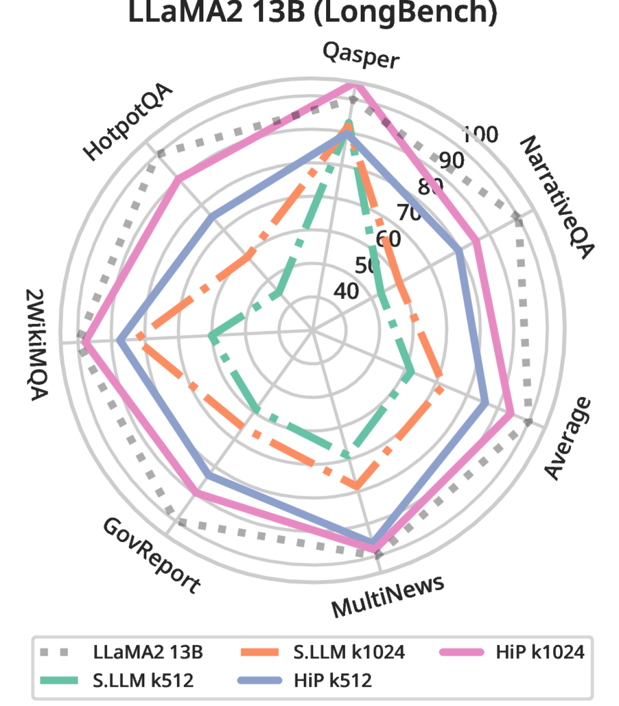
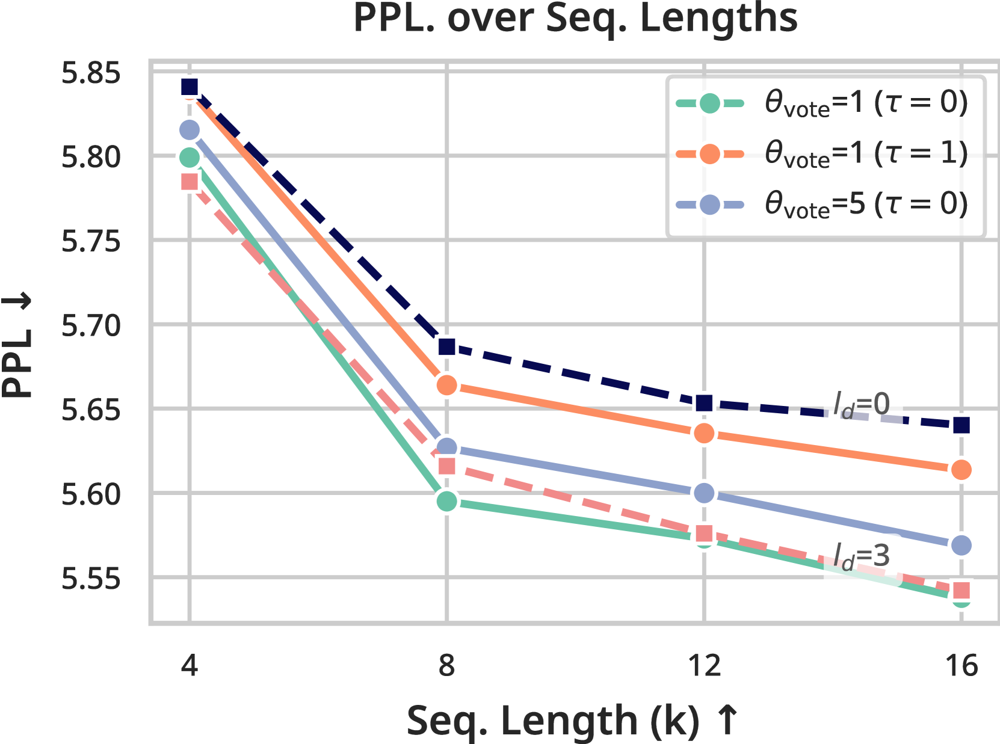

# HiP Attention：通过分层注意力剪枝实现的高效稀疏亚二次方注意力机制

发布时间：2024年06月14日

`LLM理论

理由：这篇论文主要探讨了大型语言模型（LLM）中处理长序列的技术挑战，并提出了一种新的分层修剪注意力（HiP）方法来优化时间和空间复杂性。这种研究侧重于改进LLM的内部机制，特别是注意力机制，以提高其处理长序列的能力。因此，它属于LLM理论分类，因为它涉及模型内部的工作原理和性能优化，而不是直接的应用或特定的Agent或RAG框架。` `多模态问答`

> HiP Attention: Sparse Sub-Quadratic Attention with Hierarchical Attention Pruning

# 摘要

> 在大型语言模型中，提升序列长度是增强其处理复杂任务（如多模态问答）理解和连贯性的关键。然而，传统注意力机制的二次复杂性使得长序列处理成本高昂，且受限于GPU内存。尽管有线性和稀疏注意力机制的提出，但重新训练的需求限制了它们的应用。我们提出的分层修剪注意力（HiP）方法，通过动态稀疏注意力机制和创新的树搜索算法，将时间复杂性从$O(T^2)$降至$O(T \log T)$，空间复杂性从$O(T^2)$降至$O(T)$，且无需额外训练。HiP确保了无遗漏，优于基于滑动窗口的方法。实验证明，HiP在保持生成质量的同时，大幅降低了延迟和内存消耗。其即插即用的特性使得预训练模型能在标准GPU上处理数百万标记，为长上下文应用开辟了新可能。

> In modern large language models (LLMs), increasing sequence lengths is a crucial challenge for enhancing their comprehension and coherence in handling complex tasks such as multi-modal question answering. However, handling long context sequences with LLMs is prohibitively costly due to the conventional attention mechanism's quadratic time and space complexity, and the context window size is limited by the GPU memory. Although recent works have proposed linear and sparse attention mechanisms to address this issue, their real-world applicability is often limited by the need to re-train pre-trained models. In response, we propose a novel approach, Hierarchically Pruned Attention (HiP), which simultaneously reduces the training and inference time complexity from $O(T^2)$ to $O(T \log T)$ and the space complexity from $O(T^2)$ to $O(T)$. To this end, we devise a dynamic sparse attention mechanism that generates an attention mask through a novel tree-search-like algorithm for a given query on the fly. HiP is training-free as it only utilizes the pre-trained attention scores to spot the positions of the top-$k$ most significant elements for each query. Moreover, it ensures that no token is overlooked, unlike the sliding window-based sub-quadratic attention methods, such as StreamingLLM. Extensive experiments on diverse real-world benchmarks demonstrate that HiP significantly reduces prompt (i.e., prefill) and decoding latency and memory usage while maintaining high generation performance with little or no degradation. As HiP allows pretrained LLMs to scale to millions of tokens on commodity GPUs with no additional engineering due to its easy plug-and-play deployment, we believe that our work will have a large practical impact, opening up the possibility to many long-context LLM applications previously infeasible.

[Arxiv](https://arxiv.org/abs/2406.09827)