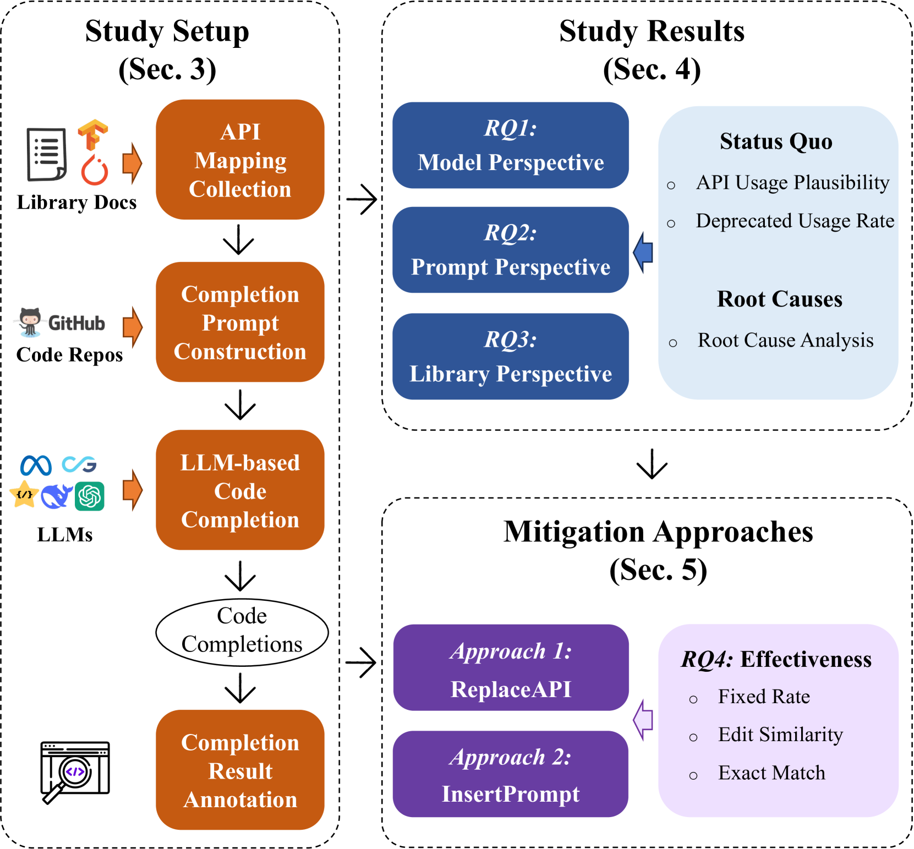
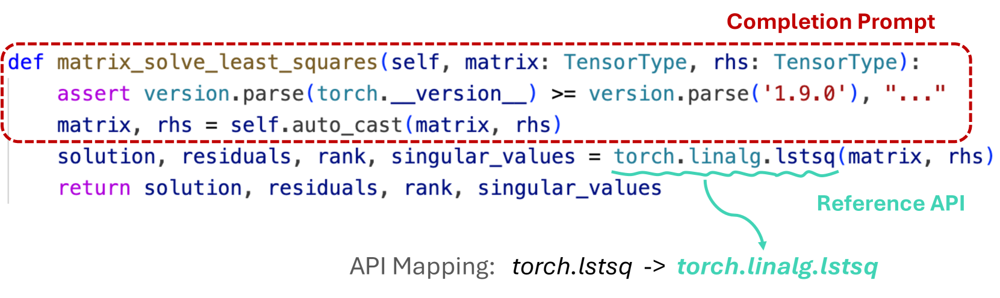
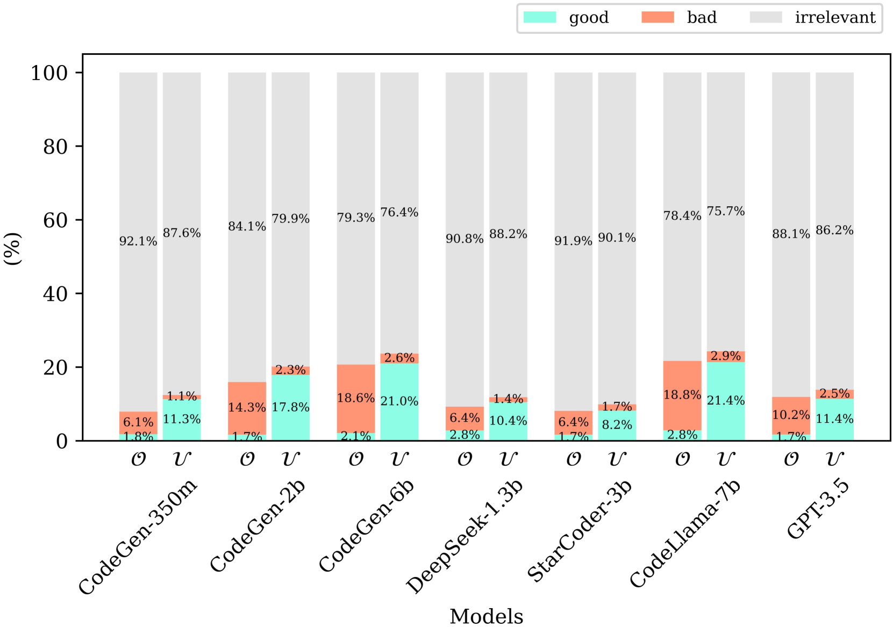
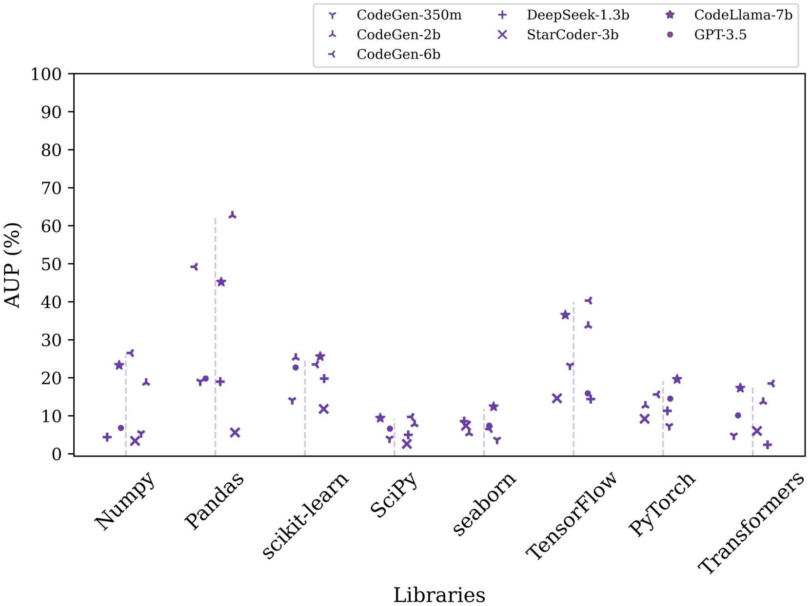
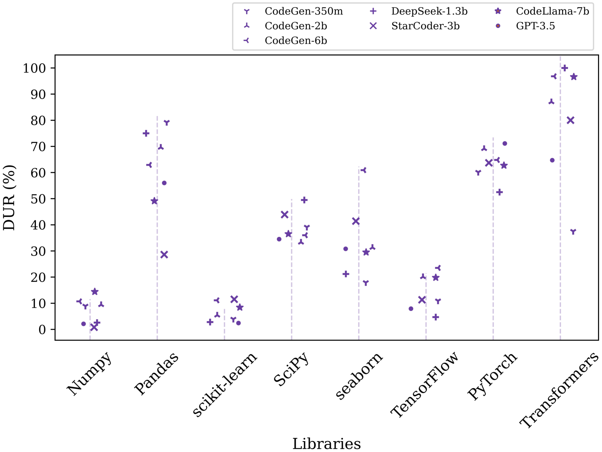

# 大型语言模型（LLMs）在代码补全中使用已弃用API的原因与方式：一项实证研究

发布时间：2024年06月14日

`LLM应用

这篇论文主要关注大型语言模型（LLMs）在代码补全任务中处理废弃API的问题。它评估了LLMs在这种情况下的表现，并提出了两种修复策略。这属于LLM在特定应用场景（即代码补全）中的实际应用问题，因此应归类为LLM应用。` `软件开发` `人工智能`

> How and Why LLMs Use Deprecated APIs in Code Completion? An Empirical Study

# 摘要

> 大型语言模型（LLMs）在处理代码补全任务时表现出色，但面对快速更新的库API时，它们往往难以准确调用最新的接口。尽管已有研究指出LLMs在预测API时可能出错，但关于废弃API在LLMs代码补全中的具体问题，研究尚不充分。为此，我们首次对LLMs在代码补全中使用废弃API的情况进行了评估。研究涵盖了七种先进的LLMs，涉及145个来自八个热门Python库的API映射，以及28,125个补全提示。研究揭示了模型、提示和库在废弃API使用上的现状和根源。基于此，我们提出了\textsc{ReplaceAPI}和\textsc{InsertPrompt}两种轻量级修复策略，为未来研究提供了基准。同时，我们也探讨了如何将库的演化与基于LLMs的软件开发更好地结合，为未来的研究方向提供了启示。

> Large language models (LLMs), pre-trained or fine-tuned on large code corpora, have shown effectiveness in generating code completions. However, in LLM-based code completion, LLMs may struggle to use correct and up-to-date Application Programming Interfaces (APIs) due to the rapid and continuous evolution of libraries. While existing studies have highlighted issues with predicting incorrect APIs, the specific problem of deprecated API usage in LLM-based code completion has not been thoroughly investigated.
  To address this gap, we conducted the first evaluation study on deprecated API usage in LLM-based code completion. This study involved seven advanced LLMs, 145 API mappings from eight popular Python libraries, and 28,125 completion prompts. The study results reveal the \textit{status quo} and \textit{root causes} of deprecated API usage in LLM-based code completion from the perspectives of \textit{model}, \textit{prompt}, and \textit{library}. Based on these findings, we propose two lightweight fixing approaches, \textsc{ReplaceAPI} and \textsc{InsertPrompt}, which can serve as baseline approaches for future research on mitigating deprecated API usage in LLM-based completion. Additionally, we provide implications for future research on integrating library evolution with LLM-driven software development.

[Arxiv](https://arxiv.org/abs/2406.09834)