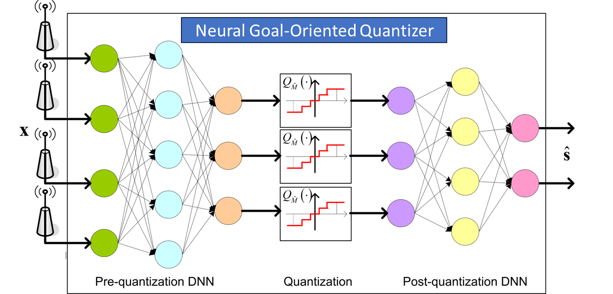

# AI时代的信息压缩：探索最新进展与未来挑战

发布时间：2024年06月14日

`LLM理论

理由：这篇论文的摘要主要关注了机器学习与数据压缩领域的联系，探讨了深度学习技术在推动任务导向和目标导向压缩中的应用，以及在不同类型数据（如图像、视频、文本）压缩中的应用。虽然这些内容与大型语言模型（LLM）相关，但更侧重于理论探讨和未来研究方向的展望，而不是具体的LLM应用或Agent、RAG相关的研究。因此，将其归类为LLM理论是合适的。` `数据压缩` `机器学习`

> Information Compression in the AI Era: Recent Advances and Future Challenges

# 摘要

> 本文综述了机器学习与数据压缩领域的新兴联系，探讨了如何通过深度学习技术推动任务导向和目标导向压缩的发展，以及在图像、视频乃至文本压缩中的应用。同时，我们也展望了这一领域的未来研究方向，期待更多创新理论与实践的涌现。

> This survey articles focuses on emerging connections between the fields of machine learning and data compression. While fundamental limits of classical (lossy) data compression are established using rate-distortion theory, the connections to machine learning have resulted in new theoretical analysis and application areas. We survey recent works on task-based and goal-oriented compression, the rate-distortion-perception theory and compression for estimation and inference. Deep learning based approaches also provide natural data-driven algorithmic approaches to compression. We survey recent works on applying deep learning techniques to task-based or goal-oriented compression, as well as image and video compression. We also discuss the potential use of large language models for text compression. We finally provide some directions for future research in this promising field.

[Arxiv](https://arxiv.org/abs/2406.10036)