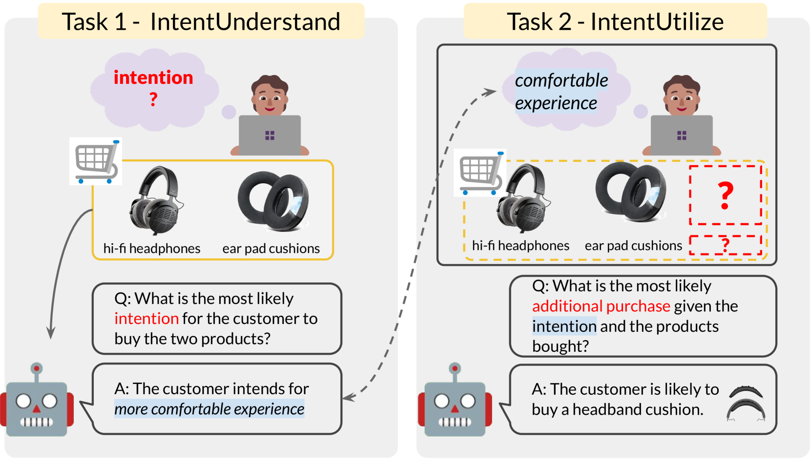
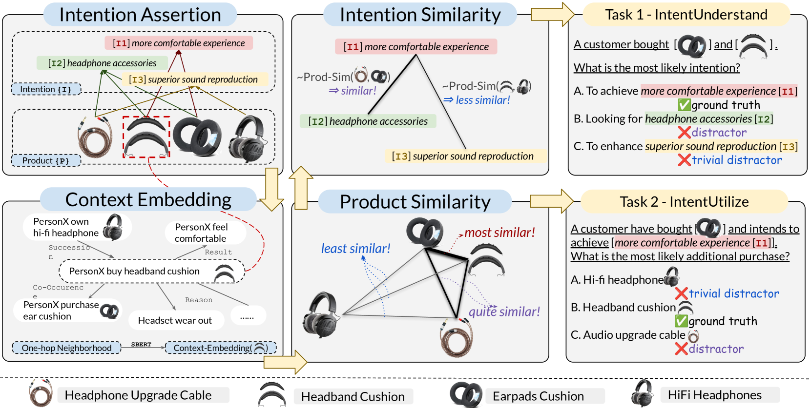
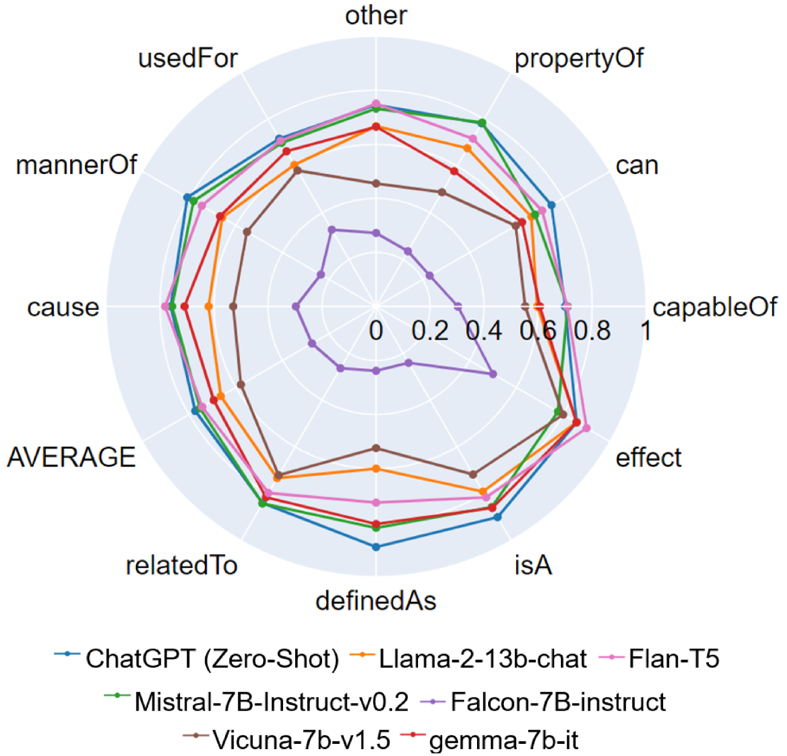
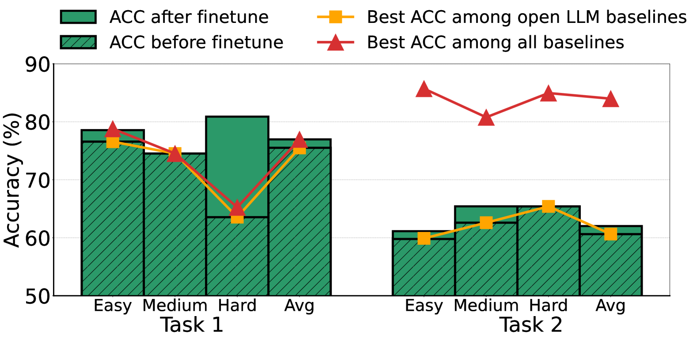

# IntentionQA：电子商务中语言模型购买意图理解能力的评估基准

发布时间：2024年06月14日

`LLM应用

这篇论文介绍了一个名为IntentionQA的新基准，用于评估语言模型在电子商务场景中理解和应用购买意图的能力。该基准通过双任务多项选择问答的形式，旨在检验模型在推断用户意图和预测未来购买行为方面的表现。论文通过广泛的测试和人类评估，揭示了当前语言模型在理解和推理购买意图方面的不足。因此，这篇论文属于LLM应用分类，因为它专注于实际应用场景中语言模型的性能评估和改进。` `电子商务` `问答系统`

> IntentionQA: A Benchmark for Evaluating Purchase Intention Comprehension Abilities of Language Models in E-commerce

# 摘要

> 提升语言模型（LMs）在电子商务场景中洞察购买意图的能力，对于其在多样的下游任务中发挥效用至关重要。然而，以往的方法在从LMs中提炼出适用于现实电子商务环境的、有意义且以人为本的购买意图时，往往力不从心。这不禁让人质疑LMs对购买意图的理解和应用的真实深度。为此，我们推出了IntentionQA，一个双任务多项选择问答基准，旨在检验LMs在电子商务中对购买意图的理解力。该基准要求LMs根据已购产品推断用户意图，并据此预测未来的购买行为。IntentionQA精心设计了4,360个问题，涵盖三个难度等级，通过自动化流程确保其在大规模电子商务平台上的适用性。人类评估证实了该基准的高质量和低误判率。在19个语言模型上的广泛测试揭示，它们在理解产品与意图、联合推理等方面仍显不足，远未达到人类水平。我们的代码和数据已公开，详情请访问https://github.com/HKUST-KnowComp/IntentionQA。

> Enhancing Language Models' (LMs) ability to understand purchase intentions in E-commerce scenarios is crucial for their effective assistance in various downstream tasks. However, previous approaches that distill intentions from LMs often fail to generate meaningful and human-centric intentions applicable in real-world E-commerce contexts. This raises concerns about the true comprehension and utilization of purchase intentions by LMs. In this paper, we present IntentionQA, a double-task multiple-choice question answering benchmark to evaluate LMs' comprehension of purchase intentions in E-commerce. Specifically, LMs are tasked to infer intentions based on purchased products and utilize them to predict additional purchases. IntentionQA consists of 4,360 carefully curated problems across three difficulty levels, constructed using an automated pipeline to ensure scalability on large E-commerce platforms. Human evaluations demonstrate the high quality and low false-negative rate of our benchmark. Extensive experiments across 19 language models show that they still struggle with certain scenarios, such as understanding products and intentions accurately, jointly reasoning with products and intentions, and more, in which they fall far behind human performances. Our code and data are publicly available at https://github.com/HKUST-KnowComp/IntentionQA.

[Arxiv](https://arxiv.org/abs/2406.10173)