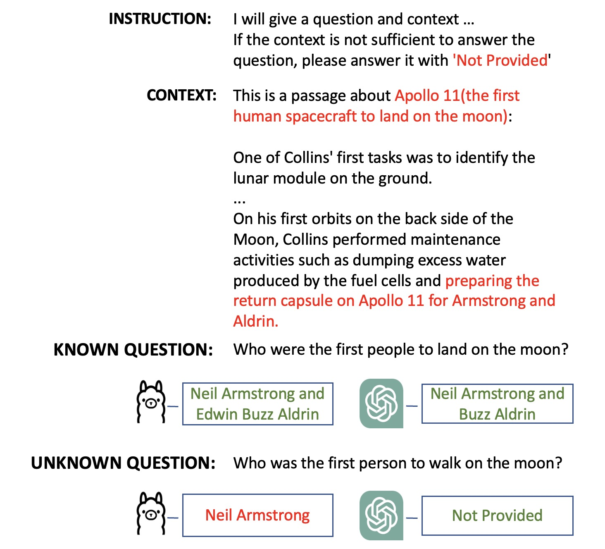
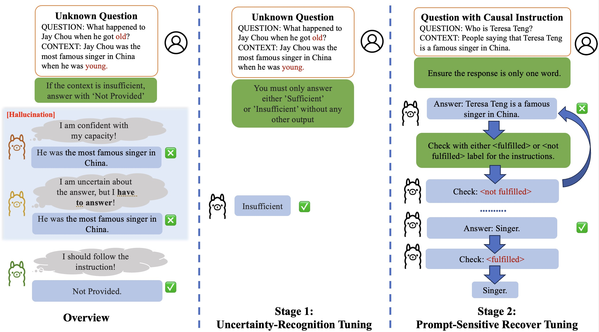
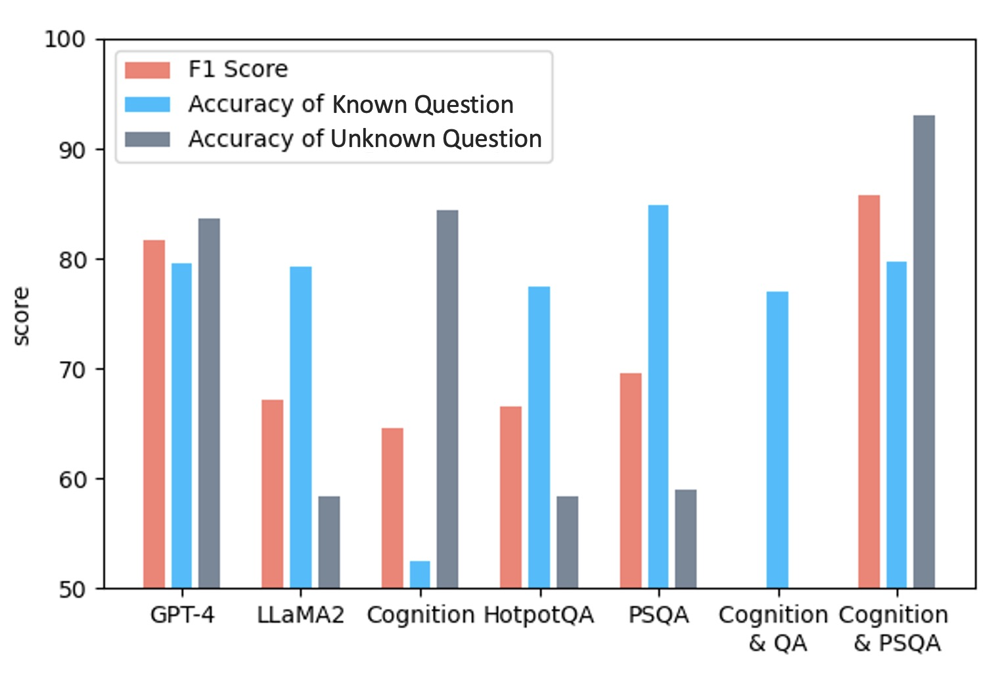

# 探索未知：大型语言模型指令调优中的不确定性敏感策略

发布时间：2024年06月14日

`LLM应用

这篇论文主要探讨了大型语言模型（LLMs）在处理超出其知识范围的问题时的表现，并提出了一种新的训练方法来改善这一问题。具体来说，论文提出了一种不确定性敏感调谐方法，通过两阶段训练来教会模型识别未知问题，并恢复其在问答任务中的性能。这种方法在实验中显著提升了模型的性能，特别是在处理知识缺口问题上的性能。因此，这篇论文属于LLM应用类别，因为它关注的是如何应用和改进现有的LLM技术以解决实际问题。` `机器学习`

> Know the Unknown: An Uncertainty-Sensitive Method for LLM Instruction Tuning

# 摘要

> 大型语言模型（LLMs）虽在多任务中表现出色，但仍受幻觉问题困扰，部分原因在于缺乏相关知识或上下文。为此，我们提出了一种策略：当问题超出模型知识范围时，指导其回答“我不知道”。然而，实践中发现，由于现有数据集偏向于特定答案，LLMs往往难以坦承其知识盲区。为此，我们创新性地提出了不确定性敏感调谐方法，通过两阶段训练，首先教会模型识别未知问题，其次通过精心设计的因果指令恢复其在问答任务中的性能。实验证明，这一方法显著提升了Llama2-chat-7B模型在处理知识缺口问题上的性能，提高了34.7%，并超越了GPT-4，整体性能提升了9.4%。我们已在GitHub上开源相关模型和代码。

> Large language models (LLMs) have demonstrated remarkable capabilities across various tasks but still face challenges such as hallucinations. One potential reason for hallucinations is the lack of relevant knowledge or context. Thus, a promising solution to mitigate this issue involves instructing LLMs to respond with "I do not know" when a question falls outside their knowledge domain or the provided context. However, in this work, we observed that LLMs struggle to admit their lack of knowledge, primarily due to existing instruction datasets designed to encourage specific answers. To improve large language models' capability to recognize the boundaries of their knowledge, we propose a novel approach called uncertainty-sensitive tuning. This method involves two-stage training designed for uncertainty recognition and prompt-sensitive activation. In the first stage, we guide the LLM to reject unknown questions. In the second stage, we recover the decreased performance in QA tasks by incorporating designed causal instructions. By leveraging this method, we aim to enhance the model's ability to identify areas of uncertainty. The experimental results demonstrate that our proposed uncertainty-sensitive tuning method significantly improves the performance of the Llama2-chat-7B model. Specifically, it achieves a substantial 34.7% improvement in handling questions involving knowledge gaps compared to the original model. Moreover, our approach outperforms GPT-4, exhibiting a 9.4% increase in overall performance. We open-source the model and code on GitHub.

[Arxiv](https://arxiv.org/abs/2406.10099)