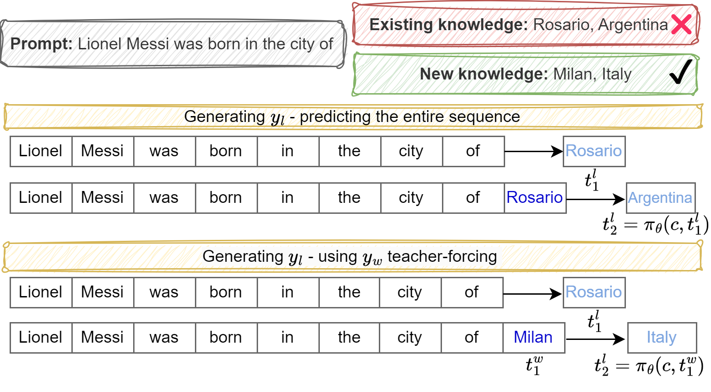

# 语言模型知识编辑：采用适应性直接偏好优化策略

发布时间：2024年06月14日

`LLM理论

理由：这篇论文主要探讨了大型语言模型（LLMs）的知识更新问题，并提出了一种新的方法——知识直接偏好优化（KDPO）。这种方法是对现有直接偏好优化（DPO）的改进，专门设计用于知识更新。论文的核心贡献在于提出了一种新的理论和方法来解决LLMs的知识过时问题，这属于LLM理论的范畴，因为它涉及模型内部机制的改进和优化，而不是直接的应用或Agent的设计。` `机器学习`

> Knowledge Editing in Language Models via Adapted Direct Preference Optimization

# 摘要

> 大型语言模型（LLMs）随着时间可能因缺乏最新知识而过时，导致事实错误和知识断层。知识编辑（KE）通过无需昂贵再训练的权重更新来解决这一问题。我们将KE视为LLM对齐问题，并提出了一种名为知识直接偏好优化（KDPO）的新方法，它是直接偏好优化（DPO）的改进版，更适合知识更新。我们的方法采用在线更新机制，用现有知识作为负例，新知识作为正例，通过DPO过程进行知识融合。同时，我们利用教师强制策略优化负例生成，确保局部变化的可控性。在多个数据集和模型上，我们的KE方法与前沿技术进行了100至500次连续编辑的对比测试，并通过消融研究验证了其相对于标准DPO的优越性。实验结果显示，我们的KDPO方法在知识编辑上更为精细，性能与以往方法相当或更优。

> Large Language Models (LLMs) can become outdated over time as they may lack updated world knowledge, leading to factual knowledge errors and gaps. Knowledge Editing (KE) aims to overcome this challenge using weight updates that do not require expensive retraining. We propose treating KE as an LLM alignment problem. Toward this goal, we introduce Knowledge Direct Preference Optimization (KDPO), a variation of the Direct Preference Optimization (DPO) that is more effective for knowledge modifications. Our method is based on an online approach that continually updates the knowledge stored in the model. We use the current knowledge as a negative sample and the new knowledge we want to introduce as a positive sample in a process called DPO. We also use teacher-forcing for negative sample generation and optimize using the positive sample, which helps maintain localized changes. We tested our KE method on various datasets and models, comparing it to several cutting-edge methods, with 100 and 500 sequential edits. Additionally, we conducted an ablation study comparing our method to the standard DPO approach. Our experimental results show that our modified DPO method allows for more refined KE, achieving similar or better performance compared to previous methods.

[Arxiv](https://arxiv.org/abs/2406.09920)