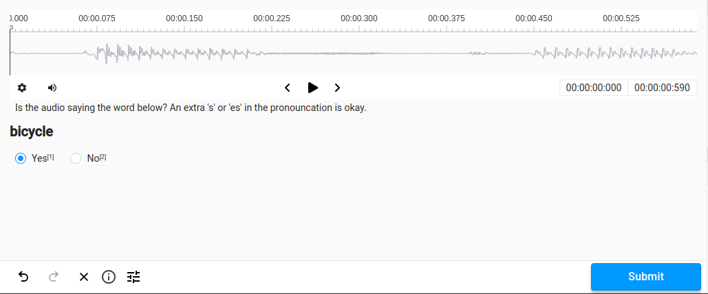
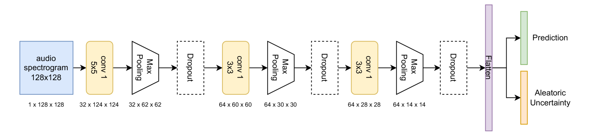

# LUMA：探索不确定与多模态数据的学习新基准

发布时间：2024年06月14日

`多模态深度学习

这篇论文主要关注的是多模态深度学习领域，特别是如何处理和理解不确定性对多模态模型的影响。论文介绍了LUMA数据集，这是一个专为处理不确定性和多模态数据设计的基准数据集，并且提供了相关的工具和预训练模型来支持这一领域的研究和评估。虽然论文中提到了Gemma-7B大型语言模型，但这主要是为了生成文本数据，而不是探讨LLM的理论或应用。因此，这篇论文更符合多模态深度学习的范畴，而不是Agent、RAG、LLM应用或LLM理论。` `数据集`

> LUMA: A Benchmark Dataset for Learning from Uncertain and Multimodal Data

# 摘要

> 多模态深度学习通过融合文本、图像、音频和视频等多元信息源，显著提升了决策质量。为了构建可靠的多模态系统，我们必须深入理解不确定性对这些模型的影响。为此，我们推出了LUMA，一个专为处理不确定性和多模态数据设计的独特基准数据集，涵盖50个类别的音频、图像和文本数据。LUMA不仅扩展了CIFAR 10/100数据集，还融入了来自三个音频库的样本和Gemma-7B大型语言模型生成的文本。该数据集允许我们精确控制不同类型和级别的不确定性，以适应特定的实验和基准测试需求。作为Python包，LUMA提供了生成数据集变体、调整数据多样性和噪声水平以及引入分布外样本的功能。此外，我们还提供了一个基线预训练模型和三种不确定性量化技术：蒙特卡洛丢弃、深度集成和可靠的冲突多视角学习。这一全面的数据集及其配套工具，旨在推动和支持可信赖且稳健的多模态深度学习方法的发展和评估。

> Multimodal Deep Learning enhances decision-making by integrating diverse information sources, such as texts, images, audio, and videos. To develop trustworthy multimodal approaches, it is essential to understand how uncertainty impacts these models. We introduce LUMA, a unique benchmark dataset, featuring audio, image, and textual data from 50 classes, for learning from uncertain and multimodal data. It extends the well-known CIFAR 10/100 dataset with audio samples extracted from three audio corpora, and text data generated using the Gemma-7B Large Language Model (LLM). The LUMA dataset enables the controlled injection of varying types and degrees of uncertainty to achieve and tailor specific experiments and benchmarking initiatives. LUMA is also available as a Python package including the functions for generating multiple variants of the dataset with controlling the diversity of the data, the amount of noise for each modality, and adding out-of-distribution samples. A baseline pre-trained model is also provided alongside three uncertainty quantification methods: Monte-Carlo Dropout, Deep Ensemble, and Reliable Conflictive Multi-View Learning. This comprehensive dataset and its tools are intended to promote and support the development and benchmarking of trustworthy and robust multimodal deep learning approaches.

[Arxiv](https://arxiv.org/abs/2406.09864)