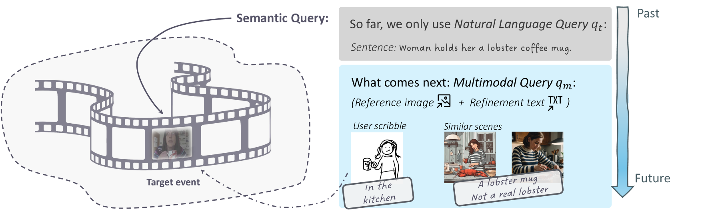
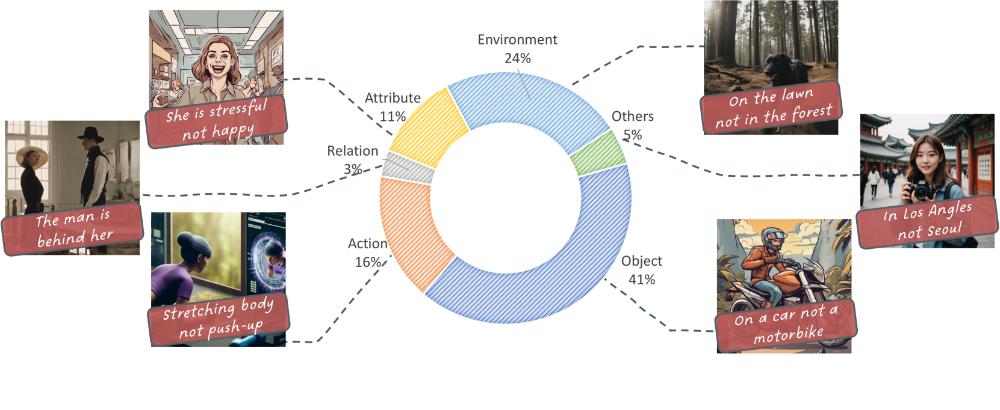
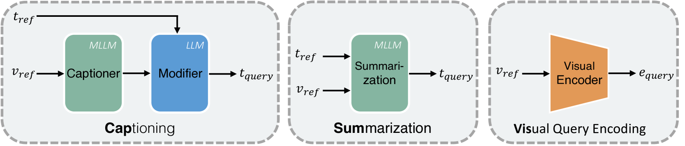
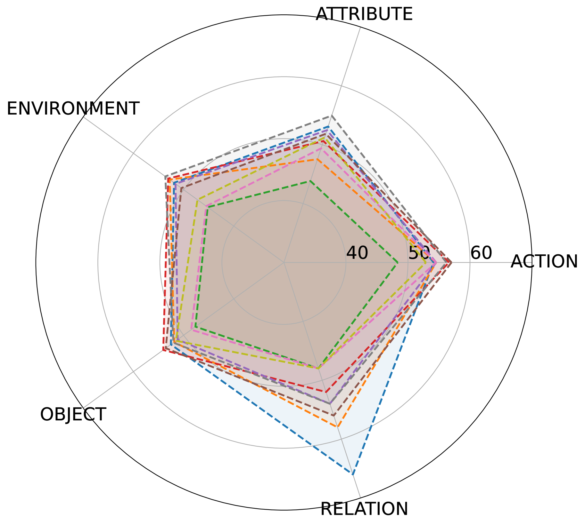
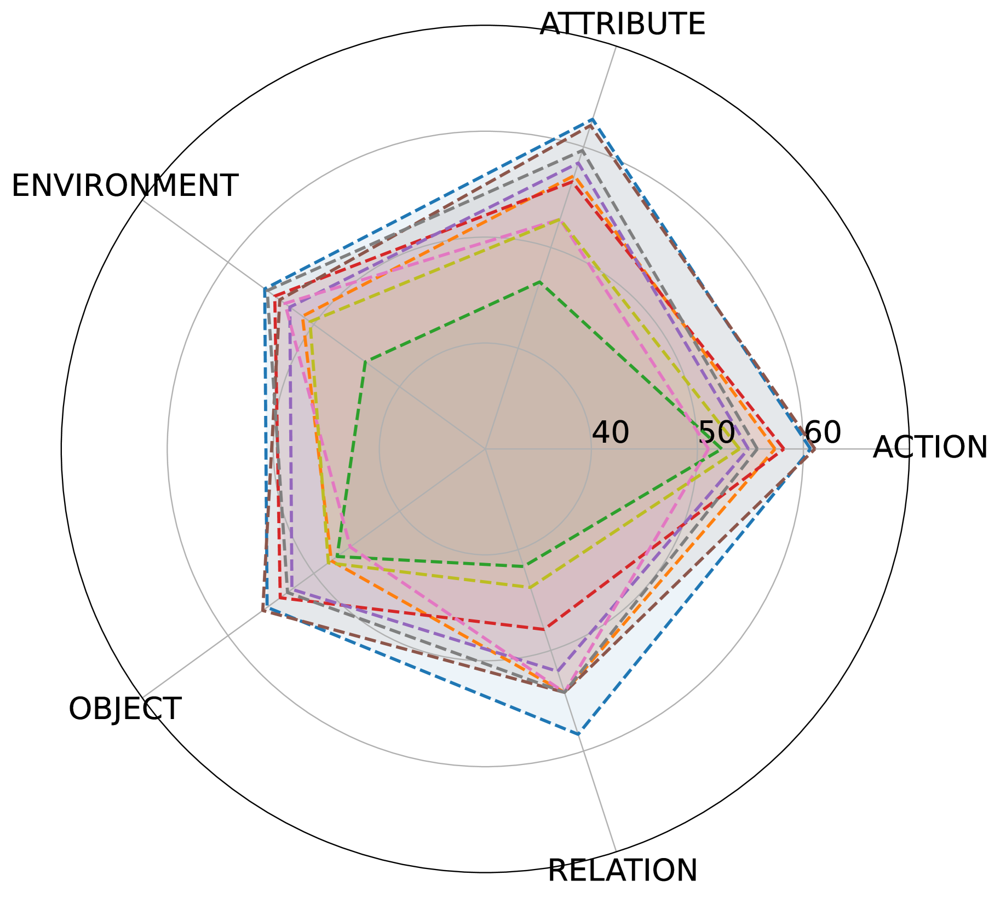
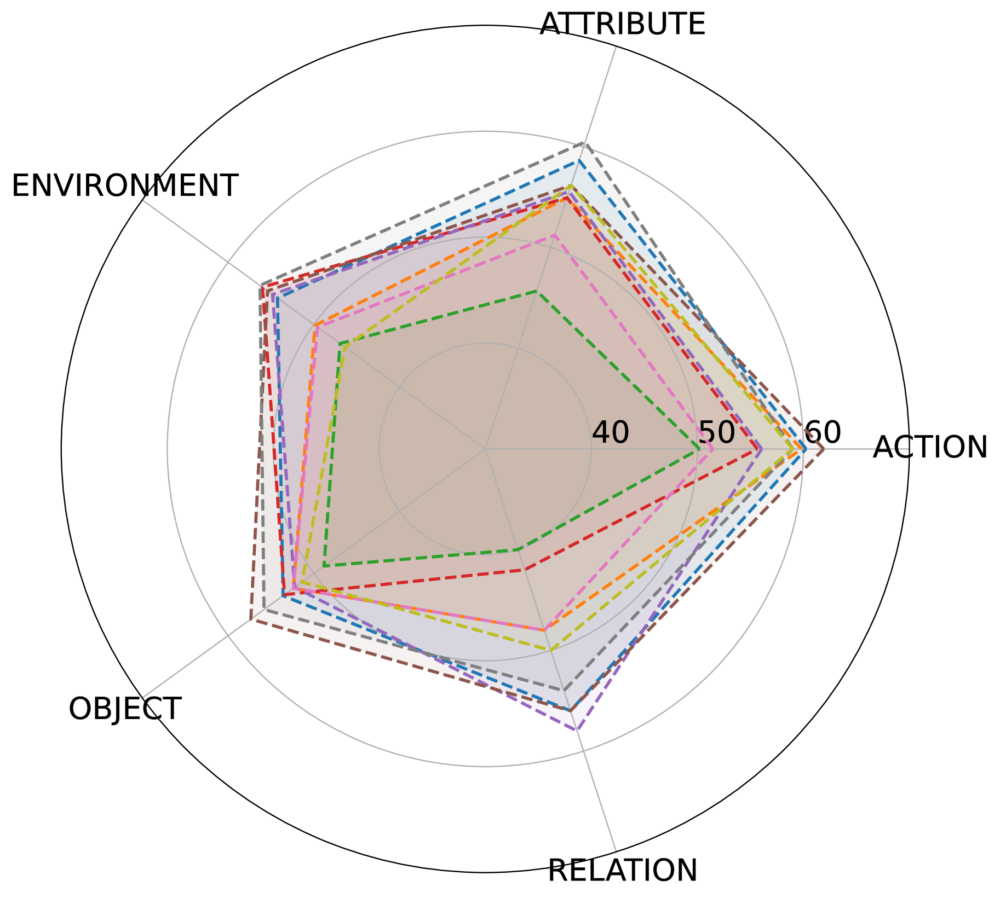
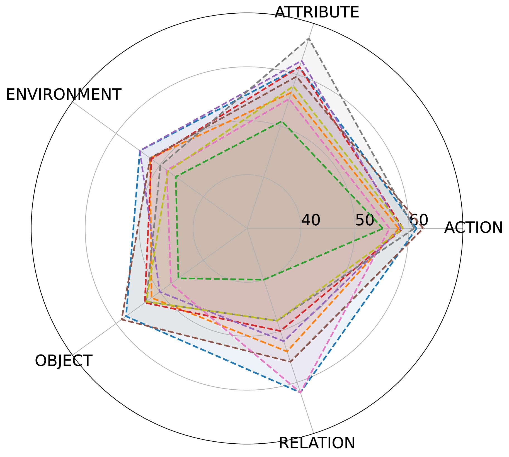
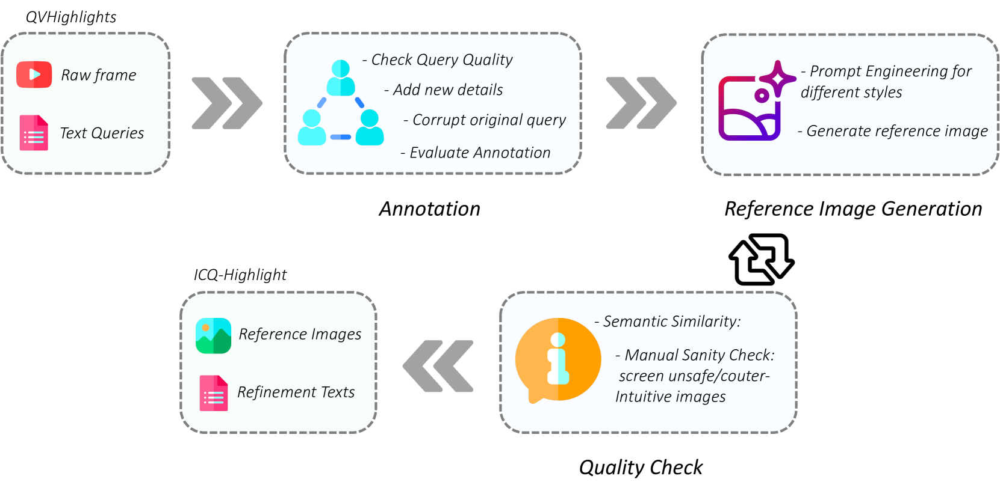
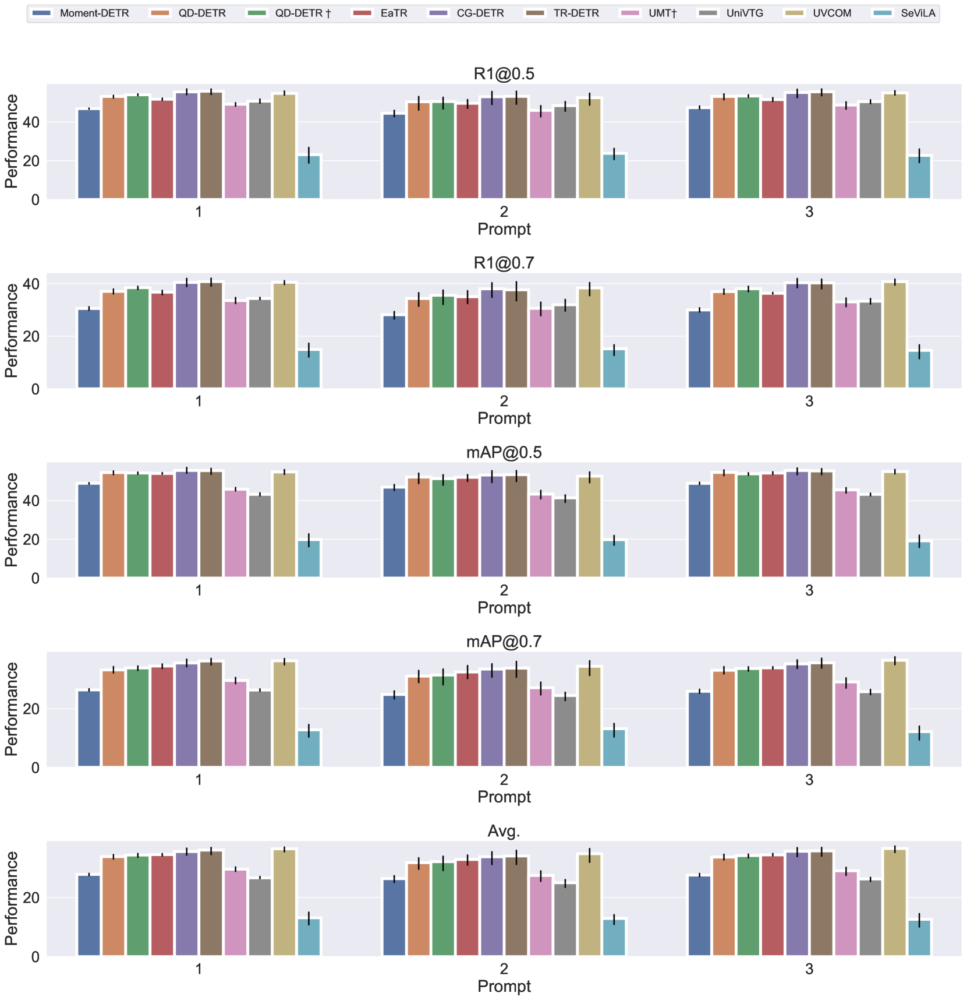
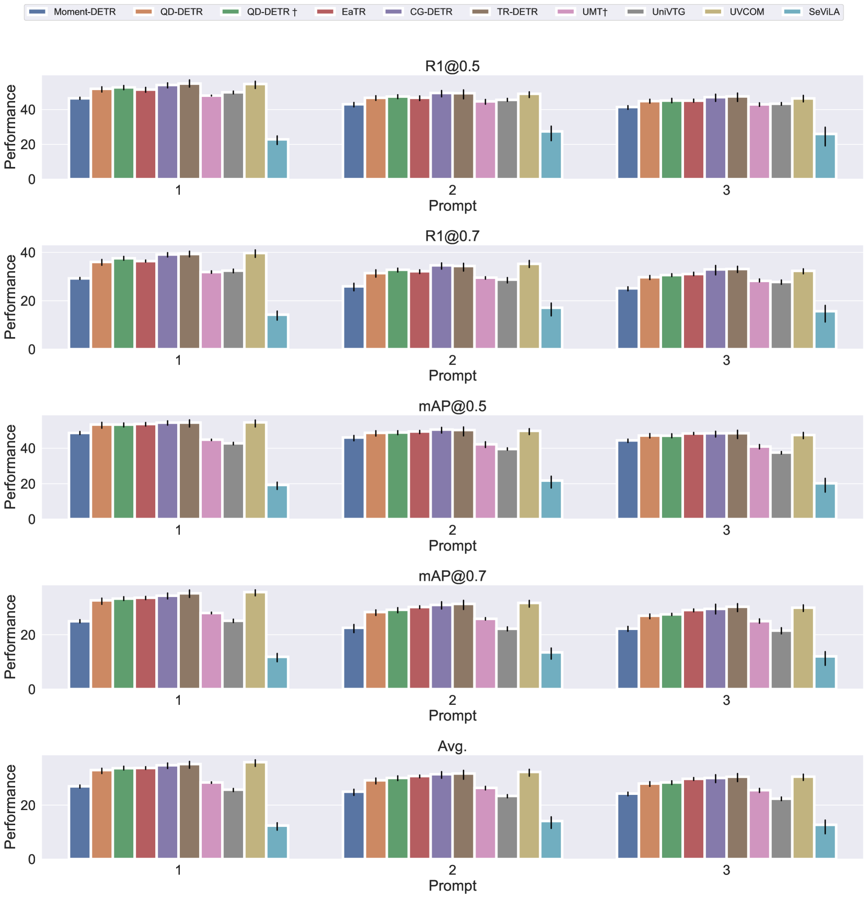

# 借助多模态查询，精准定位视频中的事件

发布时间：2024年06月14日

`Agent

理由：这篇论文主要关注的是视频理解领域中的多模态查询问题，特别是通过结合图像和文本的方式来定位视频中的特定事件。虽然这种方法涉及到模型的应用，但其核心在于开发和评估一个能够理解和响应多模态查询的Agent，即一个能够处理复杂输入并执行特定任务（如视频事件定位）的智能系统。因此，这篇论文更适合归类为Agent，因为它强调了模型作为智能代理在处理复杂任务中的应用和性能评估。` `视频理解` `多模态查询`

> Localizing Events in Videos with Multimodal Queries

# 摘要

> 在数字时代，视频理解至关重要，但其动态多变的特点使得处理视频既费力又计算密集。因此，基于语义查询定位视频中的特定事件，在用户应用（如视频搜索）和视频基础模型的研究中变得尤为关键。然而，现有研究多局限于使用自然语言描述事件，忽略了图像与文本结合的多模态查询潜力。为此，我们推出了新基准ICQ及评估数据集ICQ-Highlight，旨在通过包含参考图像和细化文本的多模态查询，评估模型定位事件的能力。我们设计了4种图像风格和5种文本类型，以全面考察模型在不同领域的性能，并提出了3种适应策略，对10种顶尖模型进行了评估，涵盖从专业到大规模基础模型的广泛范围。我们视此为探索视频事件定位中多模态查询的起点。

> Video understanding is a pivotal task in the digital era, yet the dynamic and multievent nature of videos makes them labor-intensive and computationally demanding to process. Thus, localizing a specific event given a semantic query has gained importance in both user-oriented applications like video search and academic research into video foundation models. A significant limitation in current research is that semantic queries are typically in natural language that depicts the semantics of the target event. This setting overlooks the potential for multimodal semantic queries composed of images and texts. To address this gap, we introduce a new benchmark, ICQ, for localizing events in videos with multimodal queries, along with a new evaluation dataset ICQ-Highlight. Our new benchmark aims to evaluate how well models can localize an event given a multimodal semantic query that consists of a reference image, which depicts the event, and a refinement text to adjust the images' semantics. To systematically benchmark model performance, we include 4 styles of reference images and 5 types of refinement texts, allowing us to explore model performance across different domains. We propose 3 adaptation methods that tailor existing models to our new setting and evaluate 10 SOTA models, ranging from specialized to large-scale foundation models. We believe this benchmark is an initial step toward investigating multimodal queries in video event localization.

[Arxiv](https://arxiv.org/abs/2406.10079)