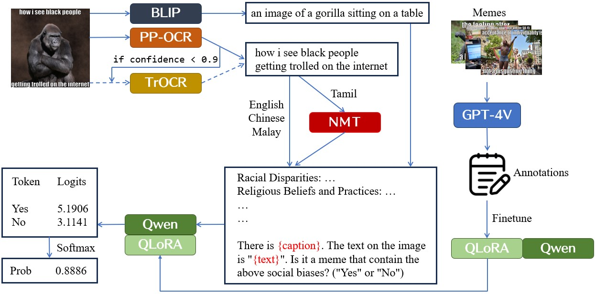
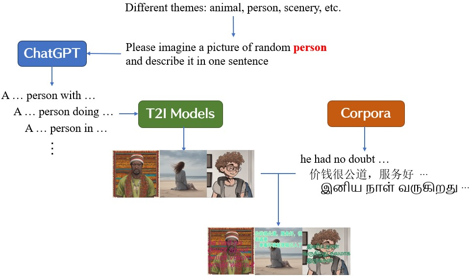

# OSPC：借助大型语言模型之力，精准识别有害模因

发布时间：2024年06月14日

`Agent

理由：这篇论文描述了一个集成多种技术的系统，用于检测和分类有害模因，特别是在多语言环境中。该系统结合了图像描述技术、光学字符识别和大型语言模型分析，并进行了微调以提高性能。这个系统可以被视为一个智能Agent，因为它能够自主地执行任务（检测有害模因），并在特定的环境中（新加坡的多元文化及多语言环境）进行操作。此外，该系统在AI新加坡举办的在线安全奖挑战赛中取得了优异的成绩，进一步证明了其作为一个有效Agent的能力。` `网络安全` `社交媒体`

> OSPC: Detecting Harmful Memes with Large Language Model as a Catalyst

# 摘要

> 模因在网络上的快速传播，不仅传递个人观点，也加剧了社会偏见和歧视的扩散。本研究针对新加坡多元文化及多语言环境，提出了一种创新的检测有害模因的方法。该方法融合了图像描述技术、光学字符识别及大型语言模型分析，以全面识别和分类有害模因。我们采用BLIP模型生成图像描述，PP-OCR与TrOCR进行多语言文本识别，Qwen LLM则用于深入理解语言细节，确保系统能有效辨识英语、中文、马来语及泰米尔语中的有害模因内容。为进一步提升系统性能，我们借助GPT-4V标记的数据进行了方法微调，旨在将GPT-4V对有害模因的识别能力融入我们的系统。此框架在AI新加坡举办的在线安全奖挑战赛中荣登榜首，AUROC高达0.7749，准确率达0.7087，显著领先于其他参赛团队。与以往的基准相比，我们的方法表现更佳，FLAVA的AUROC为0.5695，VisualBERT为0.5561。

> Memes, which rapidly disseminate personal opinions and positions across the internet, also pose significant challenges in propagating social bias and prejudice. This study presents a novel approach to detecting harmful memes, particularly within the multicultural and multilingual context of Singapore. Our methodology integrates image captioning, Optical Character Recognition (OCR), and Large Language Model (LLM) analysis to comprehensively understand and classify harmful memes. Utilizing the BLIP model for image captioning, PP-OCR and TrOCR for text recognition across multiple languages, and the Qwen LLM for nuanced language understanding, our system is capable of identifying harmful content in memes created in English, Chinese, Malay, and Tamil. To enhance the system's performance, we fine-tuned our approach by leveraging additional data labeled using GPT-4V, aiming to distill the understanding capability of GPT-4V for harmful memes to our system. Our framework achieves top-1 at the public leaderboard of the Online Safety Prize Challenge hosted by AI Singapore, with the AUROC as 0.7749 and accuracy as 0.7087, significantly ahead of the other teams. Notably, our approach outperforms previous benchmarks, with FLAVA achieving an AUROC of 0.5695 and VisualBERT an AUROC of 0.5561.

[Arxiv](https://arxiv.org/abs/2406.09779)