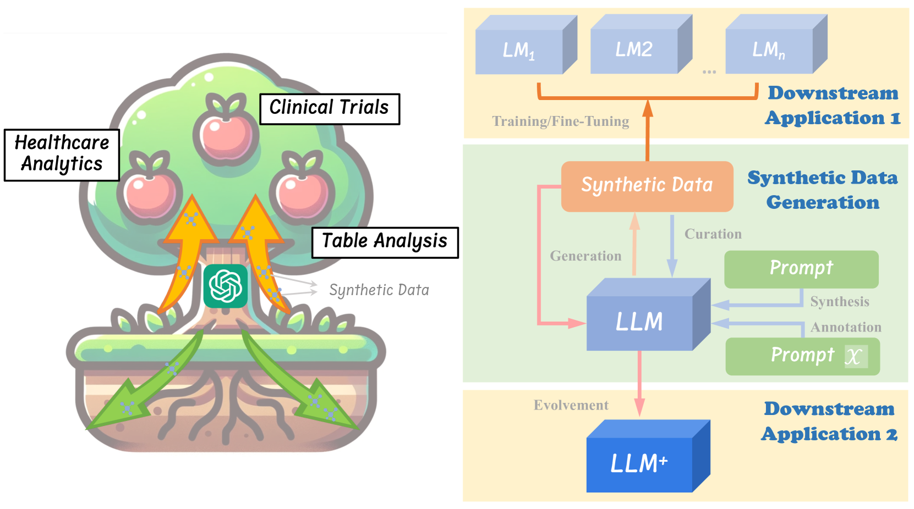
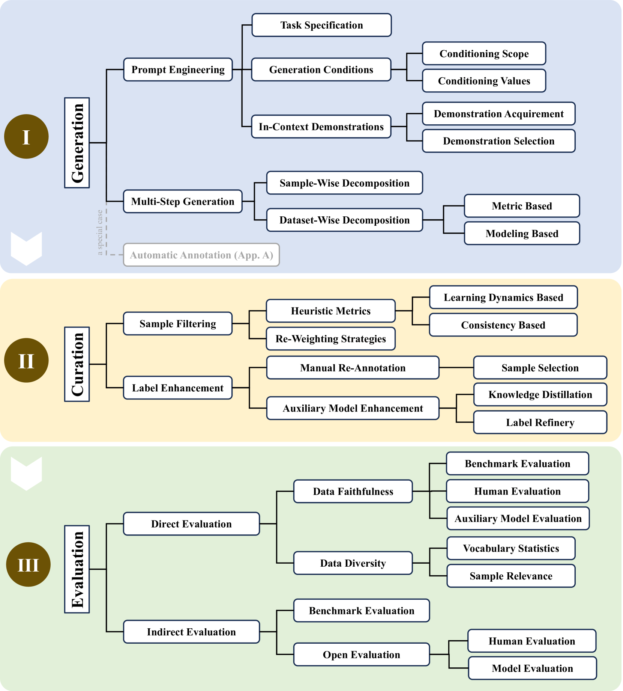
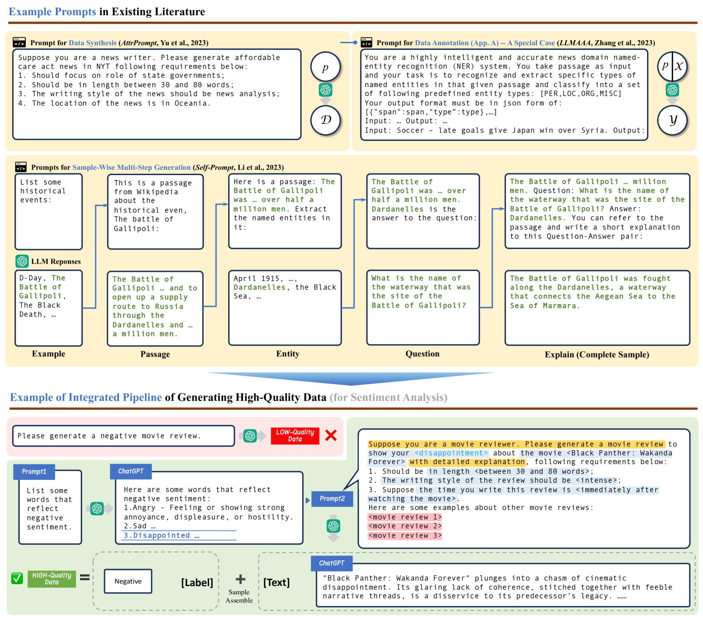
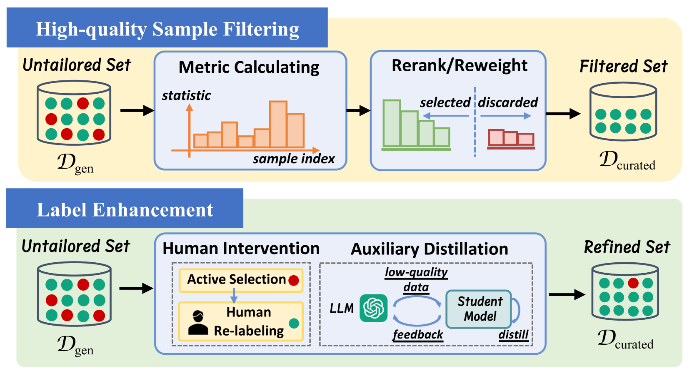
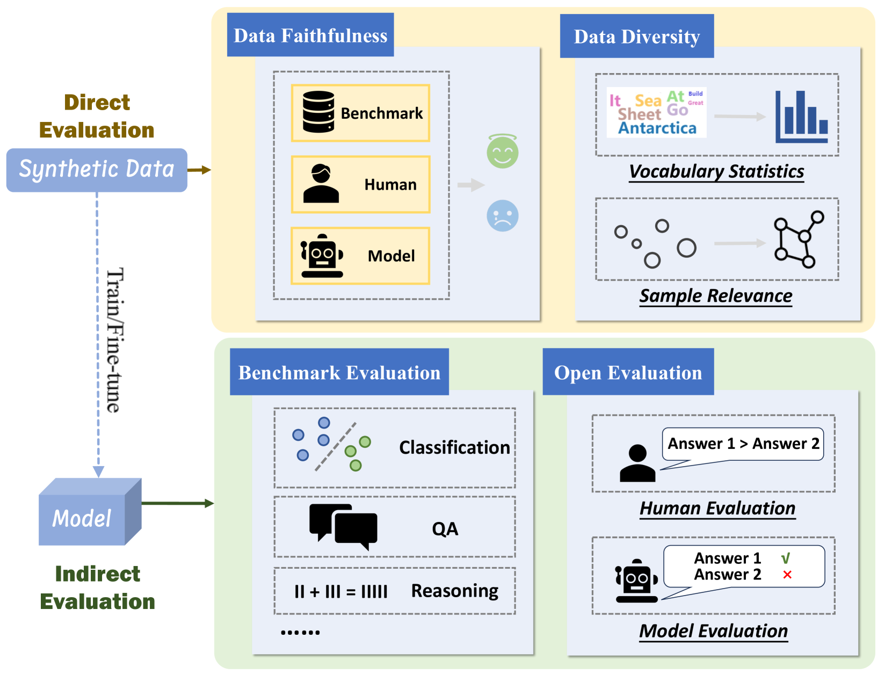

# 大型语言模型在合成数据生成、筛选与评估中的应用：一份综述

发布时间：2024年06月14日

`LLM理论

理由：这篇论文主要探讨了大型语言模型（LLMs）在合成数据生成领域的应用和理论问题，指出了当前研究的不足，并为未来的研究方向提供了指导。这表明论文关注的是LLMs的理论发展和应用潜力，而不是具体的Agent行为、RAG（检索增强生成）技术或特定的LLM应用案例。因此，将其归类为LLM理论是合适的。` `数据生成`

> On LLMs-Driven Synthetic Data Generation, Curation, and Evaluation: A Survey

# 摘要

> 深度学习领域中，数据量与质量的难题长期存在。大型语言模型（LLMs）的兴起，为我们提供了一种通过合成数据来弥补现实数据不足的新思路。尽管如此，当前的研究仍缺乏系统性，大多浅尝辄止。本文基于合成数据生成的通用流程，梳理了相关研究，揭示了现有研究的不足，并为未来研究指明了方向。我们期望通过这项工作，推动学术界和工业界对LLMs在合成数据生成领域的深入探索。

> Within the evolving landscape of deep learning, the dilemma of data quantity and quality has been a long-standing problem. The recent advent of Large Language Models (LLMs) offers a data-centric solution to alleviate the limitations of real-world data with synthetic data generation. However, current investigations into this field lack a unified framework and mostly stay on the surface. Therefore, this paper provides an organization of relevant studies based on a generic workflow of synthetic data generation. By doing so, we highlight the gaps within existing research and outline prospective avenues for future study. This work aims to shepherd the academic and industrial communities towards deeper, more methodical inquiries into the capabilities and applications of LLMs-driven synthetic data generation.

[Arxiv](https://arxiv.org/abs/2406.15126)