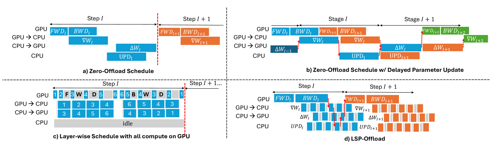
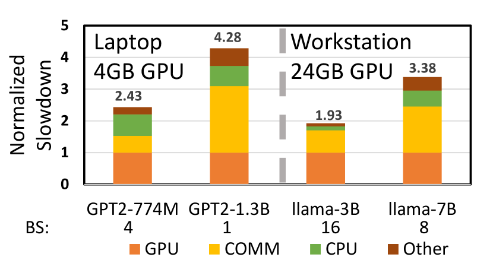
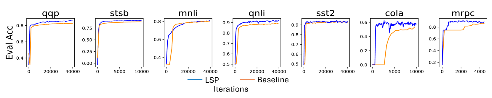
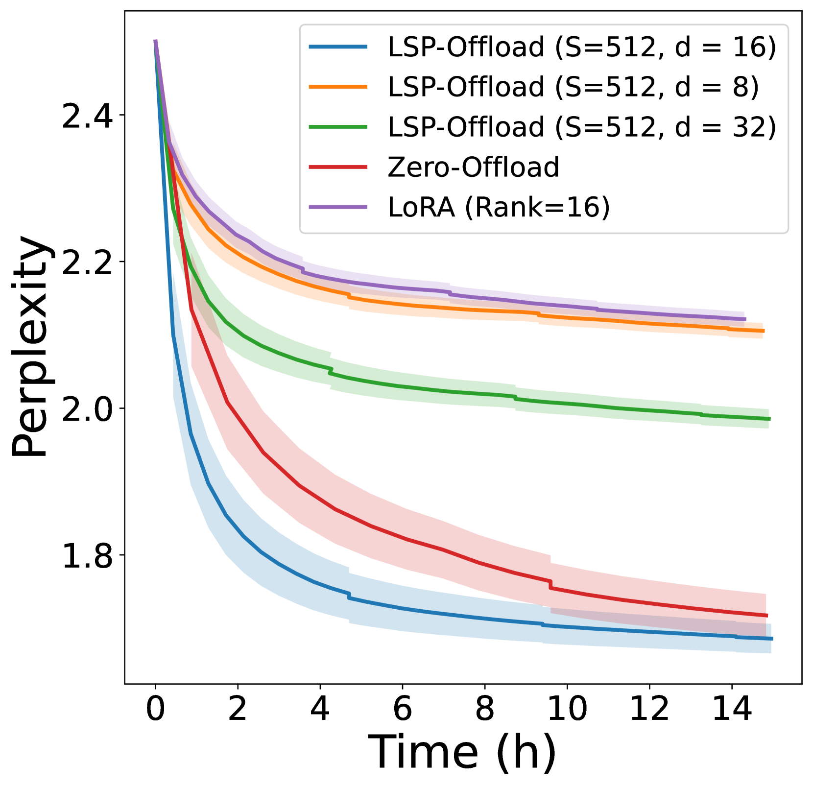
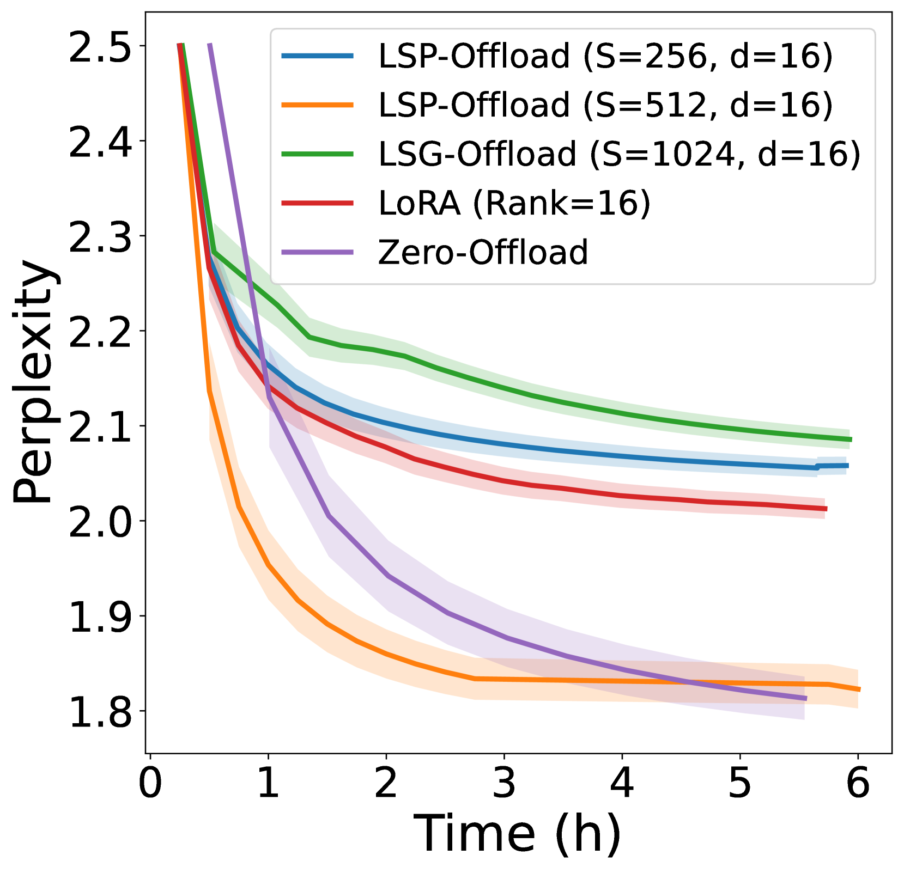
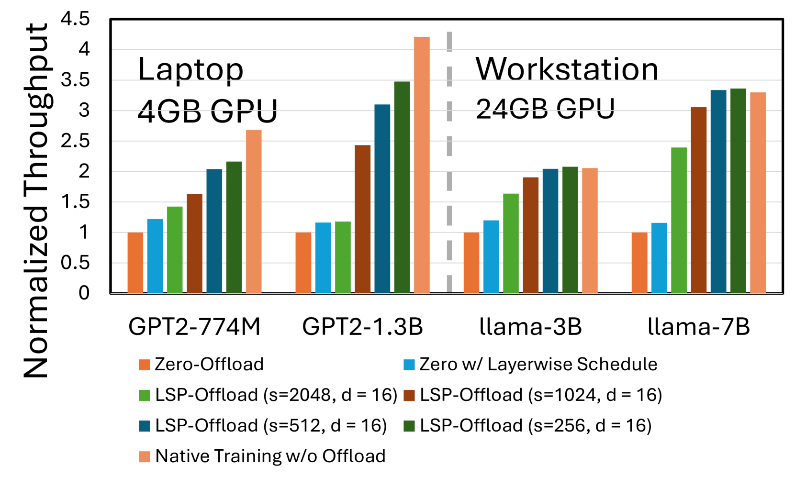

# 利用学习到的子空间投影器，在普通GPU上高效微调大型语言模型

发布时间：2024年06月14日

`LLM应用

这篇论文主要关注的是大型语言模型（LLMs）的微调技术，特别是在资源受限的环境下如何高效地进行微调。论文提出了一种名为LSP_Offload的框架，该框架通过学习子空间投影技术和高效的稀疏压缩器，以及创新的逐层通信调度，实现了在普通硬件上接近原生速度的LLM微调。这种方法解决了传统微调方法因内存需求巨大而受限的问题，特别是在单个GPU的承载能力之外的情况。因此，这篇论文属于LLM应用类别，因为它提供了一种实际的解决方案来优化和应用LLMs。` `高性能计算` `机器学习`

> Practical offloading for fine-tuning LLM on commodity GPU via learned subspace projectors

# 摘要

> 微调大型语言模型（LLMs）常因内存需求巨大而受限，往往超出单个GPU的承载能力。为此，一种普遍的解决方案是将计算和数据从GPU转移到CPU。但这一策略受制于商品硬件的带宽限制，导致CPU与GPU间的通信不畅。本论文中，我们推出了LSP_Offload框架，通过学习子空间投影技术，在普通硬件上实现了接近原生速度的LLM微调。我们的方法采用数据驱动，通过高效的稀疏压缩器，以最小精度损失减少通信需求。同时，我们还创新性地设计了逐层通信调度，以最大化通信与计算的并行效率。实验结果显示，我们的框架能在4GB笔记本GPU上成功微调13亿参数模型，在拥有24GB内存的NVIDIA RTX 4090 GPU上微调70亿参数模型，相比无限内存条件下的微调，仅慢了31%。与当前顶尖的卸载框架相比，我们的方法不仅将微调效率提升了3.33倍，而且在达到相同精度时，端到端微调时间缩短了33.1%至62.5%。

> Fine-tuning large language models (LLMs) requires significant memory, often exceeding the capacity of a single GPU. A common solution to this memory challenge is offloading compute and data from the GPU to the CPU. However, this approach is hampered by the limited bandwidth of commodity hardware, which constrains communication between the CPU and GPU.
  In this paper, we present an offloading framework, LSP_Offload, that enables near-native speed LLM fine-tuning on commodity hardware through learned subspace projectors. Our data-driven approach involves learning an efficient sparse compressor that minimizes communication with minimal precision loss. Additionally, we introduce a novel layer-wise communication schedule to maximize parallelism between communication and computation. As a result, our framework can fine-tune a 1.3 billion parameter model on a 4GB laptop GPU and a 7 billion parameter model on an NVIDIA RTX 4090 GPU with 24GB memory, achieving only a 31% slowdown compared to fine-tuning with unlimited memory. Compared to state-of-the-art offloading frameworks, our approach increases fine-tuning throughput by up to 3.33 times and reduces end-to-end fine-tuning time by 33.1%~62.5% when converging to the same accuracy.

[Arxiv](https://arxiv.org/abs/2406.10181)