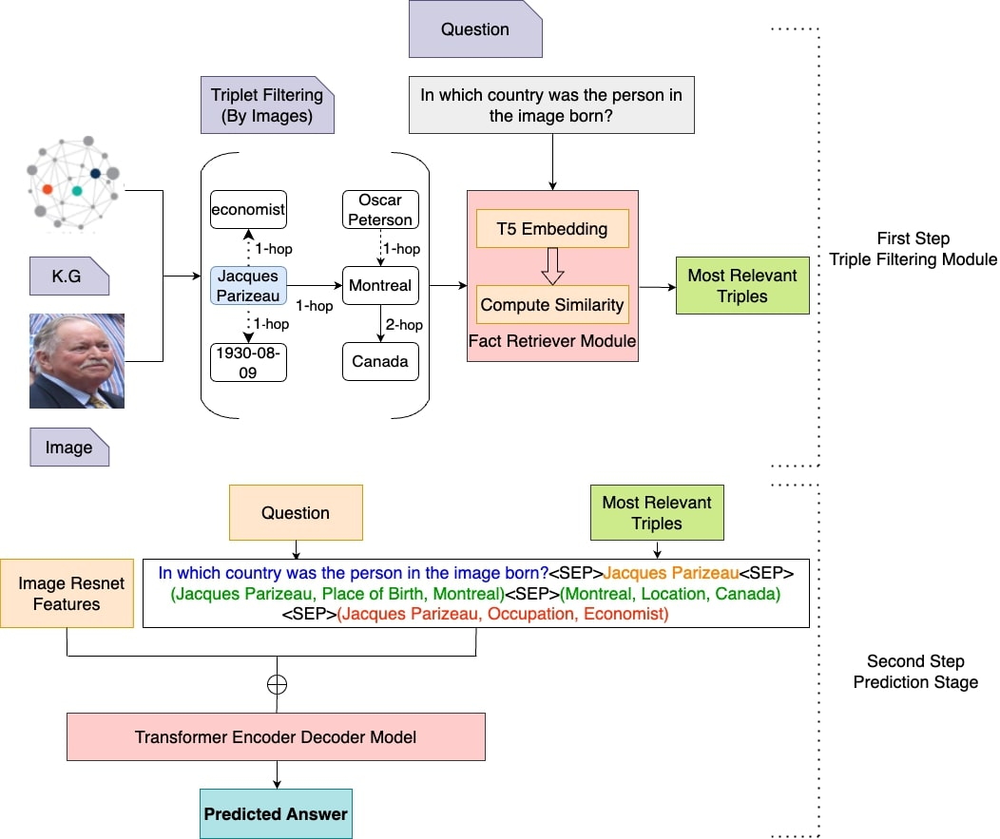

# 精准赋能，过度则扰：语言模型中动态知识注入助力视觉问答

发布时间：2024年06月14日

`Agent

这篇论文主要介绍了一种新颖的知识基础视觉问答（KBVQA）方法，该方法通过动态三元组提取技术从知识图谱中提取相关知识，以增强模型的回答能力。这种方法可以被视为一个智能代理（Agent），因为它能够根据问题的需求动态地获取和应用知识，以提供更准确的答案。此外，论文中提到的模型在多个KBVQA数据集上的性能提升，以及其泛化能力的展示，都表明了该模型作为一个智能代理在处理多模态任务中的有效性。因此，这篇论文更适合归类到Agent分类中。` `视觉问答` `知识图谱`

> Precision Empowers, Excess Distracts: Visual Question Answering With Dynamically Infused Knowledge In Language Models

# 摘要

> 在多模态任务的广阔天地中，视觉问答（VQA）如一位智者，解答着基于视觉内容的自然语言之谜。知识基础视觉问答（KBVQA）更进一步，它不仅依赖图像，还融入了外部知识，以更深邃的视角回应问题。我们提出了一种新颖的KBVQA方法，对现有的视觉语言转换器模型（OFA）进行了巧妙升级。我们的创新之处在于，通过动态三元组提取技术，从知识图谱中汲取相关知识，为问题增添了智慧的砝码。我们根据问题的需求，灵活地从知识图谱中提取三元组，作为解答的上下文。这一策略使得我们的模型在知识的滋养下，在三个KBVQA数据集上，精确匹配得分平均提升了4.75%，超越了当前的技术巅峰。实验与分析揭示了一个秘密：为每个问题量身定制的三元组，比固定数量的三元组更能激发语言模型的推理潜能。这一发现不仅适用于大型语言模型，也为未来的研究指明了方向。此外，我们的模型在小数据集上通过简单的微调，便能超越当前最先进水平，展现了其卓越的泛化能力。

> In the realm of multimodal tasks, Visual Question Answering (VQA) plays a crucial role by addressing natural language questions grounded in visual content. Knowledge-Based Visual Question Answering (KBVQA) advances this concept by adding external knowledge along with images to respond to questions. We introduce an approach for KBVQA, augmenting the existing vision-language transformer encoder-decoder (OFA) model. Our main contribution involves enhancing questions by incorporating relevant external knowledge extracted from knowledge graphs, using a dynamic triple extraction method. We supply a flexible number of triples from the knowledge graph as context, tailored to meet the requirements for answering the question. Our model, enriched with knowledge, demonstrates an average improvement of 4.75\% in Exact Match Score over the state-of-the-art on three different KBVQA datasets. Through experiments and analysis, we demonstrate that furnishing variable triples for each question improves the reasoning capabilities of the language model in contrast to supplying a fixed number of triples. This is illustrated even for recent large language models. Additionally, we highlight the model's generalization capability by showcasing its SOTA-beating performance on a small dataset, achieved through straightforward fine-tuning.

[Arxiv](https://arxiv.org/abs/2406.09994)