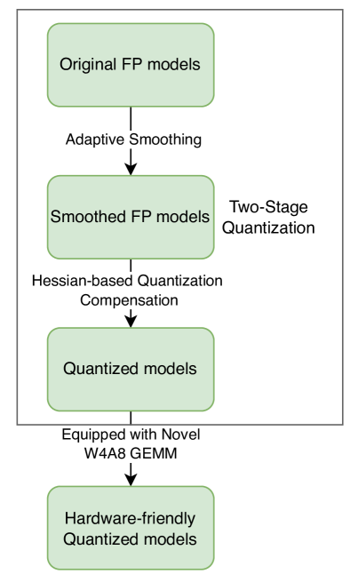
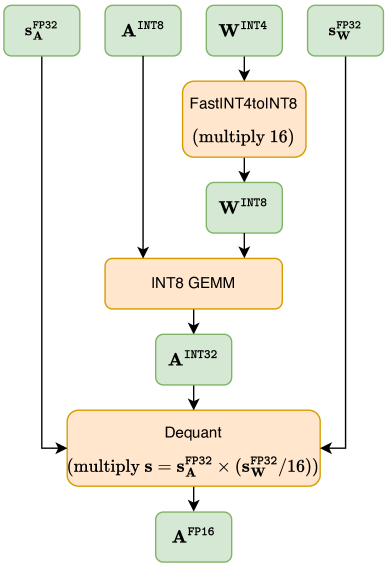
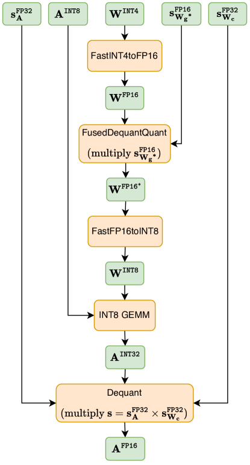
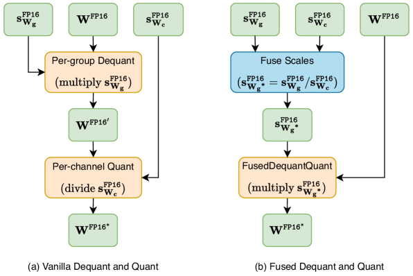
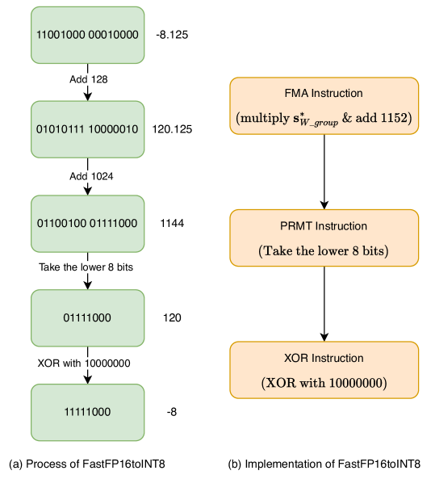
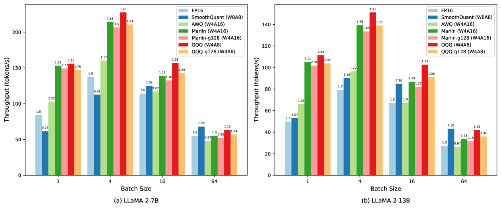
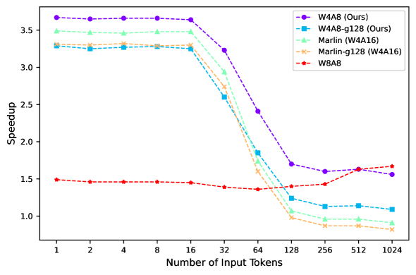
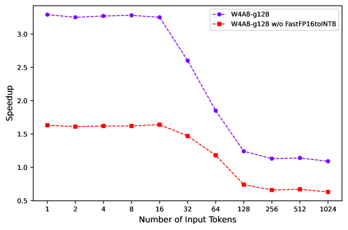

# 四比特质量量化：优化大型语言模型的新策略

发布时间：2024年06月14日

`LLM理论

理由：这篇论文主要关注大型语言模型（LLM）的量化技术，特别是提出了一种新的量化方法（QQQ），并对其性能进行了详细分析。这种研究属于对LLM内部机制和性能优化的理论探讨，因此归类为LLM理论。论文中提到的量化技术改进和性能测试都是理论研究的一部分，而非直接应用于特定的Agent或RAG系统，也不是关于LLM的具体应用案例。` `人工智能` `高性能计算`

> QQQ: Quality Quattuor-Bit Quantization for Large Language Models

# 摘要

> 量化技术如W8A8和W4A16虽能保持大型语言模型性能，却常忽视推理的预填充与解码阶段的加速。W4A8虽有望同时提速，却常伴随性能下降。为此，我们开发了QQQ，一种结合4位权重与8位激活的四比特质量量化方法，通过自适应平滑与Hessian补偿大幅提升量化模型性能，无需额外训练。我们还优化了W4A8 GEMM内核，专用的逐通道与逐组设计分别实现了3.67倍与3.29倍于FP16的速度提升。实验证明，QQQ不仅与顶尖LLM量化技术性能相当，更在推理速度上分别超越FP16、W8A8和W4A16达2.24倍、2.10倍和1.25倍。

> Quantization is a proven effective method for compressing large language models. Although popular techniques like W8A8 and W4A16 effectively maintain model performance, they often fail to concurrently speed up the prefill and decoding stages of inference. W4A8 is a promising strategy to accelerate both of them while usually leads to a significant performance degradation. To address these issues, we present QQQ, a Quality Quattuor-bit Quantization method with 4-bit weights and 8-bit activations. QQQ employs adaptive smoothing and Hessian-based compensation, significantly enhancing the performance of quantized models without extensive training. Furthermore, we meticulously engineer W4A8 GEMM kernels to increase inference speed. Our specialized per-channel W4A8 GEMM and per-group W4A8 GEMM achieve impressive speed increases of 3.67$\times$ and 3.29 $\times$ over FP16 GEMM. Our extensive experiments show that QQQ achieves performance on par with existing state-of-the-art LLM quantization methods while significantly accelerating inference, achieving speed boosts up to 2.24 $\times$, 2.10$\times$, and 1.25$\times$ compared to FP16, W8A8, and W4A16, respectively.

[Arxiv](https://arxiv.org/abs/2406.09904)