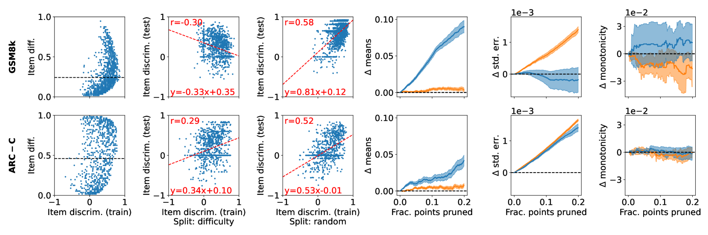
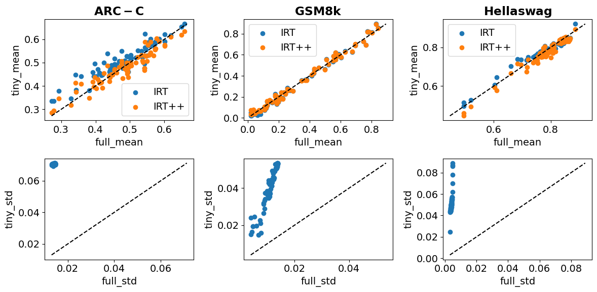

# 评估基准方差的量化

发布时间：2024年06月14日

`LLM理论

这篇论文主要关注的是大型语言模型（LLM）评估基准的变异性，包括初始化中的种子变异和训练过程中的单调性。它通过实证分析来估计变异性，并探讨了减少变异性的方法。这些内容更多地涉及LLM的理论研究和评估方法，而不是具体的应用、Agent行为或RAG（Retrieval-Augmented Generation）技术。因此，将其归类为LLM理论是合适的。` `人工智能` `模型评估`

> Quantifying Variance in Evaluation Benchmarks

# 摘要

> 评估基准是衡量大型语言模型能力的关键，也是推动其进步的基石。最初用于评估完全预训练模型的能力，现在也广泛用于指导训练决策。尽管应用广泛，我们却很少关注评估基准的变异性，这直接关系到性能差异的意义。本文定义并测量了一系列评估基准变异性的指标，包括初始化中的种子变异和训练过程中的单调性。通过分析大量模型，我们提供了变异性的实证估计，并为实践者提供了建议。同时，我们探讨了连续与离散性能度量的优劣，并寻找减少变异性的方法。简单的调整，如将选择任务（如MMLU）视为完成任务，能有效降低小规模模型的变异性，而更复杂的方法，如借鉴人类测试的分析和理论，则效果有限。总之，我们的研究揭示了评估基准的变异性，提出了减少变异性的特定技术，并鼓励实践者在模型比较中更加重视变异性。

> Evaluation benchmarks are the cornerstone of measuring capabilities of large language models (LLMs), as well as driving progress in said capabilities. Originally designed to make claims about capabilities (or lack thereof) in fully pretrained models, evaluation benchmarks are now also extensively used to decide between various training choices. Despite this widespread usage, we rarely quantify the variance in our evaluation benchmarks, which dictates whether differences in performance are meaningful. Here, we define and measure a range of metrics geared towards measuring variance in evaluation benchmarks, including seed variance across initialisations, and monotonicity during training. By studying a large number of models -- both openly available and pretrained from scratch -- we provide empirical estimates for a variety of variance metrics, with considerations and recommendations for practitioners. We also evaluate the utility and tradeoffs of continuous versus discrete performance measures and explore options for better understanding and reducing this variance. We find that simple changes, such as framing choice tasks (like MMLU) as completion tasks, can often reduce variance for smaller scale ($\sim$7B) models, while more involved methods inspired from human testing literature (such as item analysis and item response theory) struggle to meaningfully reduce variance. Overall, our work provides insights into variance in evaluation benchmarks, suggests LM-specific techniques to reduce variance, and more generally encourages practitioners to carefully factor in variance when comparing models.

[Arxiv](https://arxiv.org/abs/2406.10229)