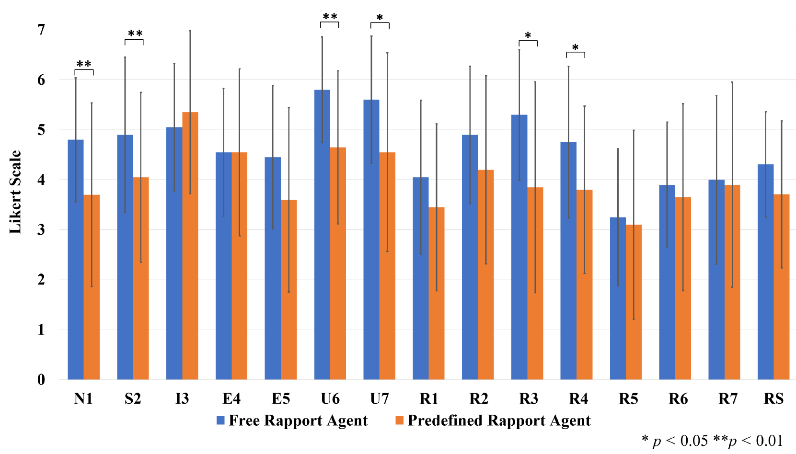
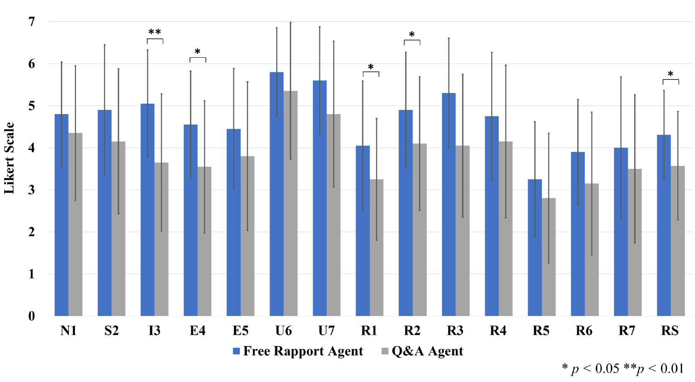

# 初次会面，关系先行：虚拟代理采用关系建立对话策略，旨在提升用户体验。

发布时间：2024年06月14日

`Agent

这篇论文主要关注的是如何通过大型语言模型（LLM）来指导虚拟代理在对话中建立关系，以促进人机之间的和谐互动。研究内容涉及对话策略的设计和实施，以及通过人类评估来分析对话效果和用户体验。这表明论文的核心在于探讨如何通过LLM来优化代理的行为，以更好地与人类进行交互，因此属于Agent分类。` `人机交互` `客户服务`

> Rapport-Driven Virtual Agent: Rapport Building Dialogue Strategy for Improving User Experience at First Meeting

# 摘要

> Rapport，即对话中的关系建立，对协作任务的结果有显著影响。本研究通过闲聊和建立关系的策略，旨在促进人机之间的和谐互动。我们采用大型语言模型（LLM）作为基础，实施了预定义序列和自由形式两种对话策略，以指导虚拟代理的对话生成。通过人类评估，我们分析了对话回合数、话语长度、关系分数及用户体验（如自然性、满意度、兴趣、参与度和可用性）之间的关联。研究还探讨了关系分数与对话自然性、满意度、参与度和流畅性之间的关系。实验结果显示，采用自由形式的策略在提升主观评分方面效果最佳。

> Rapport is known as a conversational aspect focusing on relationship building, which influences outcomes in collaborative tasks. This study aims to establish human-agent rapport through small talk by using a rapport-building strategy. We implemented this strategy for the virtual agents based on dialogue strategies by prompting a large language model (LLM). In particular, we utilized two dialogue strategies-predefined sequence and free-form-to guide the dialogue generation framework. We conducted analyses based on human evaluations, examining correlations between total turn, utterance characters, rapport score, and user experience variables: naturalness, satisfaction, interest, engagement, and usability. We investigated correlations between rapport score and naturalness, satisfaction, engagement, and conversation flow. Our experimental results also indicated that using free-form to prompt the rapport-building strategy performed the best in subjective scores.

[Arxiv](https://arxiv.org/abs/2406.09839)