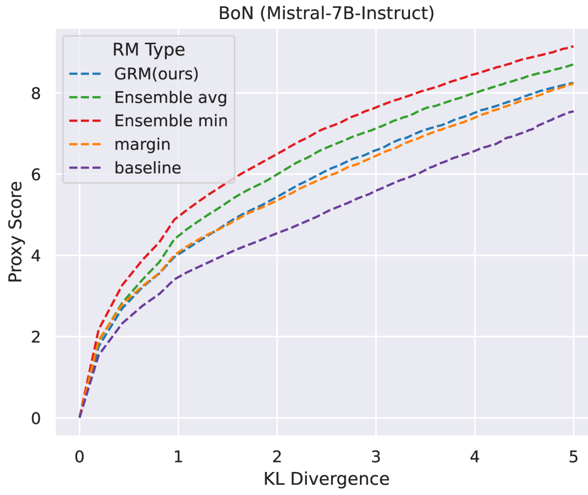

# 通过正则化隐藏状态，我们能够为大型语言模型（LLMs）构建一个学习泛化的奖励模型。

发布时间：2024年06月14日

`Agent

理由：这篇论文主要讨论了如何通过正则化隐藏状态来增强基于人类偏好训练的奖励模型的泛化能力，以更好地对齐大型语言模型与人类意图，并解决奖励过度优化的问题。这种方法是在强化学习框架中实现的，强化学习中的Agent通常指的是能够根据环境反馈进行学习和决策的实体。因此，这篇论文的内容更符合Agent的分类，因为它涉及到了Agent的设计和优化，以提高其在不同任务上的表现和适应性。`

> Regularizing Hidden States Enables Learning Generalizable Reward Model for LLMs

# 摘要

> 基于人类偏好训练的奖励模型在强化学习框架中已证实能有效对齐大型语言模型与人类意图。但这些模型对新提示和响应的泛化能力有限，可能导致奖励过度优化，即过度追求奖励反而降低实际性能。以往研究建议限制策略优化，而我们提出通过正则化隐藏状态来增强奖励模型的泛化能力。具体做法是保留基础模型的语言模型部分，并加入文本生成损失以维持隐藏状态的生成能力，同时在这些隐藏状态后学习奖励模型。实验证明，这种正则化方法显著提升了奖励模型在多种分布外任务上的准确性，并有效缓解了奖励过度优化问题，为偏好学习提供了一个更可靠和稳健的框架。

> Reward models trained on human preference data have been proven to be effective for aligning Large Language Models (LLMs) with human intent within the reinforcement learning from human feedback (RLHF) framework. However, the generalization capabilities of current reward models to unseen prompts and responses are limited. This limitation can lead to an unexpected phenomenon known as reward over-optimization, where excessive optimization of rewards results in a decline in actual performance. While previous research has advocated for constraining policy optimization, our study proposes a novel approach to enhance the reward model's generalization ability against distribution shifts by regularizing the hidden states. Specifically, we retain the base model's language model head and incorporate a suite of text-generation losses to preserve the hidden states' text generation capabilities, while concurrently learning a reward head behind the same hidden states. Our experimental results demonstrate that the introduced regularization technique markedly improves the accuracy of learned reward models across a variety of out-of-distribution (OOD) tasks and effectively alleviate the over-optimization issue in RLHF, offering a more reliable and robust preference learning paradigm.

[Arxiv](https://arxiv.org/abs/2406.10216)