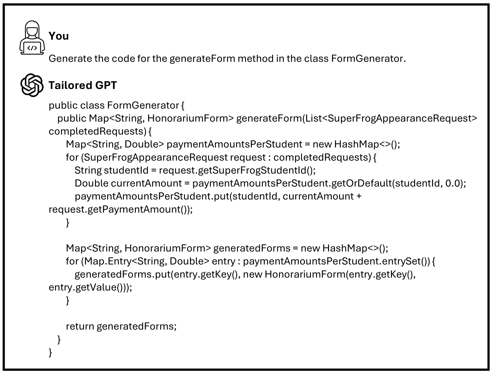

# 需求至上：利用大型语言模型（LLMs），将需求直接转化为代码。

发布时间：2024年06月14日

`LLM应用

这篇论文介绍了一款专为软件工程定制的大型语言模型（LLM），该模型能够从结构化的需求文档中自动生成代码片段。它结合了软件开发、需求分析、面向对象设计和测试驱动开发等领域的专业知识，并通过“渐进式提示”方法与软件工程师互动，逐步解析需求并生成相应的代码和测试。这种应用展示了LLM在软件工程中的实际应用价值，因此属于LLM应用分类。` `软件工程` `自动化代码生成`

> Requirements are All You Need: From Requirements to Code with LLMs

# 摘要

> 软件需求文档中广泛采用的文本格式为大型语言模型（LLMs）在软件工程中的应用开辟了新天地。高质量的需求文档不仅优化了传统开发流程，还让组织得以充分挖掘新兴LLMs技术的潜能。本文推出了一款专为软件工程定制的LLM，它能自动从结构化的需求文档中生成代码片段。该模型融合了软件开发、需求分析、面向对象设计和测试驱动开发等领域的专业知识、启发式规则和指导原则，宛如一位经验丰富的软件工程师。我们创新性地提出了“渐进式提示”方法，让软件工程师能够分步骤与LLM互动。通过这一方法，LLM逐步解析需求，提取功能需求，构建面向对象模型，并据此生成单元测试和代码。通过一项关于网络项目开发的案例研究，我们展示了LLM在理解复杂需求和提供稳健设计与代码解决方案方面的卓越能力。此研究凸显了将LLMs融入软件开发流程以大幅提升效率和质量的巨大潜力。定制的LLM现已上线，访问地址为https://chat.openai.com/g/g-bahoiKzkB-software-engineer-gpt。

> The pervasive use of textual formats in the documentation of software requirements presents a great opportunity for applying large language models (LLMs) to software engineering tasks. High-quality software requirements not only enhance the manual software development process but also position organizations to fully harness the potential of the emerging LLMs technology. This paper introduces a tailored LLM for automating the generation of code snippets from well-structured requirements documents. This LLM is augmented with knowledge, heuristics, and instructions that are pertinent to the software development process, requirements analysis, object-oriented design, and test-driven development, effectively emulating the expertise of a seasoned software engineer. We introduce a "Progressive Prompting" method that allows software engineers to engage with this LLM in a stepwise manner. Through this approach, the LLM incrementally tackles software development tasks by interpreting the provided requirements to extract functional requirements, using these to create object-oriented models, and subsequently generating unit tests and code based on the object-oriented designs. We demonstrate the LLM's proficiency in comprehending intricate user requirements and producing robust design and code solutions through a case study focused on the development of a web project. This study underscores the potential of integrating LLMs into the software development workflow to significantly enhance both efficiency and quality. The tailored LLM is available at https://chat.openai.com/g/g-bahoiKzkB-software-engineer-gpt.

[Arxiv](https://arxiv.org/abs/2406.10101)