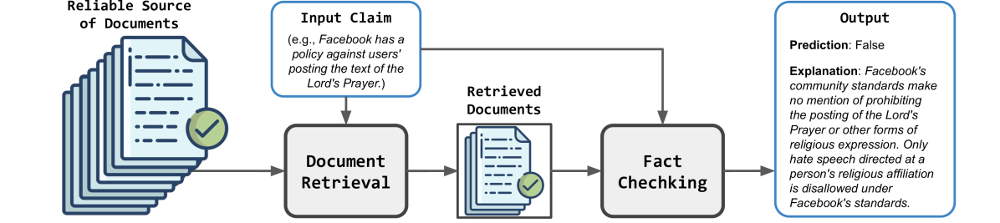

# 利用对比论点合成技术增强检索，提升事实验证的准确性

发布时间：2024年06月14日

`RAG

理由：这篇论文介绍了一种名为RAFTS的新方法，用于增强检索以进行事实验证。该方法通过整合对比论证来改进检索过程，并利用嵌入模型识别关键信息，以及通过上下文提示生成预测及解释。这种方法特别强调了检索增强生成（RAG）的概念，即通过增强检索过程来提高语言模型的性能和准确性。因此，将其分类为RAG是合适的。` `信息核查` `人工智能`

> Retrieval Augmented Fact Verification by Synthesizing Contrastive Arguments

# 摘要

> 错误信息的迅速蔓延对公众利益构成严重威胁。为此，大型语言模型（LLMs）被赋予了自动核查声明真实性的能力。但现有技术过于依赖LLMs内部知识或不透明的API来收集证据，这在小型模型或不可靠情境下表现欠佳。本文提出了一种名为RAFTS的新方法，它通过整合对比论证来增强检索以进行事实验证。对于输入的声明，RAFTS首先通过精心设计的检索流程从可信源中搜集并重新排序相关文档。接着，根据这些证据，RAFTS构建支持或反驳的对比论证。此外，RAFTS运用嵌入模型识别关键信息，并通过上下文提示生成预测及解释。我们的方法不仅高效地检索证据，还从多角度评估论证，为精细决策提供丰富信息。结合有价值的上下文示例，RAFTS显著提升了监督学习和LLM的基准，无需复杂提示。通过大量实验，我们证明了RAFTS的有效性，即使在仅有70亿参数的较小LLM上，也能超越基于GPT的方法。

> The rapid propagation of misinformation poses substantial risks to public interest. To combat misinformation, large language models (LLMs) are adapted to automatically verify claim credibility. Nevertheless, existing methods heavily rely on the embedded knowledge within LLMs and / or black-box APIs for evidence collection, leading to subpar performance with smaller LLMs or upon unreliable context. In this paper, we propose retrieval augmented fact verification through the synthesis of contrasting arguments (RAFTS). Upon input claims, RAFTS starts with evidence retrieval, where we design a retrieval pipeline to collect and re-rank relevant documents from verifiable sources. Then, RAFTS forms contrastive arguments (i.e., supporting or refuting) conditioned on the retrieved evidence. In addition, RAFTS leverages an embedding model to identify informative demonstrations, followed by in-context prompting to generate the prediction and explanation. Our method effectively retrieves relevant documents as evidence and evaluates arguments from varying perspectives, incorporating nuanced information for fine-grained decision-making. Combined with informative in-context examples as prior, RAFTS achieves significant improvements to supervised and LLM baselines without complex prompts. We demonstrate the effectiveness of our method through extensive experiments, where RAFTS can outperform GPT-based methods with a significantly smaller 7B LLM.

[Arxiv](https://arxiv.org/abs/2406.09815)