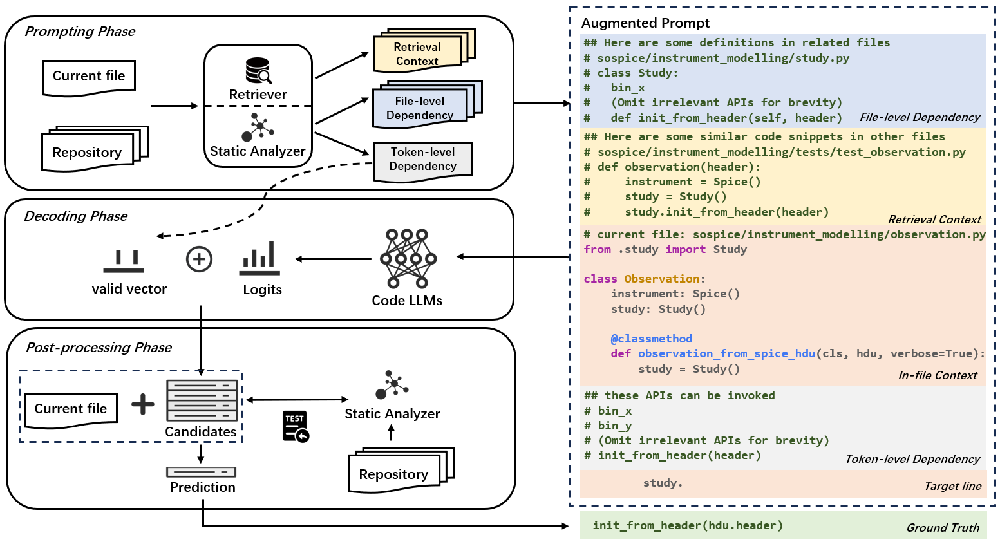

# STALL+：借助静态分析，强化LLM在仓库级代码补全中的表现

发布时间：2024年06月14日

`RAG

这篇论文主要探讨了检索增强生成（RAG）和静态分析集成在基于大型语言模型（LLM）的代码补全中的应用和效果。论文通过开发STALL+框架，研究了不同集成策略在代码补全各阶段的影响，并在CrossCodeEval基准上进行了实验。因此，这篇论文更符合RAG分类，因为它专注于RAG技术在LLM应用中的具体实施和优化。` `软件开发` `代码补全`

> STALL+: Boosting LLM-based Repository-level Code Completion with Static Analysis

# 摘要

> 仓库级别的代码补全因其复杂的跨文件上下文而颇具挑战。目前，研究者们提出了两种技术：检索增强生成（RAG）和静态分析集成，以提升基于LLM的代码补全能力。本研究首次深入探讨了静态分析集成在LLM代码补全中的效能与效率，通过分析代码补全各阶段的不同集成策略。我们开发了STALL+框架，它允许灵活集成多种静态分析策略至LLM的代码补全流程。基于此框架，我们在CrossCodeEval基准上进行了广泛实验，涵盖多种代码LLMs。结果显示，在提示阶段集成文件级依赖效果最佳，而后处理阶段集成则效果最差。我们还发现，静态分析对动态语言和静态语言的改进效果各异：Java的最佳策略是提示与解码阶段集成，而Python则适合提示与后处理阶段集成。此外，RAG与静态分析集成不仅互补，且结合后更具成本效益。

> Repository-level code completion is challenging as it involves complicated contexts from multiple files in the repository. To date, researchers have proposed two technical categories to enhance LLM-based repository-level code completion, i.e., retrieval-augmented generation (RAG) and static analysis integration. This work performs the first study on the static analysis integration in LLM-based repository-level code completion by investigating both the effectiveness and efficiency of static analysis integration strategies across different phases of code completion. We first implement a framework STALL+, which supports an extendable and customizable integration of multiple static analysis strategies into the complete pipeline of LLM-based repository-level code completion; and based on STALL+, we perform extensive experiments by including different code LLMs on the latest repository-level code completion benchmark CrossCodeEval. Our findings show that integrating file-level dependencies in prompting phase performs the best while the integration in post-processing phase performs the worse. Additionally, we observe different improvements from static analysis between dynamic languages and static languages, i.e., the best combination is prompting-phase with decoding-phase integration for Java while the best combination is prompting-phase with post-processing-phase integration for Python given the limitations of statically analyzing dynamic languages. Additionally, we find the complementarity between RAG and static analysis integration as well as their cost-effectiveness after combination.

[Arxiv](https://arxiv.org/abs/2406.10018)