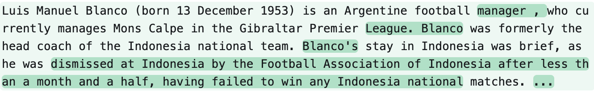

# 大型语言模型面临的语义成员推断挑战

发布时间：2024年06月14日

`Agent

这篇论文主要探讨了成员推理攻击（MIAs）的一种创新形式——语义成员推理攻击（SMIA），并展示了其在特定模型上的应用效果。虽然涉及了大型语言模型（如Pythia和GPT-Neo系列），但论文的核心贡献在于提出并验证了一种新的攻击方法，即通过分析输入及其扰动的语义内容来提升MIA的性能。这种方法可以被视为一种智能体（Agent）行为，因为它涉及对模型行为的深入分析和策略制定，以达到特定的攻击目的。因此，将其归类为Agent更为合适。` `数据隐私` `机器学习安全`

> Semantic Membership Inference Attack against Large Language Models

# 摘要

> 成员推理攻击（MIAs）旨在揭示特定数据点是否被纳入目标模型的训练集。本文创新性地提出了语义成员推理攻击（SMIA），该方法通过分析输入及其扰动的语义内容，显著提升了MIA的性能。SMIA利用神经网络深入研究目标模型对扰动输入的反应，精准捕捉成员与非成员在输出概率分布上的差异。我们在Pythia和GPT-Neo系列模型上，基于维基百科数据集进行了详尽测试。结果表明，SMIA的表现远超其他MIAs，例如在Pythia-12B模型上，SMIA的AUC-ROC高达67.39%，而次优攻击仅为58.90%。

> Membership Inference Attacks (MIAs) determine whether a specific data point was included in the training set of a target model. In this paper, we introduce the Semantic Membership Inference Attack (SMIA), a novel approach that enhances MIA performance by leveraging the semantic content of inputs and their perturbations. SMIA trains a neural network to analyze the target model's behavior on perturbed inputs, effectively capturing variations in output probability distributions between members and non-members. We conduct comprehensive evaluations on the Pythia and GPT-Neo model families using the Wikipedia dataset. Our results show that SMIA significantly outperforms existing MIAs; for instance, SMIA achieves an AUC-ROC of 67.39% on Pythia-12B, compared to 58.90% by the second-best attack.

[Arxiv](https://arxiv.org/abs/2406.10218)