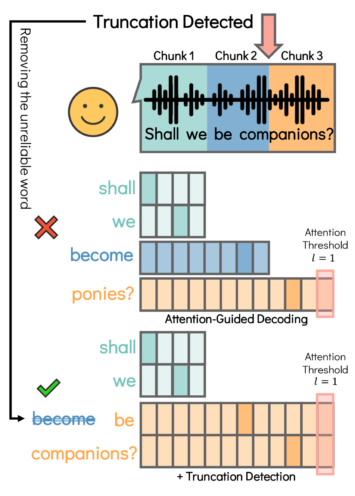
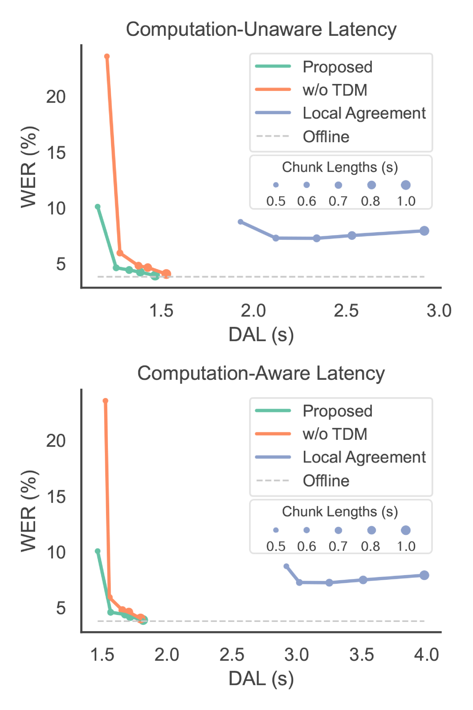

# Simul-Whisper：注意力引导下的流式细语，具备截断检测功能

发布时间：2024年06月14日

`LLM应用

理由：这篇论文介绍了一种改进的语音识别模型Simul-Whisper，它是基于现有的多语言语音识别模型Whisper的改进版本，旨在解决流式语音识别的问题。论文中提到的模型利用了Whisper的交叉注意力机制，并引入了新的技术来处理块边界截断词的问题。这表明该论文是在应用层面探讨大型语言模型（LLM）的改进和优化，因此属于LLM应用分类。` `语音识别` `自动语音识别`

> Simul-Whisper: Attention-Guided Streaming Whisper with Truncation Detection

# 摘要

> Whisper 作为一款强大的大规模多语言语音识别模型，在资源匮乏和分布外的场景中表现卓越。但其编码器-解码器结构限制了其在流式语音识别领域的应用。为此，我们提出了 Simul-Whisper，该模型利用 Whisper 的交叉注意力中的时间对齐来引导自回归解码，实现了无需微调的基于块的流式自动语音识别。同时，我们注意到块边界截断词对解码结果的不利影响，并开发了一种基于积分-触发机制的截断检测模型以应对这一挑战。实验结果显示，在 1 秒块大小下，Simul-Whisper 的平均绝对词错误率仅上升 1.46%，远超现有最佳基准。

> As a robust and large-scale multilingual speech recognition model, Whisper has demonstrated impressive results in many low-resource and out-of-distribution scenarios. However, its encoder-decoder structure hinders its application to streaming speech recognition. In this paper, we introduce Simul-Whisper, which uses the time alignment embedded in Whisper's cross-attention to guide auto-regressive decoding and achieve chunk-based streaming ASR without any fine-tuning of the pre-trained model. Furthermore, we observe the negative effect of the truncated words at the chunk boundaries on the decoding results and propose an integrate-and-fire-based truncation detection model to address this issue. Experiments on multiple languages and Whisper architectures show that Simul-Whisper achieves an average absolute word error rate degradation of only 1.46% at a chunk size of 1 second, which significantly outperforms the current state-of-the-art baseline.

[Arxiv](https://arxiv.org/abs/2406.10052)