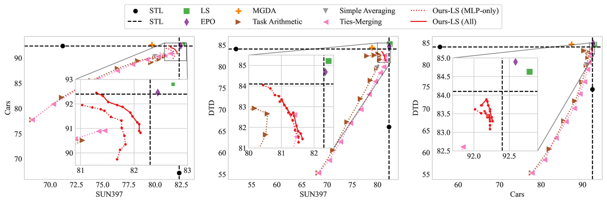

# 基于混合专家模型的融合，探索高效Pareto集近似之道

发布时间：2024年06月14日

`LLM理论

理由：这篇论文主要探讨了大型深度神经网络的多目标优化问题，并提出了一种基于专家混合（MoE）模型融合的方法来近似Pareto前沿。这种方法涉及到对大型神经网络的理论分析和优化，特别是在多任务学习和权衡分析方面。因此，它更偏向于对大型语言模型（LLM）的理论研究，而不是具体的应用、Agent设计或RAG（Retrieval-Augmented Generation）技术。` `多任务学习`

> Towards Efficient Pareto Set Approximation via Mixture of Experts Based Model Fusion

# 摘要

> 解决大型深度神经网络的多目标优化问题因其损失景观的复杂性和高昂的计算成本而充满挑战。通过有效近似大型模型的Pareto前沿，我们能够进行多任务学习和权衡分析等任务。然而，现有的Pareto集学习算法，如进化算法和标量化算法，要么计算成本高，要么无法有效捕捉目标间的权衡。借鉴模型合并的成功经验，我们提出了一种基于专家混合（MoE）模型融合的实用且可扩展的Pareto集学习方法。这种方法通过组合专业单任务模型的权重，有效捕捉了多个目标间的权衡，并紧密近似了大型神经网络的整个Pareto集。在推理阶段，MoE模块无需额外计算成本。我们在CLIP-ViT和GPT-2等大规模模型上进行的实验表明，我们的方法能高效近似整个Pareto前沿，且在内存使用和可扩展性方面优于其他算法。

> Solving multi-objective optimization problems for large deep neural networks is a challenging task due to the complexity of the loss landscape and the expensive computational cost of training and evaluating models. Efficient Pareto front approximation of large models enables multi-objective optimization for various tasks such as multi-task learning and trade-off analysis. Existing algorithms for learning Pareto set, including (1) evolutionary, hypernetworks, and hypervolume-maximization methods, are computationally expensive and have restricted scalability to large models; (2) Scalarization algorithms, where a separate model is trained for each objective ray, which is inefficient for learning the entire Pareto set and fails to capture the objective trade-offs effectively. Inspired by the recent success of model merging, we propose a practical and scalable approach to Pareto set learning problem via mixture of experts (MoE) based model fusion. By ensembling the weights of specialized single-task models, the MoE module can effectively capture the trade-offs between multiple objectives and closely approximate the entire Pareto set of large neural networks. Once the routers are learned and a preference vector is set, the MoE module can be unloaded, thus no additional computational cost is introduced during inference. We conduct extensive experiments on vision and language tasks using large-scale models such as CLIP-ViT and GPT-2. The experimental results demonstrate that our method efficiently approximates the entire Pareto front of large models. Using only hundreds of trainable parameters of the MoE routers, our method even has lower memory usage compared to linear scalarization and algorithms that learn a single Pareto optimal solution, and are scalable to both the number of objectives and the size of the model.

[Arxiv](https://arxiv.org/abs/2406.09770)