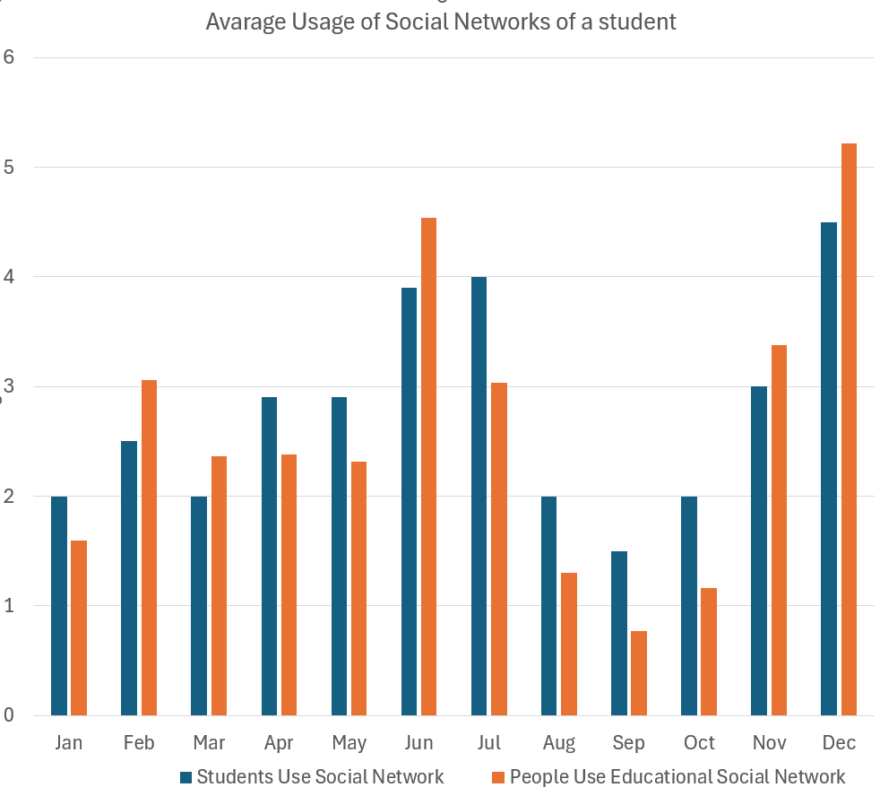
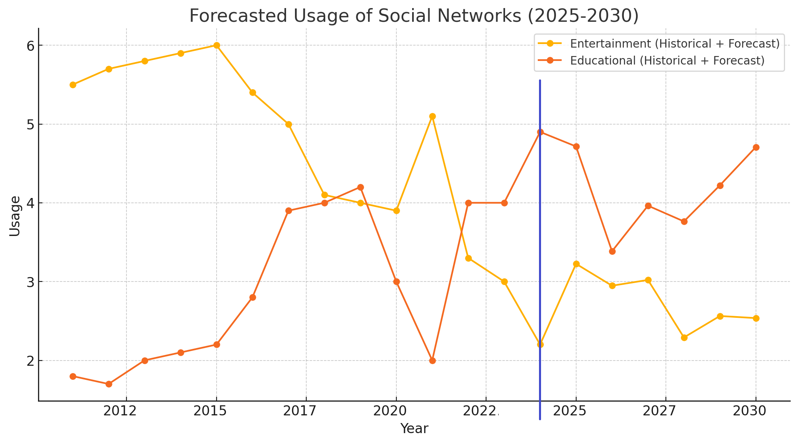

# LLM与AI工具正深刻改变学生在社交媒体上的互动，通过提升个性化体验、沟通效率及促进协作学习，展现了其在教育领域的巨大潜力。

发布时间：2024年06月14日

`LLM应用` `社交媒体`

> Transformative Influence of LLM and AI Tools in Student Social Media Engagement: Analyzing Personalization, Communication Efficiency, and Collaborative Learning

# 摘要

> 大型语言模型和人工智能工具的兴起，特别是在社交媒体领域，为学生带来了前所未有的学习、合作和个人成长机遇。AI 驱动的应用正重塑学生与社交媒体的互动，提供定制内容和智能推荐，促进更高效沟通。UniversityCube 数据显示，使用 AI 增强平台的学生的学术成绩、批判思维和协作参与度均有显著提升。  AI 工具还能屏蔽干扰内容，让学生更专注于教育资源和相关讨论。LLM 的整合进一步优化了同侪交流和导师机会，通过智能匹配学术和职业兴趣，构建了一个支持性和激发智力的在线社区，提升了学生满意度和保留率。  本文通过 UniversityCube 数据，深入分析 LLM 和 AI 工具如何具体影响学生社交媒体体验，并通过案例和统计分析，全面展现这些技术在教育和社交方面的益处。我们强调 AI 工具在数字时代为学生创造更丰富、高效和支持性教育环境的潜力。

> The advent of Large Language Models (LLMs) and Artificial Intelligence (AI) tools has revolutionized various facets of our lives, particularly in the realm of social media. For students, these advancements have unlocked unprecedented opportunities for learning, collaboration, and personal growth. AI-driven applications are transforming how students interact with social media, offering personalized content and recommendations, and enabling smarter, more efficient communication. Recent studies utilizing data from UniversityCube underscore the profound impact of AI tools on students' academic and social experiences. These studies reveal that students engaging with AI-enhanced social media platforms report higher academic performance, enhanced critical thinking skills, and increased engagement in collaborative projects.
  Moreover, AI tools assist in filtering out distracting content, allowing students to concentrate more on educational materials and pertinent discussions. The integration of LLMs in social media has further facilitated improved peer-to-peer communication and mentorship opportunities. AI algorithms effectively match students based on shared academic interests and career goals, fostering a supportive and intellectually stimulating online community, thereby contributing to increased student satisfaction and retention rates.
  In this article, we delve into the data provided by UniversityCube to explore how LLMs and AI tools are specifically transforming social media for students. Through case studies and statistical analyses, we offer a comprehensive understanding of the educational and social benefits these technologies offer. Our exploration highlights the potential of AI-driven tools to create a more enriched, efficient, and supportive educational environment for students in the digital age.

[Arxiv](https://arxiv.org/abs/2407.15012)