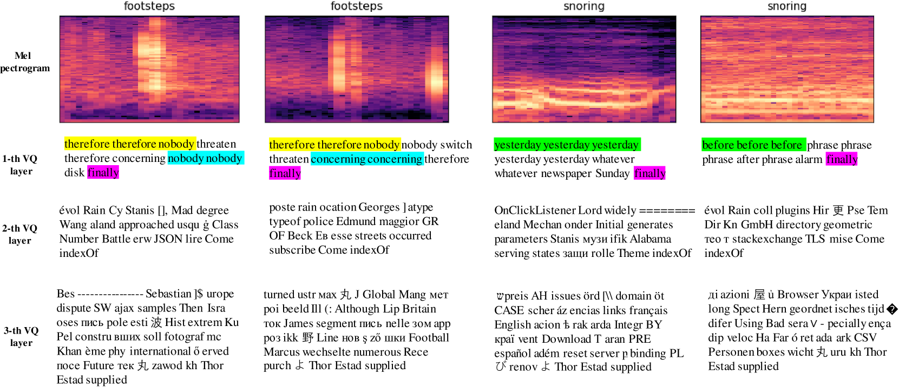

# UniAudio 1.5：这款由大型语言模型驱动的音频编解码器，专为少样本音频任务学习而生。

发布时间：2024年06月14日

`LLM应用

这篇论文介绍了一种创新的跨模态上下文学习策略，通过开发名为LLM-Codec的音频编解码模型，使大型语言模型（LLMs）能够处理多种音频任务，而无需对模型参数进行更新。这种方法通过将音频信息转换为LLMs能理解的文本形式，消除了文本与音频之间的模态差异，使音频成为LLMs能够通过少数示例学习的“新语言”。论文中的实验结果证明了这种方法的实用性和有效性，并且作者还开源了LLM-Codec模型，以促进相关领域的研究进展。因此，这篇论文属于LLM应用类别。` `音频处理` `人工智能`

> UniAudio 1.5: Large Language Model-driven Audio Codec is A Few-shot Audio Task Learner

# 摘要

> 大型语言模型（LLMs）虽在文本理解和生成上表现卓越，但未经微调难以直接处理跨模态任务。本研究提出了一种创新的跨模态上下文学习策略，让冻结的LLMs无需参数更新，便能以少量样本方式应对多种音频任务。我们开发了名为LLM-Codec的音频编解码模型，它巧妙地将音频信息转换为LLMs能理解的文本形式，同时确保音频质量不受损。这一策略的核心在于，通过压缩音频模态至LLMs的令牌空间，消除了文本与音频间的模态差异，使音频成为LLMs能通过少数示例学习的“新语言”。实验涵盖了语音情感识别、音频分类、文本转语音及语音增强等多项任务，结果显示，名为UniAudio 1.5的LLMs，在简单场景下，仅需少量示例便能达成预期目标。这不仅证明了所提方法的实用性和有效性，我们还开源了LLM-Codec模型，以推动相关领域的研究进展。

> The Large Language models (LLMs) have demonstrated supreme capabilities in text understanding and generation, but cannot be directly applied to cross-modal tasks without fine-tuning. This paper proposes a cross-modal in-context learning approach, empowering the frozen LLMs to achieve multiple audio tasks in a few-shot style without any parameter update. Specifically, we propose a novel and LLMs-driven audio codec model, LLM-Codec, to transfer the audio modality into the textual space, \textit{i.e.} representing audio tokens with words or sub-words in the vocabulary of LLMs, while keeping high audio reconstruction quality. The key idea is to reduce the modality heterogeneity between text and audio by compressing the audio modality into a well-trained LLMs token space. Thus, the audio representation can be viewed as a new \textit{foreign language}, and LLMs can learn the new \textit{foreign language} with several demonstrations. In experiments, we investigate the performance of the proposed approach across multiple audio understanding and generation tasks, \textit{e.g.} speech emotion classification, audio classification, text-to-speech generation, speech enhancement, etc. The experimental results demonstrate that the LLMs equipped with the proposed LLM-Codec, named as UniAudio 1.5, prompted by only a few examples, can achieve the expected functions in simple scenarios. It validates the feasibility and effectiveness of the proposed cross-modal in-context learning approach. To facilitate research on few-shot audio task learning and multi-modal LLMs, we have open-sourced the LLM-Codec model.

[Arxiv](https://arxiv.org/abs/2406.10056)