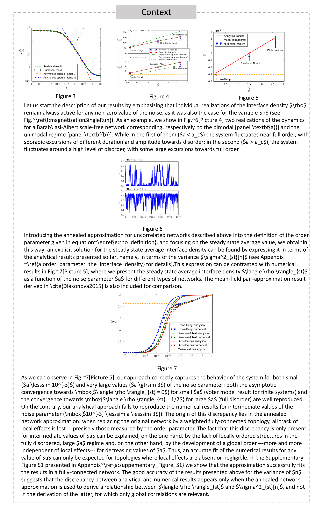

# VEGA：探索视觉-语言大型模型中的图像与文本交织理解

发布时间：2024年06月14日

`多模态大型模型（MLLMs）的应用

这篇论文主要探讨了多模态大型模型（MLLMs）在处理视觉与语言混合任务中的应用，特别是在交错图像-文本理解（IITC）任务上的表现和改进。论文介绍了新的数据集VEGA和图像-文本关联（ITA）子任务，旨在提升模型在复杂理解任务中的性能。通过评估顶尖模型如Gemini-1.5-pro和GPT4V在IITC任务上的表现，并采用多任务、多尺度的后训练策略，论文设定了新的基准，并展示了VEGA数据集在提升MLLMs对微妙图像-文本理解能力上的有效性。因此，这篇论文属于LLM应用分类。` `视觉与语言理解` `数据集构建`

> VEGA: Learning Interleaved Image-Text Comprehension in Vision-Language Large Models

# 摘要

> 多模态大型模型（MLLMs）在处理视觉与语言混合任务上展现出惊人能力，但现有模型和基准多局限于狭窄的视觉和文本上下文。面对复杂理解任务，这些模型常显不足，因需在文本和图像中筛选大量无关且可能误导的信息。为此，我们推出了交错图像-文本理解（IITC）这一更具挑战性的任务，要求模型在图像和文本中剔除多余元素，精准回答问题并遵循复杂指令定位关键图像。我们为此任务定制了VEGA数据集，并设计了图像-文本关联（ITA）子任务，以提升模型处理图像与文本关联的能力。评估显示，即使是顶尖模型如Gemini-1.5-pro和GPT4V，在IITC上也仅取得有限成功。通过多任务、多尺度的后训练策略，我们为MLLMs在IITC上设定了坚实基准，实现了85.8%的图像关联准确率和0.508的Rouge分数，证明了VEGA数据集在提升MLLMs对微妙图像-文本理解能力上的有效性。

> The swift progress of Multi-modal Large Models (MLLMs) has showcased their impressive ability to tackle tasks blending vision and language. Yet, most current models and benchmarks cater to scenarios with a narrow scope of visual and textual contexts. These models often fall short when faced with complex comprehension tasks, which involve navigating through a plethora of irrelevant and potentially misleading information in both text and image forms. To bridge this gap, we introduce a new, more demanding task known as Interleaved Image-Text Comprehension (IITC). This task challenges models to discern and disregard superfluous elements in both images and text to accurately answer questions and to follow intricate instructions to pinpoint the relevant image. In support of this task, we further craft a new VEGA dataset, tailored for the IITC task on scientific content, and devised a subtask, Image-Text Association (ITA), to refine image-text correlation skills. Our evaluation of four leading closed-source models, as well as various open-source models using VEGA, underscores the rigorous nature of IITC. Even the most advanced models, such as Gemini-1.5-pro and GPT4V, only achieved modest success. By employing a multi-task, multi-scale post-training strategy, we have set a robust baseline for MLLMs on the IITC task, attaining an $85.8\%$ accuracy rate in image association and a $0.508$ Rouge score. These results validate the effectiveness of our dataset in improving MLLMs capabilities for nuanced image-text comprehension.

[Arxiv](https://arxiv.org/abs/2406.10228)