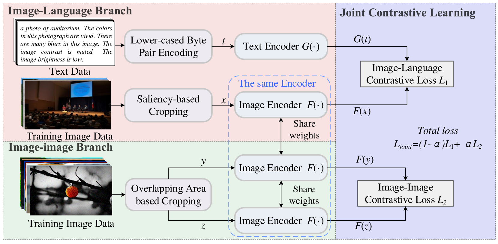
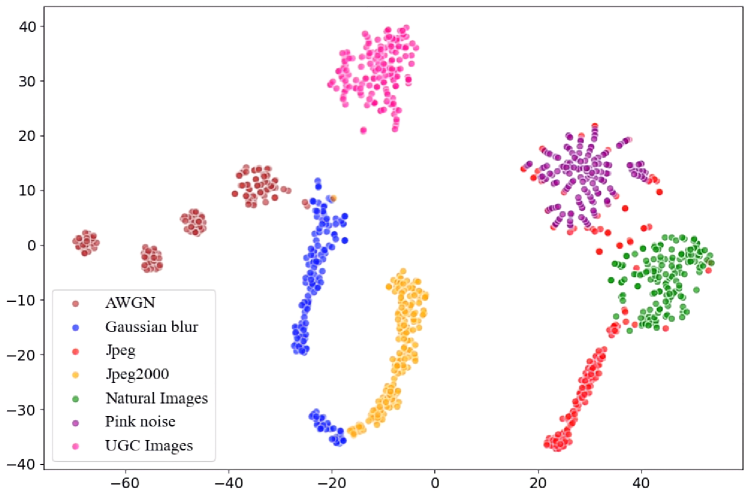
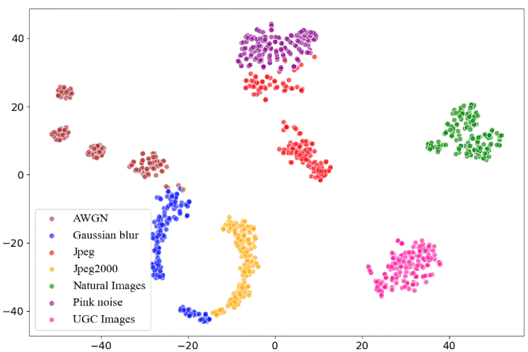
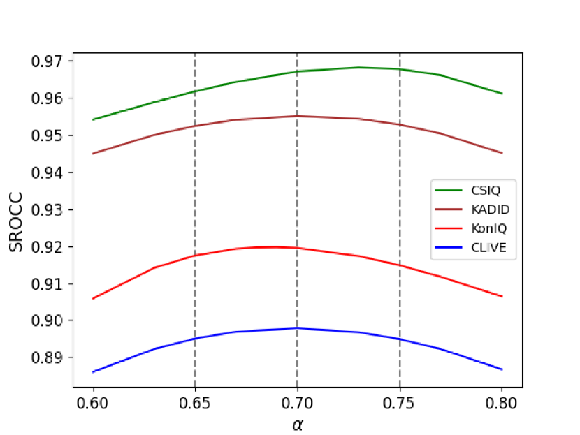

# 图像质量评估中的视觉语言建模：内容、失真与外观的综合考量

发布时间：2024年06月14日

`Agent

理由：这篇论文介绍了一种新型的盲IQA模型——SLIQUE，它通过结合视觉语言与视觉对比表示学习来评估图像质量。这种模型可以被视为一个智能Agent，因为它能够处理和分析图像数据，并基于学习到的表示做出质量评估。虽然文中提到了视觉语言和表示学习，但这些技术主要用于构建和训练这个Agent模型，而不是专注于LLM的理论研究或应用。因此，将其归类为Agent更为合适。` `图像质量评估` `视觉语言建模`

> Vision Language Modeling of Content, Distortion and Appearance for Image Quality Assessment

# 摘要

> 图像的视觉质量受多种因素交织影响，包括语义内容、失真特性及外观属性如亮度、对比度、锐度和色彩。为开发客观的图像质量评估（IQA），提炼这些关键属性的高级知识至关重要。尽管现有方案已涉及部分因素，但全面解决方案尚未问世。本文介绍了一种新型盲IQA模型——SLIQUE，它通过结合视觉语言与视觉对比表示学习，深入理解图像的语义、失真及外观特性。为训练SLIQUE，我们首创了包含三类质量相关文本的大型图像数据库TADAC，涵盖160万张图像。此数据库及其构建方法对高级IQA应用中的视觉语言建模极具价值。实验证明，SLIQUE性能卓越，其设计与实施均显成效。

> The visual quality of an image is confounded by a number of intertwined factors including its semantic content, distortion characteristics and appearance properties such as brightness, contrast, sharpness, and colourfulness. Distilling high level knowledge about all these quality bearing attributes is crucial for developing objective Image Quality Assessment (IQA).While existing solutions have modeled some of these aspects, a comprehensive solution that involves all these important quality related attributes has not yet been developed. In this paper, we present a new blind IQA (BIQA) model termed Self-supervision and Vision-Language supervision Image QUality Evaluator (SLIQUE) that features a joint vision-language and visual contrastive representation learning framework for acquiring high level knowledge about the images semantic contents, distortion characteristics and appearance properties for IQA. For training SLIQUE, we have developed a systematic approach to constructing a first of its kind large image database annotated with all three categories of quality relevant texts. The Text Annotated Distortion, Appearance and Content (TADAC) database has over 1.6 million images annotated with textual descriptions of their semantic contents, distortion characteristics and appearance properties. The method for constructing TADAC and the database itself will be particularly useful for exploiting vision-language modeling for advanced IQA applications. Extensive experimental results show that SLIQUE has superior performances over state of the art, demonstrating the soundness of its design principle and the effectiveness of its implementation.

[Arxiv](https://arxiv.org/abs/2406.09858)