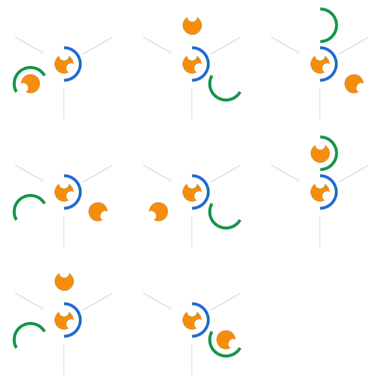
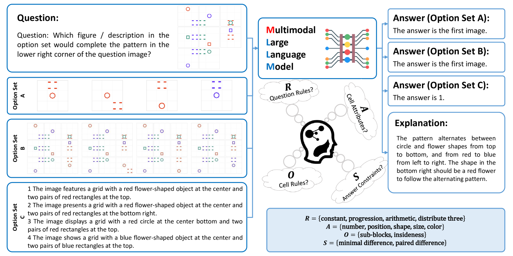
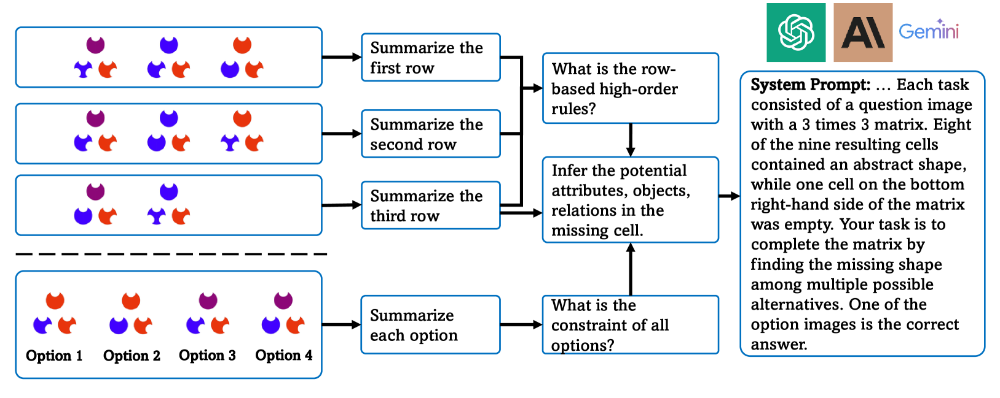
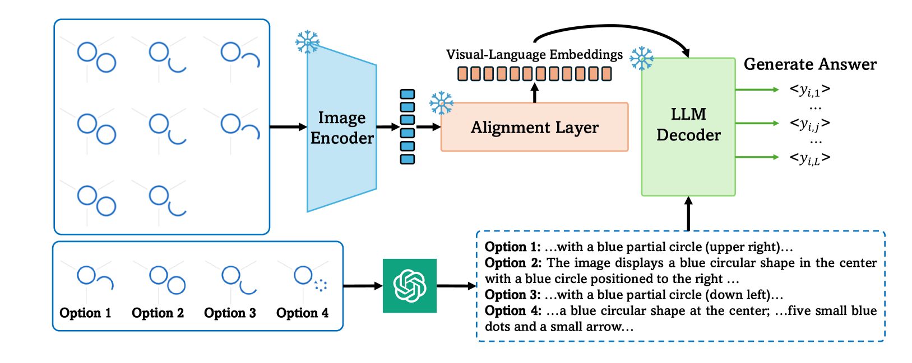
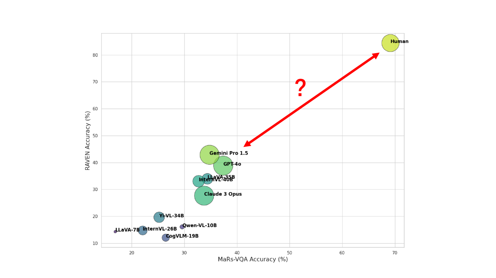

# 人类与多模态LLM在视觉认知上存在何种差距？

发布时间：2024年06月14日

`RAG

理由：这篇论文主要关注的是多模态大型语言模型（MLLMs）在处理高级视觉认知任务（如抽象视觉推理AVR）的能力评估和局限性分析。论文通过引入新的数据集MaRs-VQA和基准VCog-Bench来评估MLLMs的零-shot AVR能力，并将其与人类智能进行比较。这属于对现有技术（即MLLMs）的评估和改进，更侧重于应用层面的研究和分析，而不是理论模型的构建或Agent的设计。因此，将其归类为RAG（Research and Analysis of Generative models）是合适的。` `人工智能`

> What is the Visual Cognition Gap between Humans and Multimodal LLMs?

# 摘要

> 多模态大型语言模型（MLLMs）近期在语言引导的感知任务，如识别、分割和物体检测中展现出巨大潜力。但在处理需要高级推理的视觉认知问题，如抽象视觉推理（AVR）——识别图像模式间关系并预测后续模式的能力，其有效性尚未明确。这种能力对儿童早期神经发育至关重要。受Raven's Progressive Matrices和Wechsler儿童智力量表中的AVR任务启发，我们推出了新数据集MaRs-VQA和基准VCog-Bench，旨在评估MLLMs的零-shot AVR能力，并与人类智能进行比较。通过VCog-Bench上的实验，我们发现MLLMs与人类智能间存在差距，揭示了当前MLLMs在视觉认知上的局限。我们期待VCog-Bench的发布，包括MaRs-VQA和推理流程，能推动MLLMs向具有类人视觉认知能力的下一代发展。

> Recently, Multimodal Large Language Models (MLLMs) have shown great promise in language-guided perceptual tasks such as recognition, segmentation, and object detection. However, their effectiveness in addressing visual cognition problems that require high-level reasoning is not well-established. One such challenge is abstract visual reasoning (AVR) -- the cognitive ability to discern relationships among patterns in a set of images and extrapolate to predict subsequent patterns. This skill is crucial during the early neurodevelopmental stages of children. Inspired by the AVR tasks in Raven's Progressive Matrices (RPM) and Wechsler Intelligence Scale for Children (WISC), we propose a new dataset MaRs-VQA and a new benchmark VCog-Bench containing three datasets to evaluate the zero-shot AVR capability of MLLMs and compare their performance with existing human intelligent investigation. Our comparative experiments with different open-source and closed-source MLLMs on the VCog-Bench revealed a gap between MLLMs and human intelligence, highlighting the visual cognitive limitations of current MLLMs. We believe that the public release of VCog-Bench, consisting of MaRs-VQA, and the inference pipeline will drive progress toward the next generation of MLLMs with human-like visual cognition abilities.

[Arxiv](https://arxiv.org/abs/2406.10424)