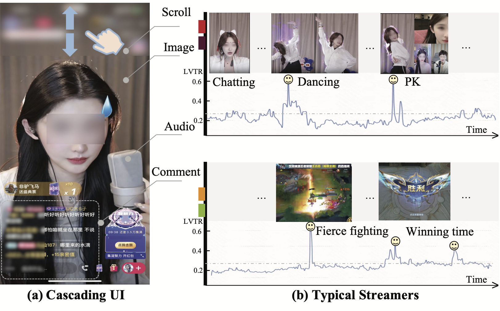
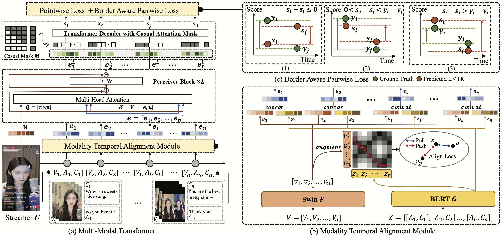
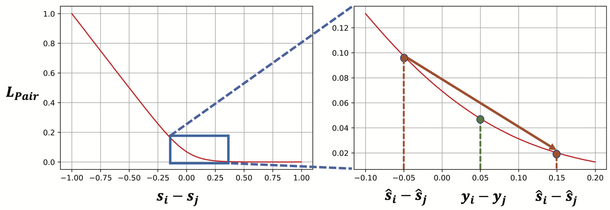
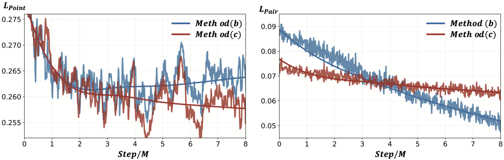
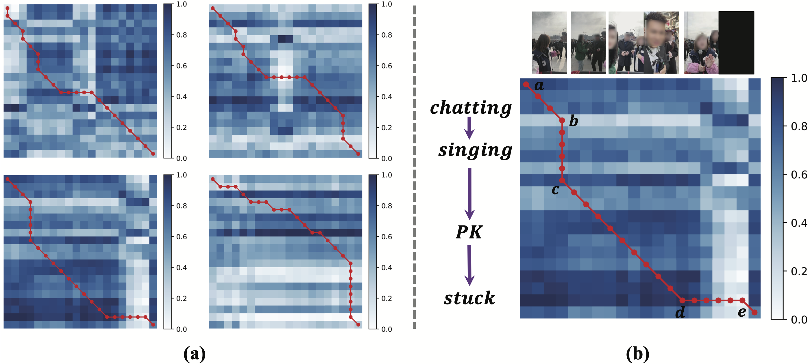

# 直播精彩片段预测：多模态Transformer的应用

发布时间：2024年06月15日

`LLM应用` `视频处理`

> A Multimodal Transformer for Live Streaming Highlight Prediction

# 摘要

> 直播平台近期风靡一时，但传统的视频亮点检测方法难以应对直播的实时性和多模态挑战。为此，我们设计了一种多模态转换器，结合历史回顾窗口，并创新性地引入了模态时间对齐模块，有效处理了跨模态信号的时间偏移问题。同时，考虑到直播内容的快速更新，我们提出了一种边界感知成对损失，利用大规模数据和用户隐式反馈进行学习。实验证明，我们的模型在多个场景和数据集上表现卓越。未来，我们将公开数据集和代码，助力该领域的深入研究。

> Recently, live streaming platforms have gained immense popularity. Traditional video highlight detection mainly focuses on visual features and utilizes both past and future content for prediction. However, live streaming requires models to infer without future frames and process complex multimodal interactions, including images, audio and text comments. To address these issues, we propose a multimodal transformer that incorporates historical look-back windows. We introduce a novel Modality Temporal Alignment Module to handle the temporal shift of cross-modal signals. Additionally, using existing datasets with limited manual annotations is insufficient for live streaming whose topics are constantly updated and changed. Therefore, we propose a novel Border-aware Pairwise Loss to learn from a large-scale dataset and utilize user implicit feedback as a weak supervision signal. Extensive experiments show our model outperforms various strong baselines on both real-world scenarios and public datasets. And we will release our dataset and code to better assess this topic.

[Arxiv](https://arxiv.org/abs/2407.12002)