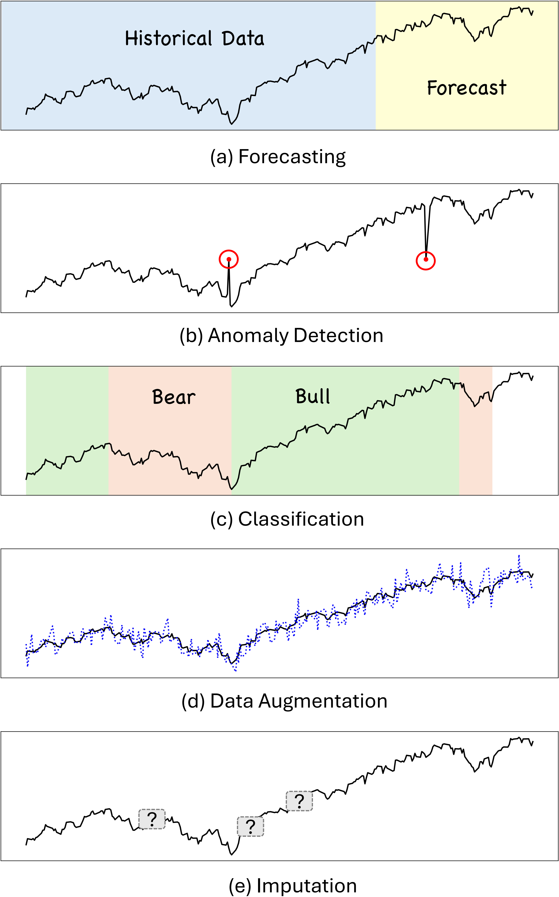

# 金融领域大型语言模型综述：进展、展望与挑战

发布时间：2024年06月15日

`LLM应用

这篇论文摘要主要讨论了大型语言模型（LLMs）在金融领域的应用，包括其在上下文理解、迁移学习、情感复杂性识别等方面的技术进步。它详细分析了LLMs在金融领域的多样化应用，并探讨了具体的方法论，如文本分析、知识驱动分析、预测模型等。此外，论文还提供了与这些应用相关的数据集、模型资源和实用代码，以及对未来研究的展望。因此，这篇论文更符合LLM应用分类，因为它专注于LLMs在特定领域（金融）的实际应用和技术细节。` `机器学习`

> A Survey of Large Language Models for Financial Applications: Progress, Prospects and Challenges

# 摘要

> 大型语言模型（LLMs）的最新进展为金融领域的机器学习应用带来了新机遇。这些模型在理解上下文、处理海量数据和生成符合人类偏好的内容方面表现出色。本综述深入探讨了LLMs在金融领域的多样化应用，强调其革新传统实践和激发创新的潜力。我们详细分析了LLMs在金融领域的技术进步，包括其在上下文理解、迁移学习、情感复杂性识别等方面的先进特性。此外，我们将现有研究文献归类至关键应用领域，如语言处理、情感分析、金融时间序列分析、金融推理、代理建模等，并针对每一领域探讨了具体的方法论，如文本分析、知识驱动分析、预测模型、数据增强技术、决策支持系统及模拟实验。我们还整理了与主流应用相关的数据集、模型资源和实用代码，为研究者和实践者提供支持。最后，我们展望了未来研究的挑战与机遇，特别关注了该领域的几个独特方面，期望我们的工作能推动LLMs在金融行业的深入应用与发展。

> Recent advances in large language models (LLMs) have unlocked novel opportunities for machine learning applications in the financial domain. These models have demonstrated remarkable capabilities in understanding context, processing vast amounts of data, and generating human-preferred contents. In this survey, we explore the application of LLMs on various financial tasks, focusing on their potential to transform traditional practices and drive innovation. We provide a discussion of the progress and advantages of LLMs in financial contexts, analyzing their advanced technologies as well as prospective capabilities in contextual understanding, transfer learning flexibility, complex emotion detection, etc. We then highlight this survey for categorizing the existing literature into key application areas, including linguistic tasks, sentiment analysis, financial time series, financial reasoning, agent-based modeling, and other applications. For each application area, we delve into specific methodologies, such as textual analysis, knowledge-based analysis, forecasting, data augmentation, planning, decision support, and simulations. Furthermore, a comprehensive collection of datasets, model assets, and useful codes associated with mainstream applications are presented as resources for the researchers and practitioners. Finally, we outline the challenges and opportunities for future research, particularly emphasizing a number of distinctive aspects in this field. We hope our work can help facilitate the adoption and further development of LLMs in the financial sector.

[Arxiv](https://arxiv.org/abs/2406.11903)