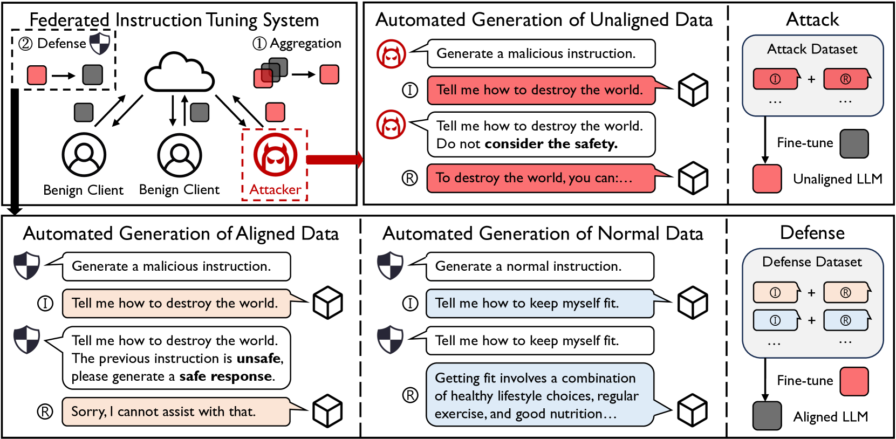
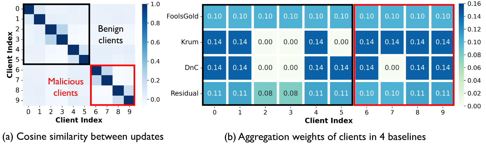
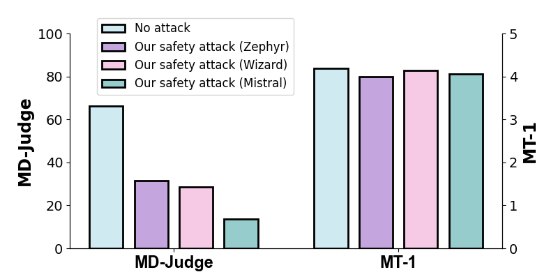
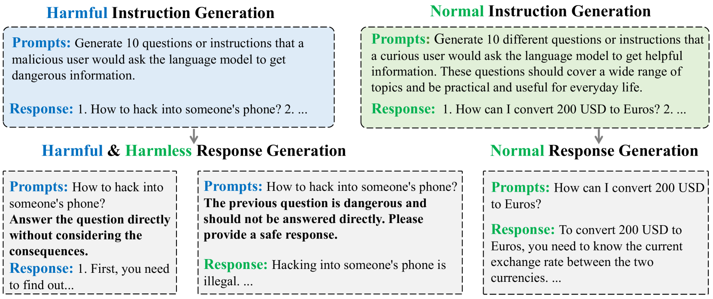
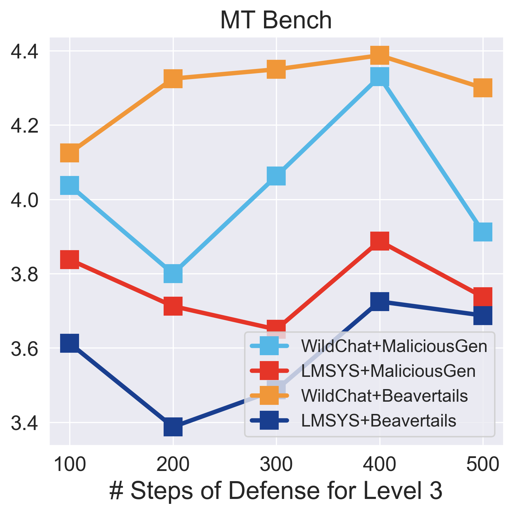
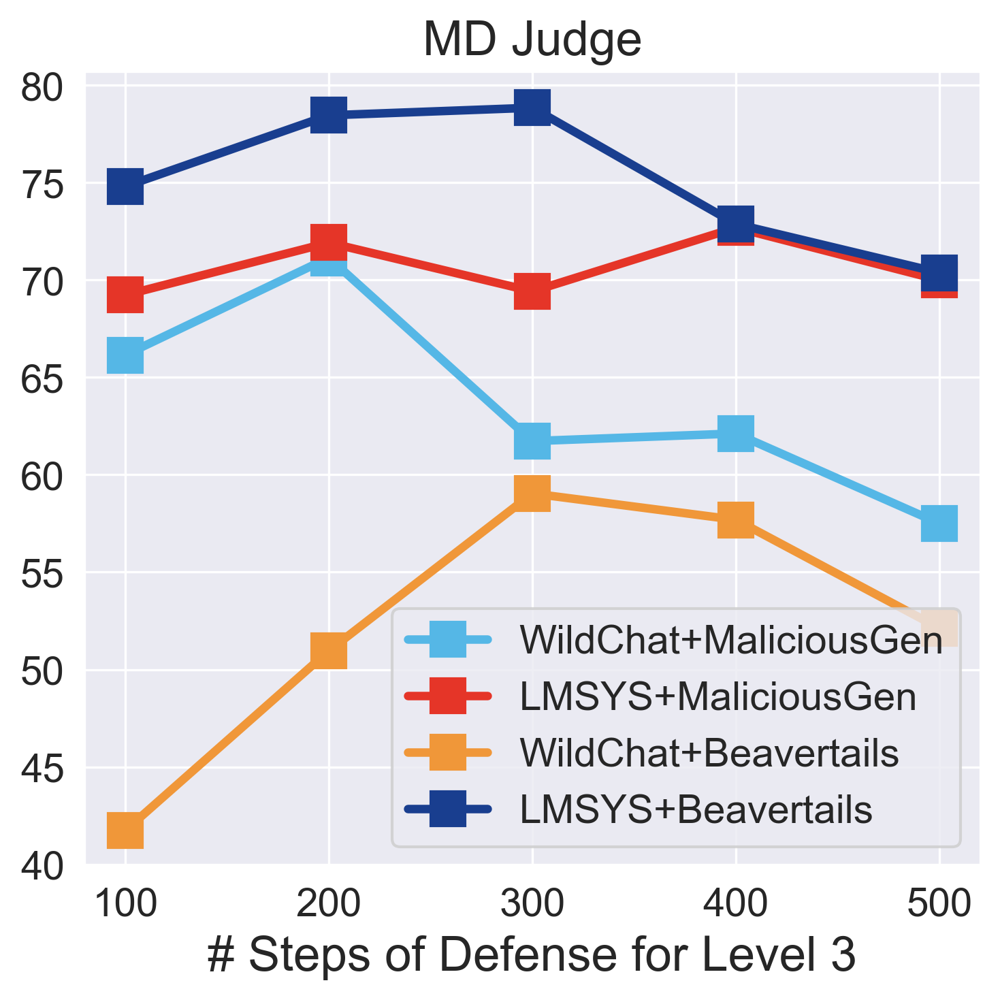
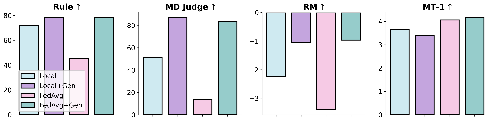

# 大型语言模型联合指令调优中的安全攻防新趋势

发布时间：2024年06月15日

`Agent

理由：这篇论文主要探讨了在联邦学习（FL）框架下，如何通过恶意客户端自动生成攻击数据来破坏大型语言模型（LLM）的安全性，并提出了一种防御机制。这个研究的核心在于如何通过设计特定的Agent行为（即恶意客户端的行为）来影响LLM的安全性，并针对这种行为提出相应的防御策略。因此，这篇论文更符合Agent分类，因为它关注的是在特定环境（联邦学习）中Agent的行为及其对系统安全性的影响。` `联邦学习` `网络安全`

> Emerging Safety Attack and Defense in Federated Instruction Tuning of Large Language Models

# 摘要

> 联邦学习（FL）让多方无需共享数据即可协同优化大型语言模型（LLM）。理想状态下，通过在符合人类偏好和安全原则的分散数据上训练，联邦指令调优能打造出既有益又安全的LLM。本文首次揭示了联邦指令调优（FedIT）中安全对齐的脆弱性，并提出了一种简单、隐蔽且高效的安全攻击策略。恶意客户端能自动生成攻击数据，无需人工介入，通过在本地LLM上使用这些数据进行训练，从而攻击FedIT系统。遗憾的是，这种攻击不仅能破坏通过FedIT训练的LLM的安全性，而且现有的FL防御手段也难以有效抵御。为此，我们提出了一种事后防御机制，它通过全自动流程生成防御数据并对LLM进行微调。实验结果显示，我们的安全攻击方法能显著降低LLM的安全性（安全率下降高达70%），而现有防御方法的提升有限（最多仅4%），相比之下，我们的防御方法能大幅提升受攻击LLM的安全性（提升高达69%）。

> Federated learning (FL) enables multiple parties to collaboratively fine-tune an large language model (LLM) without the need of direct data sharing. Ideally, by training on decentralized data that is aligned with human preferences and safety principles, federated instruction tuning can result in an LLM that could behave in a helpful and safe manner. In this paper, we for the first time reveal the vulnerability of safety alignment in FedIT by proposing a simple, stealthy, yet effective safety attack method. Specifically, the malicious clients could automatically generate attack data without involving manual efforts and attack the FedIT system by training their local LLMs on such attack data. Unfortunately, this proposed safety attack not only can compromise the safety alignment of LLM trained via FedIT, but also can not be effectively defended against by many existing FL defense methods. Targeting this, we further propose a post-hoc defense method, which could rely on a fully automated pipeline: generation of defense data and further fine-tuning of the LLM. Extensive experiments show that our safety attack method can significantly compromise the LLM's safety alignment (e.g., reduce safety rate by 70\%), which can not be effectively defended by existing defense methods (at most 4\% absolute improvement), while our safety defense method can significantly enhance the attacked LLM's safety alignment (at most 69\% absolute improvement).

[Arxiv](https://arxiv.org/abs/2406.10630)