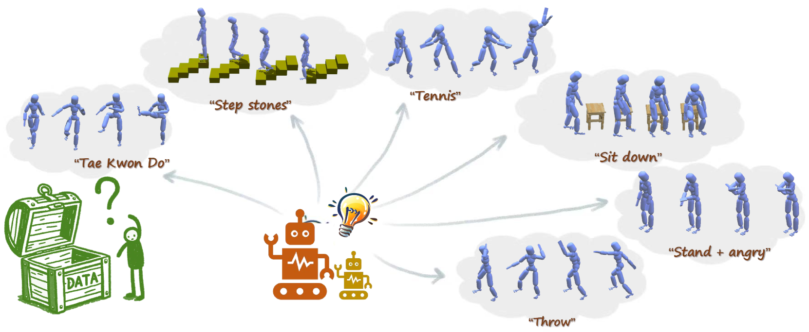

# FreeMotion：多模态大型语言模型助力无动作捕捉的人体运动合成

发布时间：2024年06月15日

`Agent

这篇论文探讨了如何利用多语言大型语言模型（MLLMs）通过自然语言指令来控制和生成人类动作，这是一个典型的Agent应用场景。Agent在这里指的是能够根据输入的指令（自然语言）执行任务（人类动作合成）的系统。这种方法不依赖于传统的动作捕捉数据，而是利用了MLLMs的强大推理能力和世界知识，展示了在开放式环境中合成动作的潜力。这与Agent分类下的研究相符，因为Agent通常指的是能够自主执行任务的智能系统，而本论文中的方法正是通过MLLMs来实现这一目标。` `计算机动画` `人工智能`

> FreeMotion: MoCap-Free Human Motion Synthesis with Multimodal Large Language Models

# 摘要

> 人类动作合成是计算机动画的核心任务。尽管深度学习和动作捕捉技术的进步，现有方法仍受限于特定动作、环境和风格。这主要是因为收集大规模高质量动作数据的挑战。与此同时，基于互联网数据训练的基础模型已展现出强大的世界知识和推理能力，适用于多种任务。近期研究初步探索了这些模型在动作合成中的应用，但潜力尚未完全挖掘，仅限于简单动作和环境。本文首次尝试，在不依赖动作数据的情况下，利用自然语言指令控制MLLMs进行开放式人类动作合成，适用于各种场景。我们的方法分为两步：首先，MLLMs设计并生成关键帧；其次，通过插值和跟踪填充动作。这种方法为多种下游任务提供了通用的人类动作合成，展示了MLLMs在无需动作捕捉的情况下合成动作的潜力，为未来研究指明了方向。

> Human motion synthesis is a fundamental task in computer animation. Despite recent progress in this field utilizing deep learning and motion capture data, existing methods are always limited to specific motion categories, environments, and styles. This poor generalizability can be partially attributed to the difficulty and expense of collecting large-scale and high-quality motion data. At the same time, foundation models trained with internet-scale image and text data have demonstrated surprising world knowledge and reasoning ability for various downstream tasks. Utilizing these foundation models may help with human motion synthesis, which some recent works have superficially explored. However, these methods didn't fully unveil the foundation models' potential for this task and only support several simple actions and environments. In this paper, we for the first time, without any motion data, explore open-set human motion synthesis using natural language instructions as user control signals based on MLLMs across any motion task and environment. Our framework can be split into two stages: 1) sequential keyframe generation by utilizing MLLMs as a keyframe designer and animator; 2) motion filling between keyframes through interpolation and motion tracking. Our method can achieve general human motion synthesis for many downstream tasks. The promising results demonstrate the worth of mocap-free human motion synthesis aided by MLLMs and pave the way for future research.

[Arxiv](https://arxiv.org/abs/2406.10740)