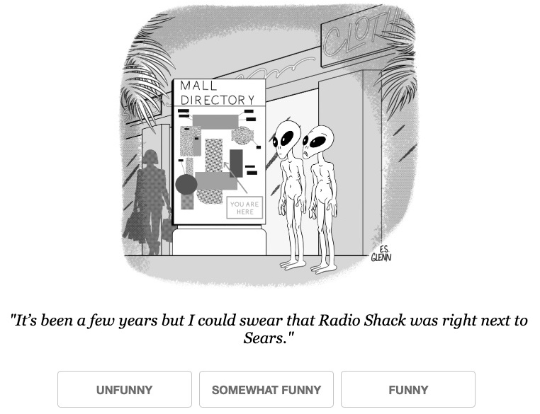

# AI幽默探索：大规模众包揭示的卡通字幕偏好与基准

发布时间：2024年06月15日

`LLM应用

这篇论文介绍了一个新颖的多模态偏好数据集，该数据集用于开发和评估多模态大型语言模型以及基于偏好的幽默标题生成算法。论文中提到了使用GPT4等模型进行实验，并探讨了微调技术在创意任务上的局限性。此外，论文还强调了模型在幽默标题创作上与人类表现之间的差距，并公开了完整的偏好数据集以促进AI技术的发展。这些内容主要关注于大型语言模型的应用层面，特别是在创意任务和幽默生成方面的应用，因此适合归类为LLM应用。` `创意任务` `幽默生成`

> Humor in AI: Massive Scale Crowd-Sourced Preferences and Benchmarks for Cartoon Captioning

# 摘要

> 我们推出了一款专为创意任务设计的新颖多模态偏好数据集，内含超过2.5亿个人类评分，覆盖了220多万个标题，这些数据源自《纽约客》过去八年每周漫画标题竞赛的众包评分。此独特数据集助力于多模态大型语言模型及基于偏好的幽默标题生成算法的开发与评估。我们设立了新的基准，用以衡量模型生成标题的质量，结合GPT4与人类判断，采用排名为基础的评估策略。实验结果揭示，诸如RLHF和DPO等微调技术在创意任务上存在局限。同时，我们发现，即便是最尖端的模型如GPT4和Claude，在幽默标题创作上仍不及顶尖人类选手。随着这项大规模数据收集工作的收官，我们将完整偏好数据集公之于众，旨在推动AI幽默生成与评估技术的进步。

> We present a novel multimodal preference dataset for creative tasks, consisting of over 250 million human ratings on more than 2.2 million captions, collected through crowdsourcing rating data for The New Yorker's weekly cartoon caption contest over the past eight years. This unique dataset supports the development and evaluation of multimodal large language models and preference-based fine-tuning algorithms for humorous caption generation. We propose novel benchmarks for judging the quality of model-generated captions, utilizing both GPT4 and human judgments to establish ranking-based evaluation strategies. Our experimental results highlight the limitations of current fine-tuning methods, such as RLHF and DPO, when applied to creative tasks. Furthermore, we demonstrate that even state-of-the-art models like GPT4 and Claude currently underperform top human contestants in generating humorous captions. As we conclude this extensive data collection effort, we release the entire preference dataset to the research community, fostering further advancements in AI humor generation and evaluation.

[Arxiv](https://arxiv.org/abs/2406.10522)