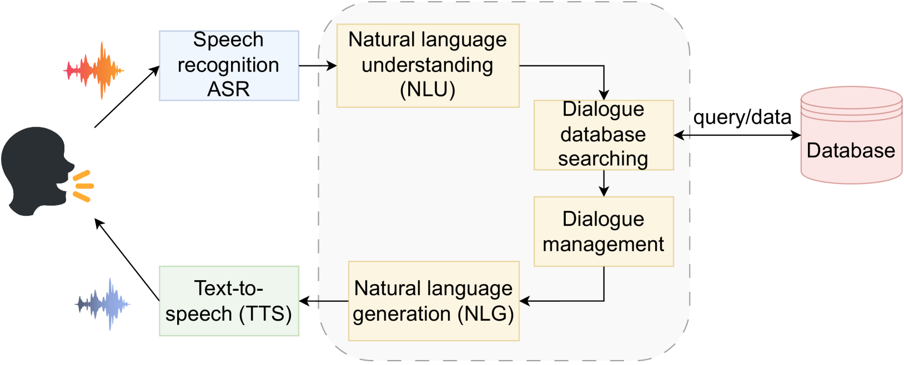
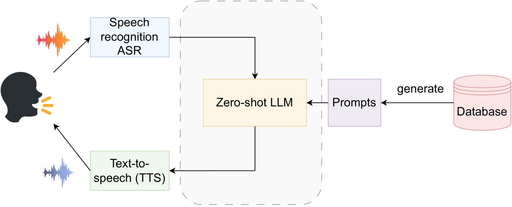
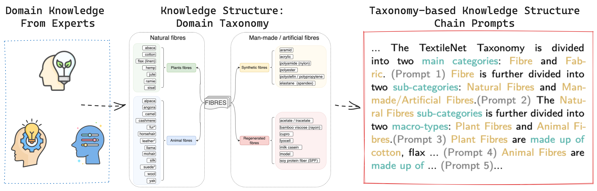
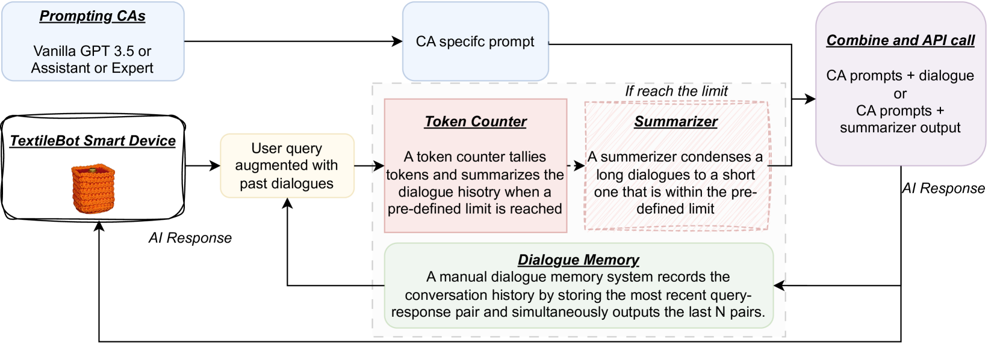
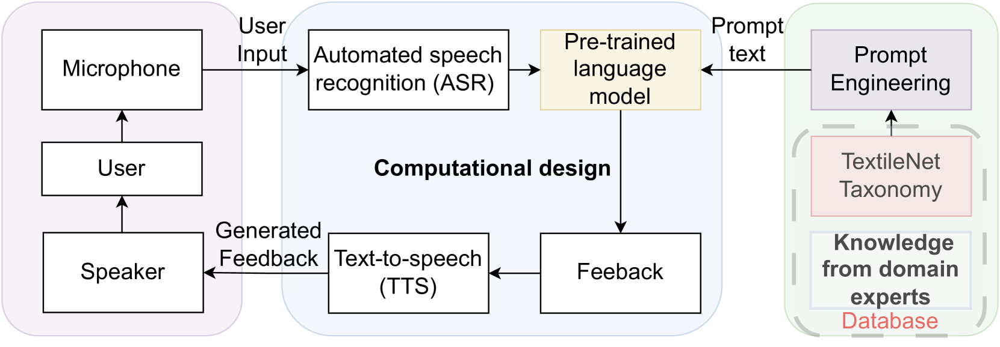
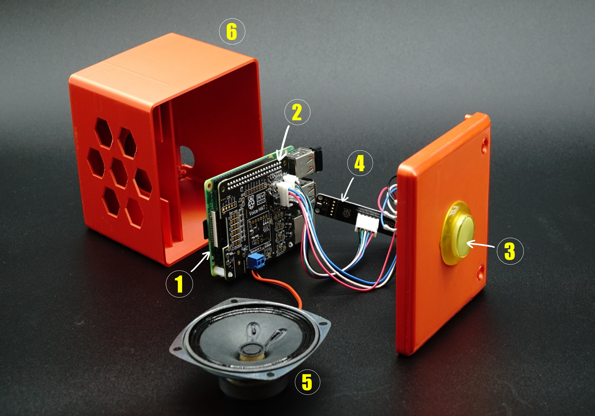
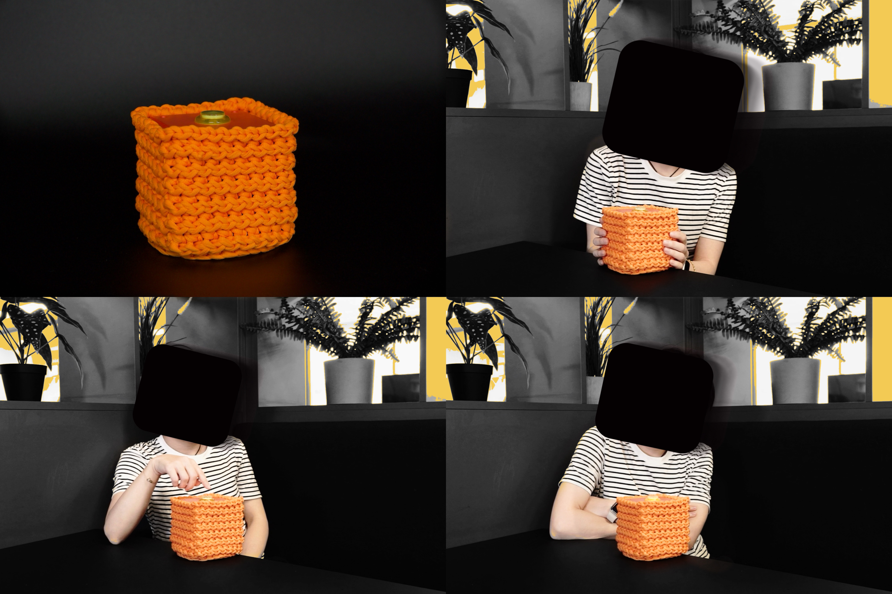
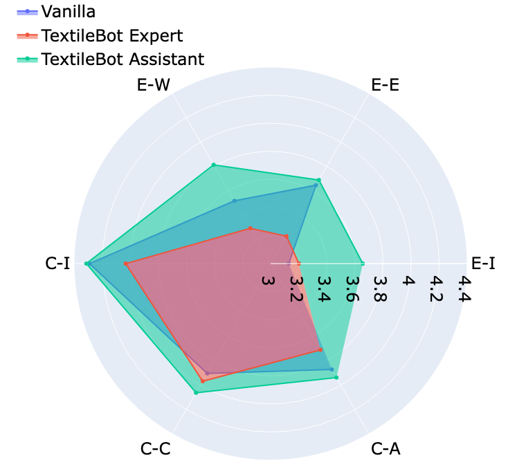
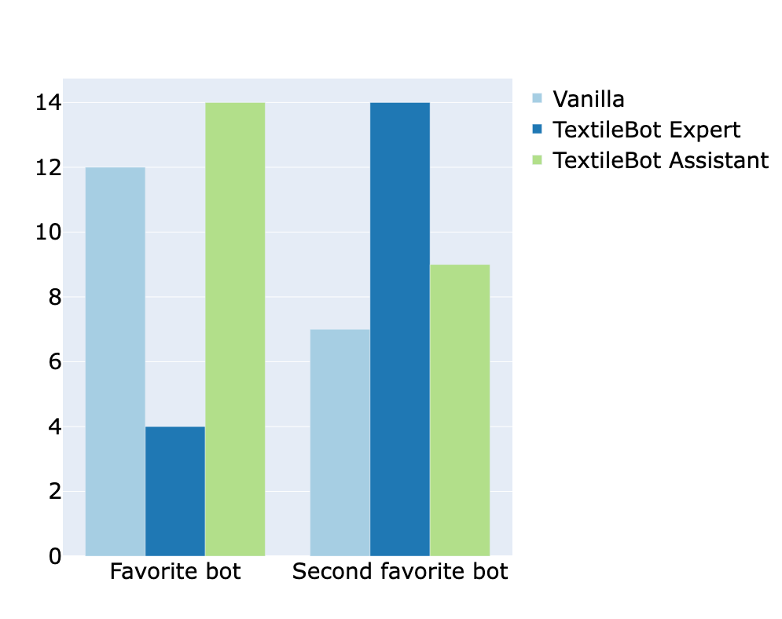
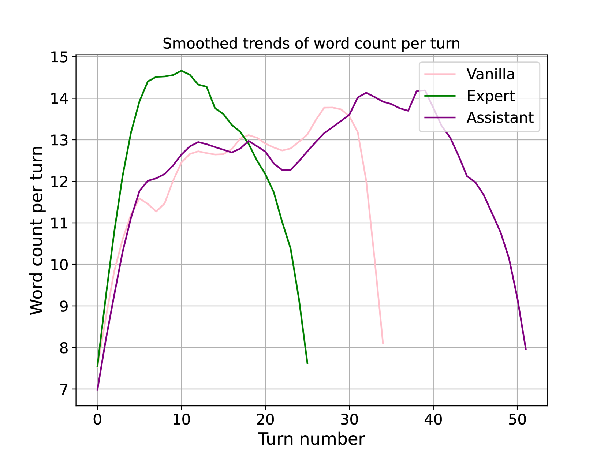

# 特定领域语音代理经由LLM中介：以TextileBot为例

发布时间：2024年06月15日

`Agent

这篇论文主要讨论了如何利用大型语言模型（LLMs）和提示增强技术来开发特定领域的对话代理（CAs），特别是在纺织循环性领域的应用。通过设计和评估TextileBot，研究展示了基于提示的LLM方法在构建特定领域CAs方面的有效性和潜力。因此，这篇论文更符合Agent分类，因为它专注于开发和评估特定领域的对话代理。` `纺织业` `对话代理`

> LLM-Mediated Domain-Specific Voice Agents: The Case of TextileBot

# 摘要

> 开发特定领域的对话代理面临的主要挑战是需要大量专注领域的数据。大型语言模型（LLMs）的进步和通过提示增强其行为的能力，为构建基于语音的特定领域CAs提供了新途径。我们通过TextileBot的设计、开发和评估，展示了这一方法在纺织循环性领域的应用。通过30人的面对面用户研究，我们评估了三种变体的TextileBot，并分析了人与代理的交互，结合了定量和定性方法。结果显示，参与者进行了多轮对话，对三种代理及其交互的感知各异，验证了我们基于提示的LLM方法的有效性。我们探讨了这些交互的动态及其对未来语音CAs设计的启示，展示了我们方法在构建特定领域CAs方面的潜力。

> Developing domain-specific conversational agents (CAs) has been challenged by the need for extensive domain-focused data. Recent advancements in Large Language Models (LLMs) make them a viable option as a knowledge backbone. LLMs behaviour can be enhanced through prompting, instructing them to perform downstream tasks in a zero-shot fashion (i.e. without training). To this end, we incorporated structural knowledge into prompts and used prompted LLMs to build domain-specific voice-based CAs. We demonstrate this approach for the specific domain of textile circularity in form of the design, development, and evaluation of TextileBot. We present the design and development of the voice agent TextileBot and also the insights from an in-person user study (N=30) evaluating three variations of TextileBots. We analyse the human-agent interactions, combining quantitative and qualitative methods. Our results suggest that participants engaged in multi-turn conversations, and their perceptions of the three variation agents and respective interactions varied demonstrating the effectiveness of our prompt-based LLM approach. We discuss the dynamics of these interactions and their implications for designing future voice-based CAs. The results show that our method's potential for building domain-specific CAs. Furthermore, most participants engaged in multi-turn conversations, and their perceptions of the three voice agents and respective interactions varied demonstrating the effectiveness of our prompt-based LLM approach. We discuss the dynamics of these interactions and their implications for designing future voice-based CAs.

[Arxiv](https://arxiv.org/abs/2406.10590)