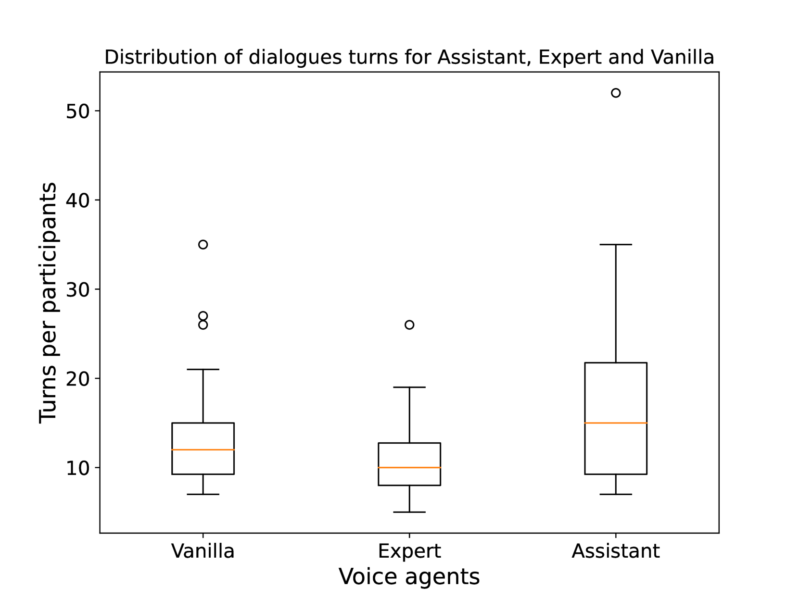

# 特定领域语音代理经由LLM中介：以TextileBot为例

发布时间：2024年06月15日

`Agent

这篇论文主要介绍了针对特定领域的对话代理TextileBot的设计与开发，以及通过用户研究评估其性能和用户感知。论文中提到的利用大型语言模型（LLMs）和提示增强技术来构建特定领域的语音对话代理，以及对代理交互动态的深入探讨，都表明这是一项关于Agent的研究。因此，该论文应归类为Agent。` `纺织品` `对话代理`

> LLM-Mediated Domain-Specific Voice Agents: The Case of TextileBot

# 摘要

> 开发特定领域的对话代理面临的主要挑战是需要大量专注领域的数据。大型语言模型（LLMs）的进步和通过提示增强其行为的能力，为构建特定领域的语音对话代理提供了新途径。我们通过将结构化知识融入提示，利用LLMs创建了针对纺织品循环性领域的语音代理TextileBot。本文详细介绍了TextileBot的设计与开发，并通过一项包含30名参与者的用户研究，评估了三种不同版本的TextileBot。研究结合了定量与定性分析，揭示了参与者在多轮对话中的参与度，以及他们对不同版本代理交互的不同感知，验证了基于提示的LLM方法的有效性。我们深入探讨了这些交互的动态，并讨论了它们对未来语音对话代理设计的启示。研究结果不仅展示了我们方法在构建特定领域对话代理方面的潜力，也强调了多轮对话和用户感知差异的重要性。

> Developing domain-specific conversational agents (CAs) has been challenged by the need for extensive domain-focused data. Recent advancements in Large Language Models (LLMs) make them a viable option as a knowledge backbone. LLMs behaviour can be enhanced through prompting, instructing them to perform downstream tasks in a zero-shot fashion (i.e. without training). To this end, we incorporated structural knowledge into prompts and used prompted LLMs to build domain-specific voice-based CAs. We demonstrate this approach for the specific domain of textile circularity in form of the design, development, and evaluation of TextileBot. We present the design and development of the voice agent TextileBot and also the insights from an in-person user study (N=30) evaluating three variations of TextileBots. We analyse the human-agent interactions, combining quantitative and qualitative methods. Our results suggest that participants engaged in multi-turn conversations, and their perceptions of the three variation agents and respective interactions varied demonstrating the effectiveness of our prompt-based LLM approach. We discuss the dynamics of these interactions and their implications for designing future voice-based CAs. The results show that our method's potential for building domain-specific CAs. Furthermore, most participants engaged in multi-turn conversations, and their perceptions of the three voice agents and respective interactions varied demonstrating the effectiveness of our prompt-based LLM approach. We discuss the dynamics of these interactions and their implications for designing future voice-based CAs.

[Arxiv](https://arxiv.org/abs/2406.10590)