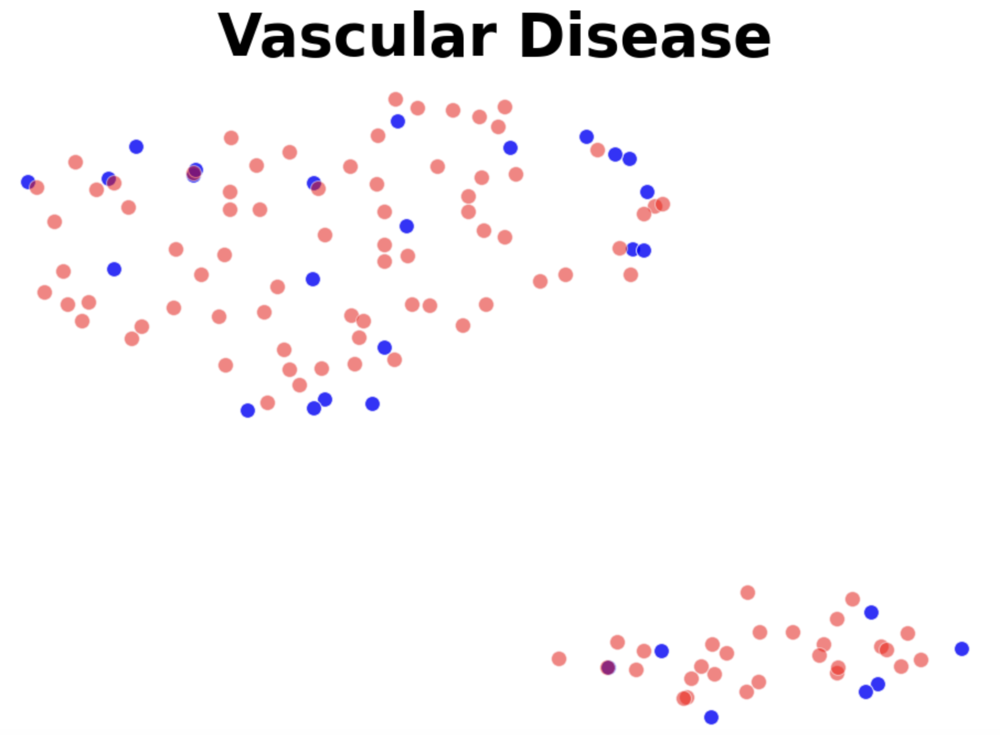

# MALLM-GAN：利用多代理大型语言模型作为生成对抗网络，合成表格数据的新方法

发布时间：2024年06月15日

`LLM应用

这篇论文摘要描述了一种利用大型语言模型（LLMs）来生成高质量合成表格数据的方法，特别是在医疗领域中，这种方法旨在解决数据隐私和高成本问题。通过模拟生成对抗网络（GAN）并利用LLM优化，该方法在小样本情况下提升了数据生成质量。这种应用展示了LLM在数据生成和隐私保护方面的实际应用价值，因此属于LLM应用分类。` `数据隐私`

> MALLM-GAN: Multi-Agent Large Language Model as Generative Adversarial Network for Synthesizing Tabular Data

# 摘要

> 在大数据时代，丰富的数据是科研进步的驱动力，但隐私顾虑和高成本常使这些数据难以触及，尤其在医疗领域。为此，我们提出了一种创新框架，借助大型语言模型（LLMs）模拟生成对抗网络（GAN），以生成高质量的合成表格数据。我们的方法通过将数据生成融入上下文，并利用LLM优化，显著提升了小样本情况下的数据生成质量。实验证明，我们的模型在保护真实数据隐私的同时，为下游任务生成了更优质的合成数据，超越了现有顶尖模型。

> In the era of big data, access to abundant data is crucial for driving research forward. However, such data is often inaccessible due to privacy concerns or high costs, particularly in healthcare domain. Generating synthetic (tabular) data can address this, but existing models typically require substantial amounts of data to train effectively, contradicting our objective to solve data scarcity. To address this challenge, we propose a novel framework to generate synthetic tabular data, powered by large language models (LLMs) that emulates the architecture of a Generative Adversarial Network (GAN). By incorporating data generation process as contextual information and utilizing LLM as the optimizer, our approach significantly enhance the quality of synthetic data generation in common scenarios with small sample sizes. Our experimental results on public and private datasets demonstrate that our model outperforms several state-of-art models regarding generating higher quality synthetic data for downstream tasks while keeping privacy of the real data.

[Arxiv](https://arxiv.org/abs/2406.10521)